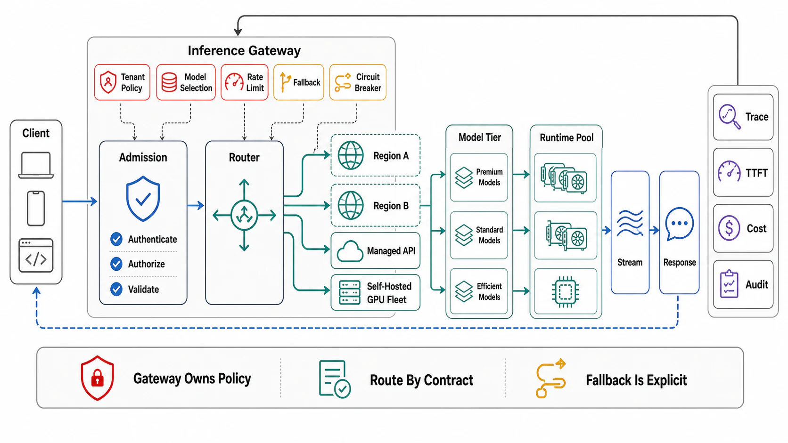

# Serving Topologies and the Inference Gateway



## Abstract

Above the single runtime sits the fleet layer, and its defining fact is that **LLM serving broke the classic load balancer**: round-robin and least-connections assume requests are (a) roughly uniform in cost and (b) indifferent to placement, and token workloads violate both — request cost varies by 1000× (10-token completion vs 100k-token prefill) and placement decides whether a request's prefix is *already resident* in some worker's KV pool (Chapter 08 file 09's economics: a routed-away hit re-pays seconds of prefill). The modern topology is therefore an **inference gateway**: a router that sees model-level state — per-worker queue depths and KV occupancy, prefix-cache contents (or a predictive model of them), phase pools where disaggregation is deployed — and scores placements against a cost function of load *and* expected cache match. The consolidation is real and dated: SGLang's cache-aware router (v0.4: up to ~3.8× hit-rate and ~1.9× throughput gains from routing alone), **llm-d** (the Kubernetes-native assembly — Red Hat/Google/IBM/NVIDIA/CoreWeave — building prefix-cache-aware scoring into the Gateway API Inference Extension), and **NVIDIA Dynamo 1.0** (GA March 2026: the datacenter-scale frame — disaggregated serving, KV-aware routing, multi-tier KV offload — statuses verified at write time). The remaining fleet decisions are placement economics: **disaggregated pools** (Ch09 f09's decision executed here: prefill and decode fleets sized independently, KV shipped between them — the router becomes the phase dispatcher); **multi-model and LoRA multiplexing** (dozens of adapters time-sharing one base model's weights — high-value consolidation with a tenancy catch: adapters share the batch, so Ch09 f06's fairness and G5's interference apply *inside* the model boundary); and **autoscaling on token metrics** — QPS is meaningless when requests vary 1000×; the scaling signals are token throughput against the file 02 envelope, KV occupancy, and queue-depth-in-tokens, with file 08's minutes-long cold starts making predictive/scheduled scaling and warm pools the default posture rather than reactive scaling's afterthought.

## 1. The Gateway's Decision — Cache-Aware, Load-Aware Routing

```text
Figure 1. The routing decision, per request.

  request {model, prefix hash chain, est. tokens, SLO class}
     │
     ▼
  score each candidate worker/pool:
     match  = expected prefix overlap (radix/block index or
              predictor) → saved prefill seconds (Ch08 f09)
     load   = queue depth in TOKENS + KV headroom (Ch09 f09's
              two-resource admission, visible to the router)
     place  = argmax( w·match − v·load )   ← the llm-d/SGLang
                                              cost-function shape
  ─────────────────────────────────────────────────────────────
  the tension the weights encode: pure match-routing HERDS hot
  prefixes onto one worker (its own hotspot — Ch08 f07's hot-key
  physics at the router); pure load-routing forfeits the cache.
  the failure drill (G9) floods one prefix and watches both
  failure modes; the answer is bounded affinity: match wins
  until the target's load penalty crosses it, then spill —
  replicating the hot prefix (Ch08's replicate-the-hot-key)
```

Placement rules carried from earlier chapters, enforced at this layer: the router is **control-plane-fed, data-plane-local** (Ch02 f05 — worker state arrives by push/gossip; a router that synchronously queries workers per request added a hop to TTFT and a failure mode to everything); routing state is **advisory, admission is authoritative** (the worker's own Ch09 f09 scheduler still enforces its KV/compute budgets — router staleness then costs efficiency, never correctness); and session affinity is a *lease, not a lock* (sticky routing for multi-turn KV locality, with Ch07 f09's resumability as the escape hatch when the leased worker drains — file 08's lifecycle reaching into routing).

## 2. Pools, Multiplexing, and Token-Metric Autoscaling

**Disaggregation, executed**: separate prefill/decode fleets turn the router into a phase dispatcher and add the KV-transfer path to the critical path (file 07's interconnect envelope prices it: NVLink/RDMA-class transfer or the design fails its own arithmetic) — with the payoff that each pool runs its own file 04 frontier point (prefill pool at max throughput, decode pool at the TPOT knee) and scales on its own signal (prefill on queued prompt tokens; decode on KV occupancy) — the independent-scaling argument that wins exactly when the workload's prompt/output ratio makes one phase the bottleneck (Ch09's open problem, decided per fleet by measurement). **LoRA multiplexing**: one base model's weights, many adapters batched together (S-LoRA-class serving) — the consolidation economics are excellent (adapters are ~10–100 MB against a 140 GB base) and the review items are tenancy-shaped: per-adapter fairness inside the shared batch, per-adapter SLIs (one adapter's traffic spike is every co-resident adapter's TPOT tax — G5 again), and adapter version closure in cache keys and routing (Ch08 f09's law, now per-adapter). **Autoscaling**: signals in tokens (throughput vs envelope, KV occupancy, queue-in-tokens), thresholds derived from file 02's envelope and Ch09 f02's SLO-inverted utilization ceilings, and the lag bridged per Ch09 f01's gate — with file 08's cold-start number making the honest statement: reactive scaling alone cannot serve spiky token traffic; the design choices are warm pools, predictive schedules, and admission-controlled degradation for the gap, chosen and priced in the dossier.

## 3. Approval Gates

| Gate | Evidence Required | Failure Condition |
|---|---|---|
| Router-fitness gate | Routing on token-cost and cache-match signals, not QPS/connections; the cost function's weights stated; G9's hot-prefix flood run showing bounded affinity | Round-robin in front of a prefix-cached fleet; match-routing herding hot prefixes into a hotspot |
| Authority gate | Router state advisory, worker admission authoritative; router fed by push, no per-request worker queries; staleness costs measured as efficiency, not correctness | TTFT paying a synchronous state-collection hop; router staleness producing OOMs |
| Pool gate | Disaggregation (if deployed) with the KV-transfer path priced on the interconnect envelope and each pool's frontier point + scaling signal stated | Phase pools connected by a link the arithmetic already condemned; one scaling signal for two phases |
| Multiplex gate | Per-adapter fairness, SLIs, and version closure; interference measured inside the shared batch (G5) | The noisy adapter every co-tenant pays for; adapter rollouts serving stale cached prefixes |
| Scaling gate | Token-metric signals with envelope-derived thresholds; the cold-start gap bridged by warm pools/predictive schedules/degradation, priced | QPS-triggered scaling of 1000×-variable requests; reactive-only scaling against minutes of cold start |

## Output

The output of this file is a fleet layer that speaks the workload's language: a gateway routing on token cost and cache match with bounded affinity and advisory-only state, pools shaped and scaled per phase where the measured mix earns disaggregation, adapters multiplexed under real tenancy discipline, and autoscaling driven by token metrics against derived thresholds with the cold-start gap bridged by design — so the fleet's economics compose with, rather than fight, every layer built below it.

## References

- [llm-d — Kubernetes-native distributed inference: prefix-cache-aware routing in the Gateway API Inference Extension](https://llm-d.ai/)
- [SGLang v0.4 — the cache-aware load balancer (routing-only gains quantified)](https://www.lmsys.org/blog/2024-12-04-sglang-v0-4/)
- [NVIDIA Dynamo — datacenter-scale disaggregated inference (1.0 GA, March 2026)](https://developer.nvidia.com/dynamo)
- [Sheng et al., "S-LoRA: Serving Thousands of Concurrent LoRA Adapters" (MLSys 2024)](https://arxiv.org/abs/2311.03285)
- [Zhong et al., "DistServe" (OSDI 2024) — the disaggregated-pool design this layer operates](https://www.usenix.org/conference/osdi24/presentation/zhong-yinmin)
