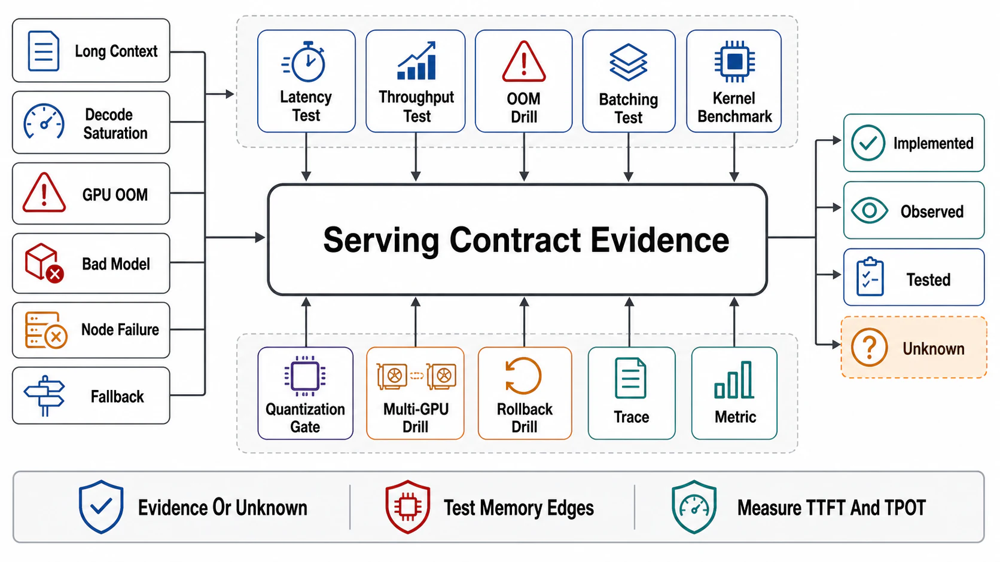

# Verification of Serving Contracts



## Abstract

Serving verification has a property no earlier chapter faced in full: the system's *outputs* are part of the contract — a fleet can pass every latency drill while a quantization config, engine upgrade, or drafter regression quietly changes what the model says — so this file's catalog pairs **performance drills** (the envelope, the frontier, the failure modes) with **output drills** (quality canaries, distribution checks, determinism probes), and its stamp discipline is correspondingly the book's strictest: every piece of evidence carries a **serving-generation stamp** `{model weights + quantization config, engine build + kernel set, serving config (batch/chunk/budgets), fleet hardware + topology, traffic mix (context/output distribution)}` — five fields, any of whose change resets dependent evidence, because a goodput curve measured on last month's engine build at last month's context mix certifies a system that no longer exists. Two postures carry forward and one is new. From Chapter 09: load drills are **open-loop** in offered tokens (not requests — the 1000× cost variance makes request-count load models fiction). From Chapter 01 file 11: evidence classes with expiry. New here: **determinism honesty** — production inference is nondeterministic *by system design* (batch-size-dependent kernels mean the same prompt answers differently under different co-batching — the Thinking Machines batch-invariance result made the mechanism precise), so the dossier must either state nondeterminism as a documented property (the overwhelmingly common choice) or deploy batch-invariant kernels and *prove* bitwise stability (G6's probe) — what it may not do is imply reproducibility it cannot demonstrate, because downstream evals, caches, and debugging sessions are all quietly built on that implication.

## 1. The Drill Catalog

```text
Figure 1. The evidence loop. Output drills (G6, G10's quality half)
and performance drills (the rest) share one stamp; the canary
pipeline (G10) is where both run continuously against every change.

  drill Gn ──► evidence {claim, class, date, serving-generation
      ▲                  stamp: model/engine/config/fleet/mix}
      │                         │ any stamp field changes
      │                         ▼
      └── canary re-mints    reset → assumed (with expiry)
```

| Drill | Hypothesis under test | Procedure / fault injected | Pass condition | Cadence |
|---|---|---|---|---|
| G1 Envelope validation | File 02 §3's derived chain matches reality | Measure tokens/s, MBU/MFU per phase at controlled batch/context points; compare against the derivation | Measured within the stated kernel-efficiency band of derived; binding resource confirmed | Per serving-generation change |
| G2 Frontier sweep | The latency-throughput curve and chosen point (file 04) | Open-loop token-load sweep across batch/chunk configs at the production mix | The knee located; the deployed config's position matches its SLO rationale | Per generation change + quarterly |
| G3 Op breakdown | Where iteration time actually goes (file 05) | Profiler-level op timing per phase at production shapes | Top ops named with binding resources; fusion/kernel engagement confirmed; eager-fallback rate known | Per engine/model change |
| G4 Closure probe | No cross-version reuse of KV/prefix/adapter state (files 03/09; Ch08 f09) | Deploy a version bump; probe for stale-state hits across block pool, router affinity, adapter caches | Zero cross-version hits; caches invalidated by unreachability | Per rollout, automated in the canary |
| G5 Interference | Batchmates and co-resident adapters pay bounded tax (files 01/04/09) | Inject long-prefill and hot-adapter traffic beside latency-class requests; measure TPOT distributions ± interference | Interference within declared bounds; fairness policy engages | Quarterly + per multiplexing change |
| G6 Output stability | Outputs stable within declared determinism posture; numerics drift caught (file 06) | Fixed-prompt suites: distribution-level comparison across engine builds; bitwise probes if batch-invariance is claimed; quantization eval deltas re-run | Deltas within declared bounds; no unexplained distribution shift; claimed determinism proven bitwise | In the canary, every rollout |
| G7 Scaling knee | Parallelism degrees sit at the measured knee (file 07) | TP/PP/EP scaling sweep; skewed-traffic MoE run; degraded-link injection | Marginal-gain curve on file; hot-expert playbook engages; slowest-participant alarms fire | Per topology change + semi-annual |
| G8 Cold start | The full cold-start budget holds fleet-wide (file 08) | Scale-from-zero drill: fetch → load → warmup → healthy, at fleet-realistic concurrency | Budget met including distribution-tier saturation; warm-pool/predictive bridge covers the measured gap | Semi-annual + per artifact-size change |
| G9 Router honesty | Cache-aware routing helps and cannot herd (file 09) | Hot-prefix flood; router-state staleness injection; affinity-lease drain | Bounded affinity spills; staleness costs efficiency only; leases migrate on drain | Quarterly |
| G10 Rollout canary | The serving artifact ships safely as one unit (file 08) | Canary with paired quality (G6 suite) + latency SLIs; rehearsed rollback under load; cache-cold capacity check | Both SLI families gate promotion; rollback within its stated time; warming absorbs the invalidation | Standing — the pipeline itself |

## 2. The Serving SLI Set

| SLI | Definition | What it catches |
|---|---|---|
| TTFT / TPOT per class, split by cache outcome | The Ch07 f09 split, per SLO class, hit-vs-miss separated | Bimodality hidden in blended averages; prefix-cache regressions as "model slowness" |
| Goodput-within-SLO | Ch09 f09's number, per class | The only throughput that counts |
| MBU / MFU per phase | Utilization against the *binding* resource (file 02 §2) | Wrong-denominator capacity decisions |
| KV pool: occupancy by state, preemption pressure, fragmentation | File 03's heap SLIs | Admission bugs presenting as OOMs; eviction churn as capacity theft |
| Eager-fallback + fusion-engagement rate | Share of iterations off the optimized path (files 04/05) | The silent 15% regression class |
| Acceptance rate per class (if speculating) | File 06's drift signal | The drafter that stopped helping |
| Per-expert load/latency (MoE) | File 07's skew dashboard | Hot experts before they become p99 mysteries |
| Health: Xid/ECC/thermal/link events; active-probe deltas | File 08's taxonomy, per parallelism group | Soft degradation; the slowest-participant tax |
| Cancellation-to-cull latency; orphaned-sequence count | File 01's contract | GPUs decoding to nobody (Ch07 f09's C10, continuously) |
| Cost per 1k tokens, per class | The envelope's outputs × fleet economics | The business number every other row exists to defend |

Standing rules: slice by SLO class and cache outcome before averaging; print the derived bound (envelope, frontier point, budget) beside each measurement; alert on derivatives (MBU sagging, fallback rate climbing, acceptance decaying) — the inherited discipline, applied to the most expensive dashboard in the book.

## 3. Evidence Classes and the Serving-Generation Stamp

The taxonomy — *tested* (a drill, dated), *observed* (standing SLIs over a window), *assumed* (declared, expiring) — with reset rules per stamp field: **model/quantization** resets G1/G2/G4/G6 (and Ch08's cache evidence via version closure); **engine/kernels** resets G1/G2/G3/G6 (numerics drift is why G6 is in this list — the strictest coupling in the book: a *performance* upgrade resets *output* evidence); **serving config** resets G2/G5; **fleet/topology** resets G1/G7/G8; **traffic mix** resets G2/G5/G9 (the mix is a stamp field precisely because every frontier and interference number is mix-conditional). The canary pipeline (G10) is what makes this affordable: it is the standing machine that re-mints G4/G6-class evidence on every change, leaving the calendar drills to carry only what canaries cannot (scaling knees, cold starts, floods).

## 4. Approval Gates

| Gate | Evidence Required | Failure Condition |
|---|---|---|
| Pairing gate | Every performance drill paired with the output-stability question (and vice versa); G6 runs inside every rollout | Engine bumps verified fast and wrong; quality canaries blind to the latency they cost |
| Open-loop-tokens gate | Load drills generated open-loop in offered tokens at the production context/output mix | Request-count load models; closed-loop self-throttling hiding the cliff (Ch09's lesson, restated) |
| Determinism-honesty gate | The determinism posture declared; nondeterminism documented to consumers, or batch-invariance proven bitwise (G6) | Reproducibility implied to downstream evals/caches that the serving stack cannot deliver |
| Stamp gate | Five-field serving-generation stamps on all evidence; resets enforced; the dossier refuses stale stamps | Envelope numbers from the pre-quantization fleet; frontier curves from last quarter's mix |
| Canary-spine gate | G10 standing as the pipeline, gating promotion on both SLI families, rollback rehearsed | Rollouts verified by absence of pages; rollback timed for the first time during an incident |

## Output

The output of this file is the chapter's evidence base: ten drills spanning the derived envelope, the measured frontier, kernel engagement, version closure, interference, output stability, scaling knees, cold starts, router honesty, and the canary spine that re-mints evidence on every change — all stamped with the five fields that define a serving generation, all honest about the one property this domain uniquely owes its consumers: whether the same question, asked twice, is promised the same answer.

## References

- [Thinking Machines Lab, "Defeating Nondeterminism in LLM Inference" (2025) — batch invariance and the determinism posture](https://thinkingmachines.ai/blog/defeating-nondeterminism-in-llm-inference/)
- [LMSYS/SGLang — deterministic inference mode (the posture, productionized)](https://www.lmsys.org/blog/2025-09-22-sglang-deterministic/)
- [Google SRE Workbook — canarying releases (G10's discipline)](https://sre.google/workbook/canarying-releases/)
- [Brooker, "Open and Closed" — the load-model requirement, in tokens](https://brooker.co.za/blog/2023/05/10/open-closed.html)
