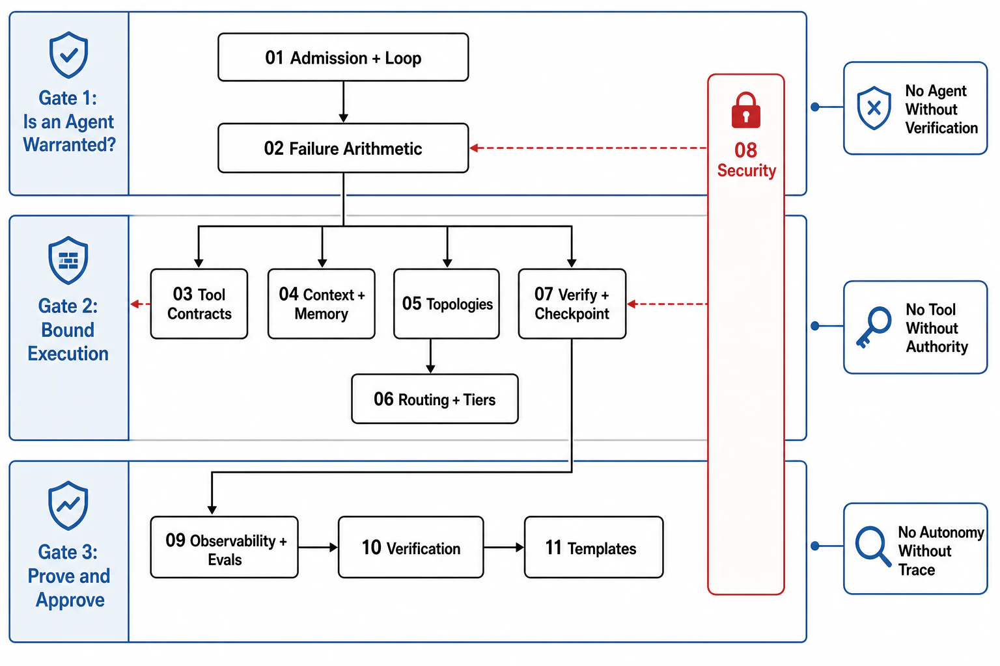

# Chapter 11 File Map — Agentic Orchestration and Tool Routing



## Reading Order

| Order | File | Owns |
|---:|---|---|
| 1 | [01-the-agent-admission-decision-and-loop-anatomy.md](01-the-agent-admission-decision-and-loop-anatomy.md) | When NOT to build an agent (the workflow-vs-agent table); the bounded loop's anatomy; the harness as the system boundary |
| 2 | [02-agent-failure-arithmetic-and-episode-economics.md](02-agent-failure-arithmetic-and-episode-economics.md) | The pⁿ composition law and its correlated-failure envelope; quadratic context economics; episode budgets derived |
| 3 | [03-tool-contracts-and-the-action-interface.md](03-tool-contracts-and-the-action-interface.md) | Tools as contract artifacts; per-tool timeout/retry/idempotency; error surfaces that steer; MCP as the consolidation |
| 4 | [04-context-engineering-and-agent-memory.md](04-context-engineering-and-agent-memory.md) | Context as the scarce resource; curation, compaction, isolation; agent memory's ownership and retention |
| 5 | [05-orchestration-topologies-single-and-multi-agent.md](05-orchestration-topologies-single-and-multi-agent.md) | The single loop as default; orchestrator-workers; the multi-agent debate resolved as a read/write criterion |
| 6 | [06-routing-model-tiers-and-escalation.md](06-routing-model-tiers-and-escalation.md) | Model and tool routing; cost tiers; escalation ladders; the router as policy, not vibes |
| 7 | [07-verification-repair-and-checkpoint-discipline.md](07-verification-repair-and-checkpoint-discipline.md) | The verify phase's mechanisms and the verifier gap; bounded repair; durable execution and resumability |
| 8 | [08-security-sandboxing-and-blast-radius.md](08-security-sandboxing-and-blast-radius.md) | Prompt injection and the lethal trifecta; least-privilege authority; sandboxing; approval gates; the incident corpus |
| 9 | [09-agent-observability-and-evaluation.md](09-agent-observability-and-evaluation.md) | Episode traces; token/cost/outcome SLIs; eval harnesses (pass^k); the prompt/model canary discipline |
| 10 | [10-verification-of-agent-contracts.md](10-verification-of-agent-contracts.md) | Drill catalog T1–T10; the agent SLI set; episode-generation evidence stamps |
| 11 | [11-agent-review-templates.md](11-agent-review-templates.md) | The agent surface dossier and reviewer checklist |

## Approval Dependency Graph

```text
Figure 1. Approval dependencies. The admission decision [01] and
the failure arithmetic [02] gate everything; security [08] gates
every tool grant in [03]; the operational files [09][10] consume
all of it into templates [11].

  [01 admission + loop anatomy]
        │
        v
  [02 failure arithmetic + episode economics]
        │
        ├──► [03 tool contracts] ◄── [08 security/blast radius]
        │            │                        ▲
        ├──► [04 context/memory]              │
        │            │                        │
        ├──► [05 topologies] ──► [06 routing/tiers]
        │            │                        │
        └──► [07 verify/repair/checkpoint] ───┘
                     │
                     v
        [09 observability/evals] ──► [10 verification]
                                          │
                                          v
                                   [11 templates]
```

## Prerequisites From Earlier Chapters

| Prerequisite | Where it is established | Consumed by |
|---|---|---|
| The agent principal: delegated, scoped, never a god-credential | [Ch07 file 08 §4](../07-api-contracts-and-request-lifecycle/08-authentication-authorization-and-tenancy.md) | [03], [08] |
| Tool calls as mutations: idempotency keys through tool loops | [Ch07 file 04](../07-api-contracts-and-request-lifecycle/04-idempotency-and-safe-retries.md), [Ch07 file 09 §4](../07-api-contracts-and-request-lifecycle/09-streaming-long-running-and-ai-request-lifecycles.md) | [03] |
| Episode budgets debited per step at admission | [Ch09 file 09 §3](../09-scheduling-queues-and-resource-admission/09-ai-workload-scheduling.md) | [02], [06] |
| Prompt-structure/prefix-cache economics; version closure | [Ch08 file 09](../08-caching-materialization-and-invalidation/09-ai-native-caching.md) | [02], [04] |
| Token serving contracts: TTFT/TPOT, cancellation, cost per token | [Ch10 README](../10-inference-runtime-and-gpu-serving-architecture/README.md) | [02], [06] |
| Derived/agent memory as owned state with lifecycle and deletion | [Ch03 file 09](../03-state-ownership-and-consistency-model/09-ai-native-state.md) | [04] |
| LRO durability, resumability, and honest cancellation | [Ch07 file 09](../07-api-contracts-and-request-lifecycle/09-streaming-long-running-and-ai-request-lifecycles.md) | [07] |
| Evidence classification (tested / observed / assumed) | [Ch01 file 11](../01-architectural-objective-and-system-boundary/11-evidence-classification-and-architecture-review.md) | [10], [11] |

## Chapter Rule

This chapter approves *agent-system decisions*: whether a loop is warranted, how it is bounded, what tools it may call with what authority, how its context and memory are engineered, how work is verified and resumed, and how the blast radius is contained. It does not approve the APIs the tools wrap (Chapter 07), the serving fleet underneath (Chapter 10), the admission machinery above (Chapter 09), or the retrieval/grounding pipelines the agent consults (Chapter 12) — those are cited as prerequisites, never re-argued. Model capability (whether the model *can* do the task) is an empirical input from evals, not an architectural assumption.
