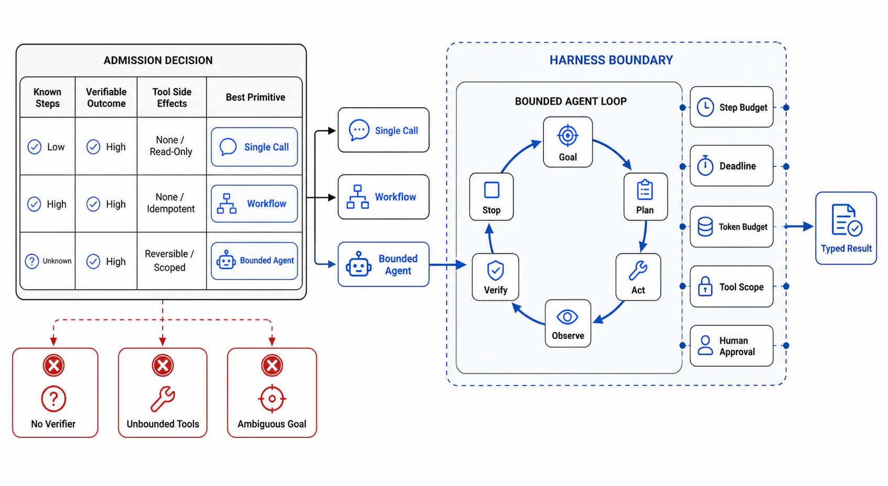

# The Agent Admission Decision and Loop Anatomy



## Abstract

An agent is a model autonomously using tools in a loop — the model decides what to do next, acts through tools, observes results, and iterates until it judges the task done — and this chapter's opening move is the same as every chapter's: the admission decision, because autonomy is the *expensive, unreliable, hard-to-verify* option and must be earned by the task, not granted by fashion. The industry's own builders state the rule plainly: find the simplest solution possible, and only increase complexity when needed — fixed **workflows** (LLM calls orchestrated through predefined code paths: prompt chains, routers, parallel fan-outs) beat agents wherever the task's structure is known in advance, because a workflow's control flow is *deterministic, testable, and priced*, while an agent buys flexibility with compounding per-step failure probability (file 02's arithmetic), unbounded cost variance, and a verification burden that lands on file 07 ([Anthropic, "Building effective agents"](https://www.anthropic.com/research/building-effective-agents)). For tasks that pass — open-ended problems where the number and order of steps is genuinely unknowable, where the model must react to what it discovers — the file fixes the loop's anatomy per the root README's contract: **bounded phases** (observe → plan → act → verify → repair → finalize), each with an owner and an exit condition, executed inside a **harness** that is the actual system boundary: the harness owns the budgets (Ch09 f09's per-step debits), the tool registry and permissions (files 03/08), the context assembly (file 04), the checkpoints (file 07), and the trace (file 09) — the model owns only the *decisions inside the loop*, and every production agent failure story that matters is a harness that ceded one of its properties to the model's discretion.

## 1. The Admission Table — Workflow, Agent, or Neither

| Task shape | Verdict | Reason / the checkable condition |
|---|---|---|
| Fixed decomposition known at design time (extract → transform → summarize; classify → route) | **Workflow** — chain/router/fan-out | Every step testable in isolation; cost is O(steps), not O(model's judgment); failures localize |
| Known steps, uncertain per-step content (draft → critique → revise, k rounds) | **Workflow with loops** (evaluator-optimizer) | The loop is bounded *by code*, not by model judgment; still deterministic control flow |
| Open-ended: step count/order unknowable, discovery-driven (debug this failure; research this question; migrate this codebase) | **Agent** — earned | The flexibility premium pays only when no workflow can express the task; verify file 07 can actually check the outcome before admitting |
| Single capable model call dressed in loop clothing | **Neither — one call** | The most common over-engineering: retrieval + one well-contexted call outperforms the agent that "explores" toward the same answer at 20× cost |
| High-stakes irreversible actions dominate the task | **Workflow with human gates**, or don't automate | Autonomy's error rate × irreversibility = the Replit-incident shape (file 08); approval gates are cheaper than apologies |
| The verification of success is itself unsolved | **Don't ship the agent** | An agent whose output cannot be checked is an unbounded liability generator — the verifier gap (file 07, README open problems) is an admission criterion, not a post-launch surprise |

Two rules harden the table. **The task defines the agent, never the reverse**: "we have an agent framework, what can it do" is the anti-pattern that produced most of the field's failed deployments; the dossier's first row is the task, its known/unknown structure, and why the simpler rung fails. **Re-admission is scheduled**: model capability moves quarterly; a task that needed an agent last year may be one call now (and vice versa: a workflow straining under special cases may have crossed into agent territory) — the verdict carries a re-decision date, exactly like Chapter 10's buy-vs-run.

## 2. The Bounded Loop and the Harness Boundary

```text
Figure 1. The loop's phases and the harness that bounds them.
Everything in the outer box is HARNESS — code, not model judgment.

  ┌─ harness ──────────────────────────────────────────────────┐
  │ budgets: tokens/steps/cost/wall-clock (Ch09 f09, debited   │
  │ per step) · tool registry + permissions (f03/f08) ·        │
  │ context assembly (f04) · checkpoints (f07) · trace (f09)   │
  │                                                            │
  │   observe ──► plan ──► act ──► verify ──► finalize         │
  │      ▲                  │        │                         │
  │      │                  ▼        ▼ (fail, budget left)     │
  │      └──── observation ◄─tool   repair ──► (re-plan)       │
  │                                                            │
  │ exits, ALL harness-enforced: task verified done · budget   │
  │ exhausted → checkpoint + summarize + escalate (a DESIGNED  │
  │ outcome, Ch09 f09) · unrecoverable error · human abort     │
  └────────────────────────────────────────────────────────────┘
```

The phase contract, stated as review items: **observe/plan** produce artifacts (the plan is written into context, inspectable in the trace — a loop that cannot show its plan cannot be debugged); **act** goes through the tool layer only (no side channel — every side effect is a tool call with file 03's contract and file 08's authority); **verify** is a distinct phase with its own mechanism (file 07 — self-assessment prose is not verification); **repair** is bounded (n attempts per failure class, then escalate — unbounded repair is where budgets go to die, and where the model re-attempts the same failing action with growing frustration in the trace); **finalize** is explicit (declared outputs, released resources, closed spans — an agent that just stops is Ch07 f09's stream-that-just-stops, one level up). And the harness properties are non-delegable: the model may *request* more budget, another tool, a sub-agent — the harness *grants* — because the moment the model can extend its own limits, every bound in this chapter is advisory.

## 3. Approval Gates

| Gate | Evidence Required | Failure Condition |
|---|---|---|
| Admission gate | The §1 verdict per task with the simpler-rung analysis; the verifiability precondition checked; a re-decision date | Agents by default; frameworks in search of tasks; unverifiable outcomes admitted |
| Phase gate | The six phases instantiated with owners, artifacts, and exit conditions; plans and verifications visible in traces | Loops with no distinct verify phase; repair unbounded; termination by model whim |
| Harness gate | Budgets, tools, permissions, context, checkpoints, traces all harness-owned; model requests, harness grants | The model extending its own budget; side effects outside the tool layer |
| Exit gate | All four exits designed; budget exhaustion checkpoints-and-escalates rather than truncating silently | Episodes that end by exception; work lost at the budget cliff |
| Task-first gate | The dossier opens with the task's structure analysis, not the architecture | "What can our agent do" as the design question |

## Output

The output of this file is an admission discipline and a loop anatomy: agents granted only to tasks whose open-endedness earns the flexibility premium and whose outcomes can be verified, running as bounded phases inside a harness that owns every limit — budgets, tools, context, checkpoints, traces — so that autonomy operates inside an envelope that code, not model judgment, enforces.

## References

- [Anthropic, "Building effective agents" — the workflow-vs-agent discipline and pattern catalog](https://www.anthropic.com/research/building-effective-agents)
- [Yao et al., "ReAct: Synergizing Reasoning and Acting in Language Models" (2022) — the loop's canonical formulation](https://arxiv.org/abs/2210.03629)
- [Chapter 09 file 09 — episode budgets as admission machinery](../09-scheduling-queues-and-resource-admission/09-ai-workload-scheduling.md)
- [OWASP LLM Top 10 (2025) — LLM06 Excessive Agency: the harness boundary as a security control](https://owasp.org/www-project-top-10-for-large-language-model-applications/)
