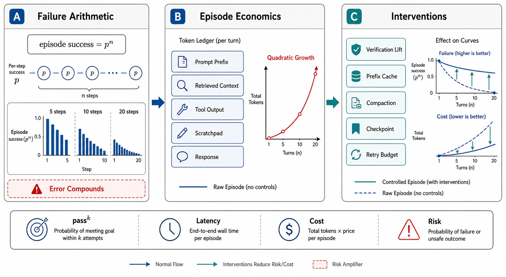

# Agent Failure Arithmetic and Episode Economics



## Abstract

Agent design is governed by two exponentials, and this file derives both (standard 9) because every architectural choice in the chapter is an intervention against one of them. **The failure exponential**: an episode of n sequential steps, each independently succeeding with probability p, completes at pⁿ — worked: a 95%-per-step agent finishes a 20-step task 35.8% of the time; at 99% per step, 81.8%; at 30 steps and 95%, 21.5% — the composition law that explains why demos (5 steps) become disappointments (30 steps) with no change in the model, and why the chapter's leverage points are exactly three: raise p (better tools/context — files 03/04), shorten n (better decomposition — file 05), and **break the exponential with verification** — a verify-repair phase converts a step's effective success to p′ = p + (1−p)·d·r (failure detected with probability d, repaired with probability r), and at p=0.95, d=0.9, r=0.8 that is p′≈0.986, lifting the 20-step episode from 36% to 75% — the single arithmetic argument for why file 07 exists. **The validity envelope (standard 7), which doubles as a design warning**: the independence assumption is *optimistic in one direction and pessimistic in the other* — failures correlate through shared context (a wrong "fact" written into context poisons every subsequent step: one bad step can make later p *collapse*, worse than independence predicts), while verification-with-checkpointing de-correlates (each verified checkpoint is a re-anchoring to ground truth). The same structure prices reliability at the episode level: τ-bench's **pass^k** (all k trials succeed) = pᵏ for episode success p — an agent that succeeds 90% of the time delivers 10 consecutive successes 35% of the time — the metric that separates "impressive" from "deployable" (file 09). **The cost exponential is quadratic**: naive context accumulation makes turn i's input ≈ c₀ + i·δ, so an n-turn episode reads Σ ≈ n·c₀ + δ·n²/2 tokens — worked: 50 turns, 5k base, 2k tokens of new context per turn ≈ 250k + 2.55M ≈ **2.8M input tokens for one episode** — the arithmetic that makes prefix caching (Chapter 08 file 09: cached input at ~10% of fresh price turns the quadratic term mostly-cached), compaction (file 04), and budget ceilings (Ch09 f09) into economic necessities rather than optimizations.

## 1. The Failure Exponential, Worked and Broken

```text
Figure 1. p^n, and what verification does to it.

  episode success vs steps (per-step p):
   n:        5      10      20      30
   p=0.90   59%    35%     12%      4%
   p=0.95   77%    60%     36%     21%
   p=0.99   95%    90%     82%     74%
   p′=0.986 93%    87%     75%     65%   ← p=0.95 + verify/repair
                                          (d=0.9, r=0.8)
  design readings:
  · the demo-to-product gap IS this table read left to right
  · at long horizons, +1% per-step reliability beats +10% on any
    single step: reliability engineering > capability shopping
  · pass^k = p^k: episode p=0.90 → 35% at k=10 — reliability
    under REPETITION is the deployable metric (τ-bench's point)
  envelope: independence is FALSE both ways —
  · context poisoning correlates failures downward (one bad step
    lowers later p): mitigation is file 04's curation + file 07's
    checkpoint re-anchoring, which restore quasi-independence
  · steps are not equal: most tasks have a few decisive steps
    and many cheap ones — spend verification where failure is
    fatal, not uniformly (file 07's rubric placement)
```

## 2. Episode Economics — the Quadratic and Its Discounts

The token ledger of a naive n-turn loop: each turn re-reads the whole history, so input tokens total n·c₀ + δ·n²/2 while output tokens total ≈ n·(tool calls + reasoning) — input dominates by an order of magnitude at agent horizons, which reorders the optimization priorities that single-call intuition suggests. The three discounts, in the order they should be taken: **prefix caching** (Ch08 f09) — the history is an append-mostly prefix, so structured prompts make the n²/2 term nearly-all-cached (at ~10× cheaper cached-input pricing, the worked 2.8M-token episode's input bill drops roughly to the cost of ~530k fresh-equivalent tokens); **compaction** (file 04) — summarize-and-truncate resets c to a compact state, converting the quadratic to piecewise-quadratic with period T (total ≈ n²/2 → n·T/2 term: at T=10, the 50-turn episode reads ~5× fewer live tokens — bought at the risk compaction always carries, losing the detail a later step needed); **tool-response hygiene** (file 03) — δ itself is a design variable: a tool that returns 50k tokens of JSON when 500 would steer the model equally has multiplied the quadratic's coefficient by 100 for nothing. The budget derivation Ch09 f09 asked for lands here: episode budget = (expected n at the task class) × (per-turn cost under the discounts) × (a tail multiplier from the measured n-distribution — agent step counts are heavy-tailed, and the budget exists to cut *that* tail, which is why exhaustion must be a designed outcome rather than a surprise).

## 3. Latency Composes the Same Way

An episode's wall-clock is Σ (model TTFT + decode + tool latency) per step — sequential by construction wherever step i+1 depends on step i's observation — so agent latency is *minutes* arithmetic: 20 steps × (2s model + 1.5s tool) = 70 s before any queueing, and the levers are again structural: fewer steps (decomposition), parallel tool calls within a step (the harness batches independent reads — Ch07 f09's multi-tool turns), sub-agent fan-out for read-heavy phases (file 05's parallelization envelope), faster tiers for cheap steps (file 06), and — the one single-call intuition misses — **tool latency dominates model latency in mature agents** (a 20-step episode calling search/CI/browsers spends most of its clock in Chapter 07's world, which is why tool timeout budgets (file 03) and Ch07 f03's deadline discipline are agent-latency engineering, not just correctness hygiene). The Ch10 seam prices the other side: agent traffic is machine-generated, bursty, and prefix-heavy — exactly the shape Ch10 f09's cache-aware routing and Ch09 f09's episode admission were built for.

## 4. Approval Gates

| Gate | Evidence Required | Failure Condition |
|---|---|---|
| Exponential gate | Per task class: measured per-step p, step-count distribution, and the pⁿ projection against the target success rate; the verification lift (p→p′) quantified | Horizon-blind capability claims; demos at n=5 sold as products at n=30 |
| Correlation gate | Context-poisoning failure modes identified; checkpoint re-anchoring (file 07) placed at the decisive steps | Independence assumed; one bad observation cascading unexamined |
| pass^k gate | Reliability reported as pass^k at deployment-relevant k, not best-of-k | pass@k demos (one of eight tries worked) marketed as reliability |
| Economics gate | The token ledger computed per task class (quadratic + discounts); budgets derived from the measured n-distribution with tail multipliers; cache-hit share of input as an SLI | Budgets as round numbers; the 2.8M-token episode discovered on the invoice; δ unexamined at 50k-token tool responses |
| Latency gate | The wall-clock decomposition (model vs tool share) measured; parallelizable reads batched; tool timeouts under Ch07 f03 discipline | Agent latency attributed to the model while tools burn the clock |

## Output

The output of this file is the chapter's governing arithmetic: episode success as pⁿ with verification as the intervention that lifts the base (and checkpointing as the intervention that restores independence), reliability stated as pass^k because repetition is what deployment means, and episode cost as a quadratic tamed by caching, compaction, and tool-response hygiene into budgets derived from measured distributions — the numbers every subsequent file's machinery exists to move.

## References

- [Yao et al., "τ-bench: A Benchmark for Tool-Agent-User Interaction in Real-World Domains" (2024) — the pass^k reliability metric](https://arxiv.org/abs/2406.12045)
- [Anthropic, "Effective context engineering for AI agents" — the context-as-scarce-resource frame behind the economics](https://www.anthropic.com/engineering/effective-context-engineering-for-ai-agents)
- [Chapter 08 file 09 — prompt/prefix caching: the discount that makes the quadratic affordable](../08-caching-materialization-and-invalidation/09-ai-native-caching.md)
- [Chapter 09 file 09 §3 — episode budgets as admission machinery, whose numbers this file derives](../09-scheduling-queues-and-resource-admission/09-ai-workload-scheduling.md)
