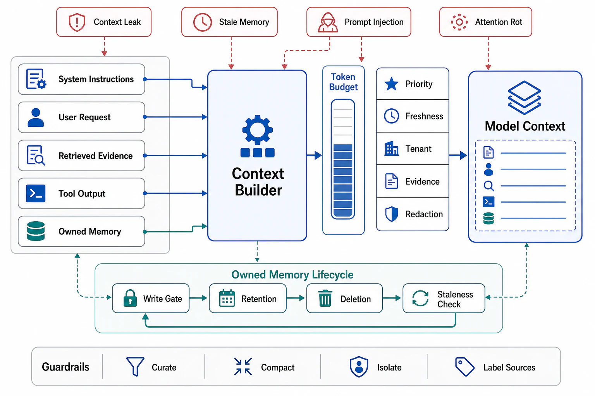

# Context Engineering and Agent Memory



## Abstract

Context is the agent's working memory and its scarcest resource, and the discipline this file owns — context engineering — starts from an empirical fact the window's headline number obscures: model attention degrades as context grows (the "context rot" regime: retrieval accuracy and instruction-following measurably decay long before the token limit), so the objective is never "fit everything in" but **the smallest set of high-signal tokens that maximizes the next decision's quality** ([Anthropic, "Effective context engineering"](https://www.anthropic.com/engineering/effective-context-engineering-for-ai-agents)). The window is a budgeted allocation with named tenants — system prompt, tool schemas (file 03's registry, task-scoped precisely to shrink this line), retrieved knowledge (Chapter 12's pipeline, consumed here), episode history, and the current observation — and three mechanisms manage the budget across an episode's life: **curation** (per-turn selection: which history, which retrievals, which tool responses *enter* — the just-in-time posture of loading identifiers and fetching content on demand, rather than front-loading everything Chapter 12 can find); **compaction** (the periodic summarize-and-reset of file 02's economics: quadratic → piecewise, bought at the standing risk that the summary dropped the detail a later step needed — which is why compaction is *structured* (preserve decisions, open questions, file/URI identifiers; compress narration) and why its information-loss rate is an eval target (file 09), not a vibe); and **isolation** (sub-agent contexts as clean rooms: a worker gets its task brief, not the orchestrator's whole history — file 05's topology reason, and the strongest anti-poisoning tool this chapter has, per file 02's correlation envelope). **Agent memory** — state that outlives the episode — is deliberately *not* a new invention: it is Chapter 03's machinery wearing a new name, and this file's contribution is the mapping: memory is derived state with an owner, a schema, a lifecycle, retention and deletion policies (Ch03 f09's GDPR-grade obligations apply to "the user's preferences the agent remembered" exactly as to any profile store), a *writer discipline* (what earns persistence — because a memory store that accretes every episode's trivia becomes a context-poisoning source with a database behind it), and a trust classification when read back (recalled memory is background signal, not instruction — file 08's injection surface includes the agent's own past).

## 1. The Window as a Budgeted Allocation

```text
Figure 1. The context ledger, per turn. Every line has an owner
and a token budget; the harness assembles, the model consumes.

  ┌────────────────────────┬────────────┬───────────────────────┐
  │ tenant                 │ budget     │ managed by            │
  ├────────────────────────┼────────────┼───────────────────────┤
  │ system prompt + policy │ fixed, low │ versioned artifact    │
  │ tool schemas           │ per phase  │ f03 task-scoping      │
  │ retrieved knowledge    │ per need   │ Ch12 pipeline; just-  │
  │                        │            │ in-time over preload  │
  │ episode history        │ elastic    │ curation + compaction │
  │ current observation    │ per f03's  │ tool response budgets │
  │                        │ δ budgets  │                       │
  └────────────────────────┴────────────┴───────────────────────┘
  ordering note (Ch08 f09): stable tenants FIRST (system, tools),
  volatile last — the ledger's layout is also the prefix-cache
  layout, and a harness that interleaves them pays 10× on the
  quadratic (file 02's discount, forfeited by formatting)
```

The envelope statement (standard 7): curation and compaction tune for the *measured* rot curve of the deployed model, and that curve is a model property that shifts across versions — a compaction period tuned on one model generation is stale config on the next (the eval canary of file 09 re-measures it; this is Ch10's stamp discipline reaching into prompt design). And the failure mode worth naming because every mature team has shipped it: **context hoarding** — the harness that passes everything "to be safe," achieving worse decisions at 10× cost; file 02's arithmetic plus the rot curve make hoarding strictly dominated, and the dossier's context ledger exists to make it visible.

## 2. Memory — Chapter 03's Questions, Asked of What Agents Remember

| Memory class | What it is | The governing contract |
|---|---|---|
| Episode scratch | The current loop's working notes (files, plans) | Dies with the episode; checkpointed by file 07, never "remembered" implicitly |
| Task/project memory | Decisions, conventions, state of long-running work (the CLAUDE.md-class artifact) | Versioned document with an owner and review — it is *configuration*, and edits are deploys |
| User/preference memory | Cross-session facts about a principal | Ch03 f09 in full: consent, schema, retention, deletion (deletion means *derived* copies too), per-tenant isolation, and read-back trust labeling |
| Learned procedure | Reusable skills/playbooks distilled from episodes | The highest bar: writes gated by verification (a failed approach must not persist as a recipe), versioned like code, eval-regressed like prompts |

Two disciplines cut across the rows. **The write gate**: persistence is earned — a memory write is a *derived-state write* with the same "which writes touch which keys" mapping Chapter 08 f05 demanded, an author (which episode, which evidence), and a TTL-or-review default; the alternative is the accretion store whose recall quality decays monotonically. **The read gate**: recalled memory enters context as labeled background ("recorded 2026-05-12, from episode X, confidence unverified"), never as instruction — because a poisoned memory (injected in a past episode, file 08's persistence attack) that reads back as authoritative instruction is prompt injection with a save button, and the label is the cheap structural defense.

## 3. Approval Gates

| Gate | Evidence Required | Failure Condition |
|---|---|---|
| Ledger gate | The context ledger per task class: tenants, budgets, owners; cache-friendly ordering; hoarding checked by the ledger sum vs the rot curve | "Pass everything" harnesses; tool schemas for all 80 tools in every turn |
| Curation gate | Just-in-time retrieval posture with identifiers-over-content defaults; per-turn selection logic inspectable in traces | Front-loaded corpora; retrievals nobody can trace to a decision |
| Compaction gate | Structured compaction (decisions/questions/identifiers preserved); information-loss measured in evals; period re-tuned per model generation | Naive truncation; the detail a later step needed, gone; compaction config stale across model bumps |
| Memory-contract gate | Every memory class mapped to its §2 contract: owner, schema, retention, deletion (including derived copies), write gate, read label | Accretion stores; preferences that survive deletion requests in caches; failed approaches persisted as recipes |
| Read-trust gate | Recalled memory labeled, non-instructional; memory store in file 08's injection-surface inventory | The agent's own past as an unauthenticated instruction channel |

## Output

The output of this file is a context and memory design under budget and contract: the window managed as a ledger of named tenants ordered for the cache and sized against the measured rot curve, curation and compaction converting the quadratic into affordable and structured loss, sub-agent isolation as the anti-poisoning instrument, and memory handled as the derived state it is — written through gates, read with labels, owned, retained, and deletable — so what the agent knows is engineered with the same rigor as what it does.

## References

- [Anthropic, "Effective context engineering for AI agents" — curation, compaction, just-in-time context](https://www.anthropic.com/engineering/effective-context-engineering-for-ai-agents)
- [Chapter 03 file 09 — AI-native state: the ownership/retention/deletion machinery memory inherits](../03-state-ownership-and-consistency-model/09-ai-native-state.md)
- [Chapter 08 file 09 — prefix-cache economics: why the ledger's ordering is a bill](../08-caching-materialization-and-invalidation/09-ai-native-caching.md)
- [Chapter 12 — retrieval and grounding: the pipeline this file consumes per need](../12-retrieval-memory-and-grounding-architecture/README.md)
