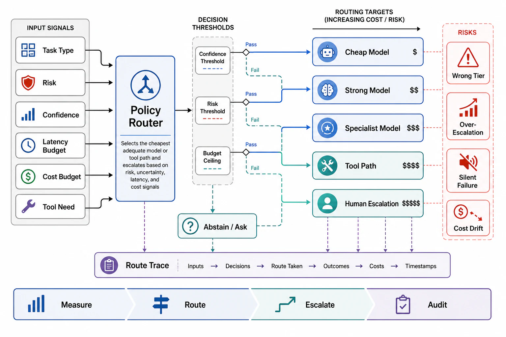

# Routing, Model Tiers, and Escalation



## Abstract

Not every step deserves the frontier model, and not every task deserves an agent's attention at all — routing is the discipline of matching work to the cheapest resource that meets its quality bar, and in agent systems it operates at three altitudes. **Task routing** (before the loop): classify incoming work and send it to the cheapest adequate handler — a template, a workflow, a small model, a full agent episode — which is file 01's admission table operating per request rather than per design, and the highest-leverage routing there is (the request that never becomes an episode costs 1000× less than the episode). **Step routing** (inside the loop): an episode's steps have wildly different difficulty — summarizing a tool response, extracting fields, or triaging a directory listing does not need the model that plans the migration — so mature harnesses run **model tiers** (frontier for plan/verify/repair decisions, mid-tier for routine tool-use steps, small models for extraction/classification sub-calls), with the arithmetic from file 02 making the case: input-heavy steps dominate the token bill, and moving the read-and-summarize steps to a 10×-cheaper tier cuts the episode's cost by whatever fraction of tokens those steps consume — typically most of it. **Escalation** (when the current tier fails): a bounded ladder — retry within tier (file 07's repair), escalate model tier, escalate topology (spawn help per file 05), escalate to a human — with each rung *triggered by measured signals* (verification failure, confidence below threshold, budget-burn anomaly, repeated repair of the same step) rather than by the model's self-assessment alone, because a model's confidence in its own stuck-ness is exactly the judgment that is unreliable when stuck. The validity envelope (standard 7) that governs the whole file: **routers are classifiers with error rates** — a misroute *down* costs quality (caught only if file 07's verification catches it: cheap-tier work must pass the same verify phase, not a discounted one), a misroute *up* costs money (invisible, chronic, and why tier-mix drift is a standing SLI in file 09) — and router thresholds tuned on one model generation are stale on the next (Ch10's stamp discipline applies to routing config as to everything else).

## 1. The Routing Ladder

```text
Figure 1. Three altitudes, one principle: cheapest adequate
resource, with verified adequacy.

  TASK routing (pre-episode; the 1000× lever)
    request ─► classifier ─► template / workflow / small-model
    one-shot / FULL EPISODE (only what earns it — f01's table
    as a runtime decision; misroutes caught by outcome evals)

  STEP routing (in-loop; the token-bill lever)
    step class ─► tier:  frontier: plan, verify, repair, merge
                         mid:      routine tool turns
                         small:    extract, classify, compress
    harness-owned tier map, per step CLASS (not per model whim);
    cheap-tier outputs pass the SAME verification

  ESCALATION (bounded ladder; signal-triggered)
    retry-in-tier (≤n, f07) → tier up → topology up (f05)
    → HUMAN (with the checkpoint + trace, f07/f09 — escalation
    hands over a resumable state, not a apology)
    triggers: verify-fail streak · confidence < τ (calibrated,
    not self-reported) · budget-burn anomaly · same-step repair
    loop detected
```

Design rules per altitude. **Task routers are contracts**: the classifier's classes, thresholds, and fallback (ambiguous → the safer, costlier route) are versioned config with eval coverage (a task router silently sending refund disputes to the template path is a product incident, not a cost win); Ch09 f06's fairness applies — routing may not starve a tenant class into the cheap path by budget pressure. **Step-tier maps are static-first**: the harness assigns tiers by step *class* (deterministic, auditable), with model-choice-by-model reserved for the cases the map genuinely cannot classify — dynamic self-routing ("decide if you need the big model") reintroduces the self-assessment problem escalation just engineered out. **Escalation to humans is an interface, not an exception**: the handoff carries the checkpoint, the trace summary, the specific question, and the resume path (file 07) — the measure of an escalation design is whether the human can act in minutes and the agent can *resume* after the answer, and "we page someone with a transcript" fails both halves.

## 2. The Economics, Worked

Take file 02's 50-turn episode (~2.8M input tokens naive, ~mostly-cached under Ch08 f09). Suppose measurement shows 70% of turns are routine tool-processing steps and 30% are decisions. Moving the routine 70% to a tier at 1/10th the per-token price cuts the episode's model bill to 0.3 + 0.7×0.1 = **37% of the frontier-only bill** — before caching, and stacking multiplicatively with it. The same shape governs task routing with bigger constants: if 60% of incoming requests resolve at workflow-or-below cost (~10³ tokens) instead of episode cost (~10⁶), the fleet's average cost per request drops by ~60% of the episode bill — which is why the task router's *classification quality* is worth real eval investment: each percentage point of misroute-up is a percentage point of the largest line item in the system. The counterweight keeps the file honest: **routing spends quality to save money, and only verification (file 07) plus outcome evals (file 09) can prove the spend was affordable** — a cost-optimization dossier without paired quality deltas is file 06 of Chapter 10's eval-gate violation, one layer up.

## 3. Approval Gates

| Gate | Evidence Required | Failure Condition |
|---|---|---|
| Task-routing gate | Router classes/thresholds versioned with eval coverage; ambiguity falls to the safer route; fairness checked per tenant class | Refund disputes in the template path; cheap-path starvation by budget pressure |
| Tier-map gate | Step-class → tier map as auditable config; cheap-tier outputs under the same verification; tier-mix as a standing SLI | Model-decides-model self-routing; discounted verification for discounted tiers |
| Escalation gate | The bounded ladder with signal-based triggers (calibrated confidence, verify-fail streaks, burn anomalies); same-step loop detection | Self-assessed stuck-ness as the only trigger; unbounded in-tier retries; escalations that lose the work |
| Human-interface gate | Escalation hands over checkpoint + trace summary + specific question + resume path; human turnaround and post-answer resumption measured | Transcript dumps as handoffs; episodes that die when the human answers |
| Paired-delta gate | Every routing cost win shipped with its measured quality delta (outcome evals per route/tier) | Cost dashboards without quality columns; misroute-down discovered by customers |

## Output

The output of this file is a routing design that spends the fleet's money where judgment lives: tasks resolved at the cheapest adequate rung with the router itself under contract and eval, steps tiered by auditable class maps whose savings are worked arithmetic rather than hope, and escalation as a bounded, signal-triggered ladder that hands humans resumable state — with every cost win paired to its quality delta, because routing without verification is just quality erosion with a good dashboard.

## References

- [Anthropic, "Building effective agents" — the routing pattern and effort-scaling guidance](https://www.anthropic.com/research/building-effective-agents)
- [Chapter 09 file 09 §3 — episode budgets the routing altitudes debit against](../09-scheduling-queues-and-resource-admission/09-ai-workload-scheduling.md)
- [Chapter 10 file 01 — the model-class economics (small-model serving) that make tiers cheap to run](../10-inference-runtime-and-gpu-serving-architecture/01-the-serving-runtime-and-the-buy-vs-run-decision.md)
- [Chapter 08 file 09 — cache economics that stack with tier economics](../08-caching-materialization-and-invalidation/09-ai-native-caching.md)
