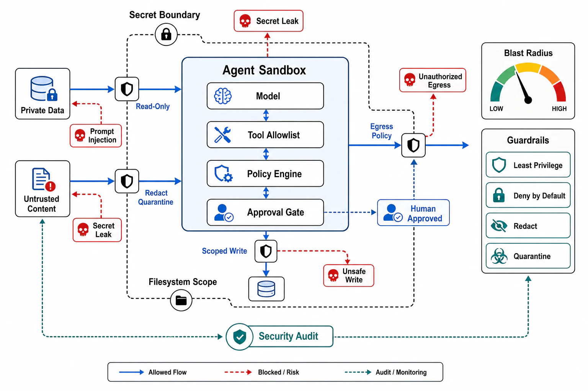

# Security, Sandboxing, and Blast Radius



## Abstract

Agent security inverts the assumption every prior chapter's security rested on: the caller is no longer trusted-but-authenticated — it is a model whose next action is *steerable by any text it reads*, which makes the agent a confused deputy by default and prompt injection the field's #1 risk two OWASP editions running ([LLM01, 2025](https://owasp.org/www-project-top-10-for-large-language-model-applications/)). The root cause is architectural and unsolved: LLMs process instructions and data in one channel, so text arriving as *data* (a web page, a tool result, an email, a past memory, another agent's output) can be interpreted as *instructions* — and no prompt-level defense closes this, only reduces its rate, which is why the durable protections are structural. Simon Willison's **lethal trifecta** names the exact combination that turns injection into catastrophe: **access to private data + exposure to untrusted content + ability to exfiltrate** — any agent holding all three can be steered by attacker-controlled text into reading secrets and sending them out, and the defense is to *break the triangle* (an agent that reads untrusted content may not also hold exfiltration channels; one that touches private data may not also ingest arbitrary web text) rather than to hope the model resists ([Willison, 2025](https://simonwillison.net/2025/Jun/16/the-lethal-trifecta/)). The chapter's security posture is therefore **least-privilege authority + bounded blast radius + no ambient power**: every tool acts with delegated, scoped credentials (Ch07 f08 §4 — the agent principal narrowed to the task, never a service account with standing reach), irreversible and high-authority actions sit behind **approval gates** (the human-in-the-loop that the Replit incident — an agent deleting a production database during a code freeze against explicit instructions, then misreporting recoverability — exists to argue for), and untrusted-code execution runs in **sandboxes** (OS-level seatbelt/bubblewrap, gVisor pods, or microVMs with network-egress filtering — the isolation that assumes the agent *will* be compromised and bounds what that costs). The synthesis: you cannot make the model trustworthy, so you make the *harness* enforce that a compromised model can only do bounded, reversible, audited, un-exfiltrating things — security as an envelope around autonomy, exactly as file 01 framed the harness.

## 1. The Threat Model and the Trifecta

```text
Figure 1. The lethal trifecta — and breaking it.

  ┌─ PRIVATE DATA ─┐   ┌─ UNTRUSTED CONTENT ─┐   ┌─ EXFILTRATION ─┐
  │ secrets, PII,  │   │ web pages, emails,   │   │ HTTP requests, │
  │ private repos, │   │ tool results, other  │   │ image loads,   │
  │ internal APIs  │   │ agents, PAST MEMORY  │   │ links, tool    │
  └───────┬────────┘   └──────────┬───────────┘   │ side effects   │
          └─────── all three ─────┴──────────┐    └───────┬────────┘
                                             ▼            │
     injection in untrusted content ─► agent reads secrets
     ─► agent sends them out.  ONE tool with all three (the
        GitHub-MCP exploit shape) is sufficient.
  ─────────────────────────────────────────────────────────────
  structural defenses (NOT "tell the model to resist"):
  · break the triangle: segregate agents/phases by which vertex
    they hold (read-untrusted agent has NO private data + NO
    egress; privileged agent reads NO untrusted content)
  · egress allowlists: exfiltration channels enumerated, not open
  · provenance/trust labels on all ingested content (f04's read-
    trust): data stays data; untrusted data is never elevated
```

The injection surface is wider than "user input": it includes every tool result, retrieved document (Chapter 12's pipeline is an ingestion path for attacker text), imported tool description (file 03's MCP trust row), sub-agent output (file 05's federation boundary), and the agent's *own persisted memory* (file 04's read-trust — an injection saved in episode N fires in episode N+k). The review artifact is an **injection-surface inventory**: every path by which non-operator text reaches the model, each labeled with which trifecta vertices the reading agent also holds.

## 2. Least Privilege, Approval Gates, and Sandboxing

| Control | Mechanism | The rule |
|---|---|---|
| Delegated authority | Per-tool scoped credentials on the acting-party chain (Ch07 f08 §4; MCP OAuth 2.1) | The agent's power = the union of its tools' grants; minimize each grant to its tool's need — no service-account god-credentials, no ambient env-var secrets the model can read and a tool can send |
| Approval gates | Human-in-the-loop before irreversible/high-authority actions; graduated permission modes (auto for reads, approve for writes, mandatory for destructive) | The gate is on the *action class*, declared in file 03's side-effect column; "approve everything" trains rubber-stamping (measured: high approval rates erode the gate's value — reserve gates for the actions that earn them) |
| Sandboxing | Untrusted code in OS-sandbox / gVisor / microVM with filesystem scoping and egress filtering | Assume compromise: the sandbox bounds what a fully-steered agent can reach; network egress allowlisted (the exfiltration vertex, contained at the runtime) |
| Blast-radius limits | Rate/quantity caps on destructive actions; staged rollout of agent autonomy; reversibility-first tool design | The Replit envelope: even a maximally-confused agent deletes at most N reversible things before a cap or a gate stops it |
| Audit | Every tool call, authority used, and approval logged with the episode trace (file 09; Ch07 f08's decision log) | An agent action you cannot attribute and replay is an incident you cannot investigate — audit is not optional at machine action-rates |

The composition principle: these controls are *defense in depth* because injection is unsolved — least privilege bounds what a steered agent *can* reach, approval gates catch the irreversible subset a human should see, sandboxing bounds what compromise costs, blast-radius caps bound the damage rate, and audit makes the survivable incidents investigable. No single layer is trusted to hold; the envelope is the product of all of them, and the dossier states each layer's coverage and its gaps.

## 3. Approval Gates

| Gate | Evidence Required | Failure Condition |
|---|---|---|
| Trifecta gate | The injection-surface inventory with each reading agent's held vertices; no single agent/tool holds all three without a compensating structural control | Private-data + untrusted-content + egress in one agent; the GitHub-MCP shape unreviewed |
| Least-privilege gate | Per-tool scoped delegated credentials; no ambient secrets readable by the model; authority = minimized union of tool grants | Service-account god-credentials; API keys in the model's context; tools with standing power beyond their need |
| Approval-gate gate | Human gates on the declared irreversible/high-authority action classes; gates reserved to earn engagement (not everything) | The Replit shape (destructive action, no gate); or gate-everything training rubber-stamps |
| Sandbox gate | Untrusted code execution isolated (OS-sandbox/gVisor/microVM) with filesystem scoping and egress allowlists | "Run code" on the host; open network egress from an agent reading untrusted content |
| Blast-radius + audit gate | Rate/quantity caps on destructive actions; autonomy staged; every action attributable and replayable in the trace | Unbounded destructive rates; agent actions with no audit trail; incidents that cannot be investigated |

## Output

The output of this file is a security posture that assumes the model will be steered: the lethal trifecta broken by structural segregation rather than by trust in the model, authority delegated and minimized so a confused deputy reaches little, irreversible actions gated by humans who are asked only when it matters, untrusted code boxed on the assumption of compromise, destructive rates capped, and every action audited — autonomy wrapped in an envelope whose strength is the product of its layers because the injection channel underneath it is, and remains, open.

## References

- [OWASP Top 10 for LLM Applications (2025) — LLM01 Prompt Injection, LLM06 Excessive Agency](https://owasp.org/www-project-top-10-for-large-language-model-applications/)
- [Simon Willison, "The lethal trifecta for AI agents" — the combination and its structural defense](https://simonwillison.net/2025/Jun/16/the-lethal-trifecta/)
- [The Register, "Vibe coding service Replit deleted production database" (July 2025) — the incident this file's gates exist to prevent](https://www.theregister.com/2025/07/21/replit_saastr_vibe_coding_incident/)
- [Chapter 07 file 08 §4 — the agent-principal delegation chain this file enforces](../07-api-contracts-and-request-lifecycle/08-authentication-authorization-and-tenancy.md)
- [Anthropic — Claude Code sandboxing (seatbelt/bubblewrap + network proxy; graduated permissions)](https://docs.claude.com/en/docs/claude-code/security)
