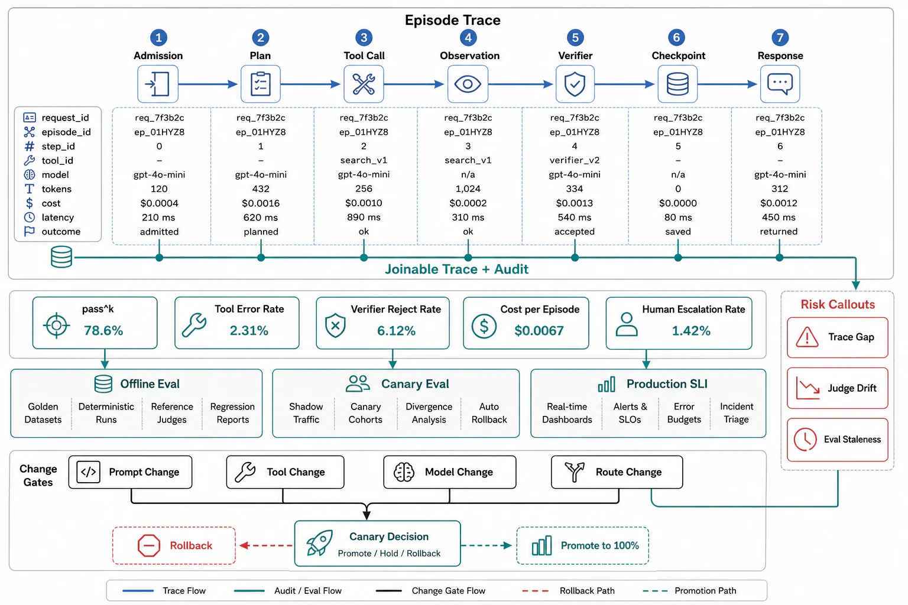

# Agent Observability and Evaluation



## Abstract

An agent system whose episodes cannot be replayed and whose quality cannot be measured is not operable — it is a slot machine with a logo — and this file owns the two instruments that make it a system: **the episode trace** (the full decision record — every observation, plan, tool call with arguments and result, verification outcome, tier/route taken, tokens and cost per step, and the budget ledger — spanning the harness so that any episode can be reconstructed and any failure located) and **the eval harness** (offline task suites and online sampling that measure whether the agent *succeeds*, at what reliability, at what cost, at what quality). The observability half inherits Chapter 01 file 09's discipline with agent-shaped SLIs and one hard rule: because the loop's behavior is non-deterministic (Ch10's determinism posture) and emergent over many steps, **the trace is the primary debugging surface, not logs** — a per-step structured span tree is the difference between "the agent did something wrong" and "at step 14 it misread tool X's response and every later step compounded it." The evaluation half confronts the measurement problem this whole chapter has circled: agent success is often not a scalar — a research report, a code change, a resolved ticket are graded on multiple axes with no single ground truth — so the harness combines **executable/structural checks** where the domain offers them (file 07's strongest rungs, run as the eval's backbone), **calibrated LLM judges** for the rest (file 07's bounded instrument, with human-labeled anchor sets and measured agreement), and **human evaluation** on sampled episodes as the ground-truth calibration for everything above — reported not as pass@k vanity but as **pass^k reliability** (file 02: all-k-succeed, the metric that survives deployment) plus the cost and latency distributions the success rate is meaningless without. The through-line to every prior chapter's verification file: agents change through *prompt edits, tool changes, model swaps, and routing-config tweaks*, each of which can move quality with no code diff — so the eval harness is a **canary gate** (Ch10 f10's discipline, inherited): nothing reaches production behavior without an eval run, and every one of those four change types is stamped as a version that resets the evidence.

## 1. The Episode Trace

```text
Figure 1. The trace as the debugging surface. One span tree per
episode; every node is a decision the harness can replay.

  episode[id, task, principal, budget]
   ├─ observe    {inputs, retrieved (Ch12 sources + provenance)}
   ├─ plan       {plan text, model tier, tokens, cost}
   ├─ act        tool=search  args={...}  → result{tokens, ms}
   │             authority=<scoped cred>  approved=n/a
   ├─ verify     mechanism=structural  pass=true
   ├─ act        tool=write_db args={...} → result
   │             authority=<scoped>  approved=HUMAN@12:04  ← gate
   ├─ repair     trigger=verify-fail  attempt=2  finding="..."
   └─ finalize   {outputs, budget spent, exit=verified-done}
  ─────────────────────────────────────────────────────────────
  non-negotiables: every tool call's ARGS + AUTHORITY + APPROVAL
  logged (file 08's audit); token/cost per step (file 02's
  ledger); the trace carries the serving-generation + prompt +
  tool versions (the stamp) so a regression is attributable to
  the change that caused it
```

The SLI set the trace feeds:

| SLI | Definition | What it catches |
|---|---|---|
| Task success rate + pass^k | Outcome-verified success; all-k-succeed at deployment k | The demo-to-product gap (file 02); reliability under repetition |
| Cost per episode (dist.) | Tokens × price, incl. cache-hit share, per task class | The quadratic (file 02) escaping; tier-mix drift (file 06) |
| Steps per episode (dist.) | Loop length distribution, with the tail | Budget-tail growth; degradation into wandering |
| Tool success / selection rates | Per tool: call success, and correct-selection rate | File 03's ergonomics failing; the tool nobody uses right |
| Verification pass / repair rates | Per phase: verify outcomes, repair attempts, escalations | File 07 breaking; doom loops; the verifier gap widening |
| Human-intervention rate | Approvals, escalations, corrections per episode | Autonomy that isn't; gates that rubber-stamp (file 08) |
| Injection / anomaly signals | Egress-to-new-hosts, authority-escalation attempts, trifecta-adjacent patterns | File 08's attacks in progress |
| TTF-useful-action + episode latency | Time to first useful step; wall-clock dist. | File 02's latency composing; tool-latency dominance |

## 2. Evaluation as a Canary Gate

The eval harness is built from three layers stacked by cost and trust (file 07's ladder, operationalized): a **regression suite** of tasks with executable/structural ground truth (run on every change, cheap, the backbone — coding and tool-use tasks shine here because they verify themselves); a **judge tier** with rubrics and human-anchored calibration for open-ended tasks (agreement rate measured and expiring); and **human evaluation** on sampled production episodes (the calibration ground truth, and the only honest signal for taste-laden outputs). The gate discipline: the four agent-change types — **prompt/instruction edits, tool registry/description changes, model swaps or tier-map changes, routing-config changes** — each ship through the harness before production, because each can move quality invisibly (a tool description edit that drops the tool's selection rate 20 points has no code diff and no error, only a worse agent), and each is a stamp field (file 10) that resets the affected evidence. The honest limits, stated for the dossier: offline evals drift from production distribution (the tasks users bring are not the tasks you tested — online sampling with human review is the correction), judges are gameable and version-fragile (calibration has a half-life), and *no eval fully captures open-ended quality* (the verifier gap of file 07 is an eval gap too) — so the review's standard is not "the evals pass" but "the eval coverage, its known blind spots, and the online-monitoring that watches those blind spots are all stated."

## 3. Approval Gates

| Gate | Evidence Required | Failure Condition |
|---|---|---|
| Trace gate | Per-episode span tree with args/authority/approval/tokens/cost per step and the change-version stamp; replay demonstrated | Log-string debugging of emergent failures; episodes that cannot be reconstructed |
| SLI gate | The §1 set implemented per task class and tenant; pass^k not pass@k; cost/step/latency as distributions with tails | Scalar success rates; averages hiding the tail; cost unwatched until the invoice |
| Eval-layer gate | The three-layer harness (regression/judge/human) with executable ground truth as backbone, judge calibration measured, human sampling live | Judge-only evals uncalibrated; no executable backbone where the domain offers one |
| Canary gate | All four change types (prompt/tool/model/route) gated through the harness pre-production; each a stamp field resetting evidence | Prompt edits shipped straight to prod; tool-description changes with no eval; silent model swaps |
| Blind-spot gate | Eval coverage, its stated blind spots, and the online monitoring that watches them, all documented | "The evals pass" as sufficient; the verifier gap unacknowledged; offline-only measurement |

## Output

The output of this file is the operability layer: an episode trace rich enough to replay any decision and attribute any regression to the change that caused it, an SLI set that reports reliability as pass^k with cost and latency as distributions, and an eval harness stacked from executable ground truth through calibrated judges to human review — run as a canary gate over every prompt, tool, model, and routing change, honest about the blind spots no eval closes and monitored where those blind spots live.

## References

- [Anthropic, "Building effective agents" (Appendix: evaluation and observability guidance)](https://www.anthropic.com/research/building-effective-agents)
- [Yao et al., "τ-bench" (2024) — pass^k and outcome-state evaluation](https://arxiv.org/abs/2406.12045)
- [Chapter 01 file 09 — the observability/SLO/audit discipline agent traces inherit](../01-architectural-objective-and-system-boundary/09-observability-slo-and-audit-contract.md)
- [Chapter 10 file 10 — the canary/stamp discipline this file applies to agent changes](../10-inference-runtime-and-gpu-serving-architecture/10-verification-of-serving-contracts.md)
