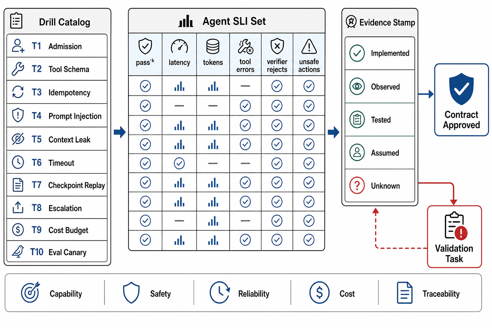

# Verification of Agent Contracts



## Abstract

Agent verification faces every hard property at once: the system is non-deterministic (Ch10's posture), emergent over many steps (file 02's exponentials), adversarially reachable (file 08's open injection channel), and often lacks a scalar success signal (file 07's verifier gap) — so this file's catalog pairs *capability* drills (does it succeed, reliably, affordably) with *safety* drills (can it be steered, and is the blast radius bounded when it is), and its stamp discipline is the strictest composition in the book. Every piece of evidence carries an **episode-generation stamp** `{model + serving generation (Ch10's five fields), system/tool prompts + versions, tool registry + schemas, routing/tier config, harness version}` — six fields, any of whose change resets dependent evidence, because an agent is the *product* of all of them and a success rate measured against last week's prompt on last week's model with last week's tools certifies a system that no longer exists. Two postures carry forward and one sharpens. From file 02/09: reliability is **pass^k**, and load is generated with *adversarial* inputs alongside benign ones (the injection surface is part of the contract). From Ch10: the **canary spine** (file 09) is the standing re-minting machine across all six stamp fields. The sharpening: agent drills are *expensive and partially non-reproducible* (an episode costs real tokens and may not repeat exactly), so the catalog leans harder than any prior chapter on **large-N statistical drills** (run the suite k times, report distributions and pass^k, not single verdicts) and on **the trace as the falsifiable artifact** (a drill's pass condition is checkable in the span tree, not inferred from the final answer).

## 1. The Drill Catalog

```text
Figure 1. The evidence loop. Capability drills (T1-T5) and safety
drills (T6-T9) share one six-field stamp; the eval canary (T10) re-
mints across every prompt/tool/model/route change continuously.

  drill Tn ──► evidence {claim, class, date, episode-generation
      ▲                  stamp: model/prompts/tools/routing/harness}
      │                        │ any of six fields changes
      │                        ▼
      └── canary re-mints   reset → assumed (with expiry)
```

| Drill | Hypothesis under test | Procedure / fault injected | Pass condition | Cadence |
|---|---|---|---|---|
| T1 Task success (pass^k) | The agent succeeds reliably at its task class (files 02/09) | Run the regression suite k times per task; outcome-verify (file 07's executable/structural rungs) | pass^k ≥ target at deployment k; cost/latency distributions within budget | Standing, canary + release |
| T2 Horizon reliability | Success holds at production step-counts (file 02) | Long-horizon tasks at the 90th-percentile step count; measure per-step p and the pⁿ curve | Measured pⁿ matches the projection; verification lift (p→p′) confirmed at the decisive steps | Per model/prompt change |
| T3 Tool contract | Tools behave per file 03's registry rows under agent use | Fault each tool (timeout, error, malformed result); measure selection + repair | Timeouts bounded; retries respect idempotency; error text steers repair; selection rate per tool ≥ bar | Standing, CI + quarterly fault run |
| T4 Context integrity | Curation/compaction preserve decision-critical info (file 04) | Long episodes with planted must-not-lose facts; force compaction; measure recall | Planted facts survive compaction; hoarding within ledger budget; rot-curve tuning current | Per model change + quarterly |
| T5 Economics | Episode cost/latency within budget under the discounts (file 02) | Measure token ledger, cache-hit share, tier mix, wall-clock at the production mix | Within budget; cache-hit + tier-mix at target; tail cut by budget ceiling | Standing SLI + monthly drill |
| T6 Injection resistance | Injected instructions in untrusted content don't steer harmful action (file 08) | Adversarial suite: injections in tool results, docs, memory, sub-agent outputs; attempt exfiltration/authority-escalation | No trifecta completion; structural defenses hold; attempts logged and alarmed | Standing adversarial canary + quarterly red-team |
| T7 Least-privilege | An agent cannot exceed its delegated authority (file 08) | Probe each tool's credential scope; attempt cross-scope/ambient-secret access | Zero cross-scope access; no ambient secrets reachable; authority = declared union | Per tool/credential change + release |
| T8 Blast radius | A steered/erring agent's damage is bounded and reversible (file 08) | Simulate a confused/compromised agent; measure destructive-action reach against caps and gates | Caps + approval gates halt within bound; actions reversible or gated; the Replit shape blocked | Semi-annual game day |
| T9 Recovery | Episodes survive crash/deploy/pause and resume correctly (file 07) | Kill mid-episode; deploy during episodes; long approval pauses | Checkpoint restore; ground-truth re-verified on resume; idempotent steps; no double side effects | Per harness change + quarterly |
| T10 Change canary | No prompt/tool/model/route change regresses quality or safety (file 09) | Run T1/T6 subsets on every change of the six stamp fields | Both families gate promotion; regressions block; stamp recorded | Standing — the pipeline itself |

## 2. The Agent SLI Set and Its Standing Posture

The SLIs are file 09's set, and this file's contribution is their *verification posture*: which are standing monitors (re-mint continuously — T1's success rate, T5's economics, T6's injection signals, all cheap to sample in production) versus calendar drills (T8's blast-radius game day, T9's recovery injection, the quarterly red-team — expensive, destructive, or adversarial enough to need a window). The design rules inherited and applied: alert on derivatives (pass^k sagging, cost-per-episode creeping, injection-signal rate rising, human-intervention climbing), slice per task class and tenant before averaging, and — the agent-specific one — **watch the safety SLIs with the same standing as the capability SLIs**, because an agent that is getting *cheaper and more capable* while its injection-resistance quietly degrades (a new tool widened the trifecta, a prompt edit weakened a guardrail) is the failure mode this chapter most wants caught before an incident writes the postmortem.

## 3. Evidence Classes and the Episode-Generation Stamp

The taxonomy — *tested* (a drill, dated), *observed* (standing SLI over a window), *assumed* (declared, expiring) — with the six-field reset rules: **model/serving** resets T1/T2/T6 (capability *and* safety shift with the model — the strictest coupling, inherited from Ch10 and extended: a model that got better at the task may have gotten more injectable); **prompts** reset T1/T4/T6 (a system-prompt edit is a behavior change); **tools** reset T3/T6/T7 (a new tool is new capability and new attack surface); **routing/tier** resets T1/T5 (cheaper routing may be lower quality); **harness** resets T8/T9 (the enforcement layer changed). The canary spine (T10) makes this affordable exactly as Ch10's did — it re-mints the cheap capability-and-injection subset on every change, leaving the calendar for what only game days and red-teams can produce. The honest note the stamp forces into the open: because six fields each reset a slice, agent evidence *expires fast* — an agent system under active development has a short evidence half-life, and the dossier's job is to make that half-life visible rather than to pretend a quarter-old eval still describes today's agent.

## 4. Approval Gates

| Gate | Evidence Required | Failure Condition |
|---|---|---|
| Pairing gate | Every capability drill paired with a safety drill; T6 injection resistance run with the same standing as T1 success | Capability verified, safety assumed; the agent that got better and more injectable, unnoticed |
| pass^k gate | Reliability reported as pass^k at deployment k with cost/latency distributions; large-N statistical drills, not single runs | pass@k vanity; single-episode "it worked" as evidence |
| Adversarial gate | T6/T7/T8 run with real adversarial inputs and simulated compromise in production-shaped conditions; quarterly red-team | Injection tested with polite inputs; blast radius assumed from architecture diagrams |
| Stamp gate | Six-field episode-generation stamps on all evidence; resets enforced; the dossier states its evidence half-life | Success rates from a prior model/prompt/tool generation, still cited as current |
| Canary-spine gate | T10 standing over all six change types, gating on capability and safety; recovery (T9) rehearsed | Changes shipped without eval; recovery tested first in an incident |

## Output

The output of this file is the chapter's evidence base: ten drills pairing capability (success, horizon, tools, context, economics) with safety (injection, least-privilege, blast radius, recovery) under a canary spine, reliability reported as pass^k over large-N runs with the trace as the falsifiable artifact, and a six-field episode-generation stamp that makes an agent's fast evidence half-life visible instead of pretending a stale eval still describes a system rebuilt by every prompt edit since.

## References

- [Yao et al., "τ-bench" (2024) — pass^k and the large-N reliability posture](https://arxiv.org/abs/2406.12045)
- [OWASP LLM Top 10 (2025) — the adversarial classes T6/T7/T8 mechanize](https://owasp.org/www-project-top-10-for-large-language-model-applications/)
- [Principles of Chaos Engineering — hypothesis-driven injection (T8/T9's method)](https://principlesofchaos.org/)
- [Chapter 10 file 10 — the serving-generation stamp this chapter's six-field stamp extends](../10-inference-runtime-and-gpu-serving-architecture/10-verification-of-serving-contracts.md)
