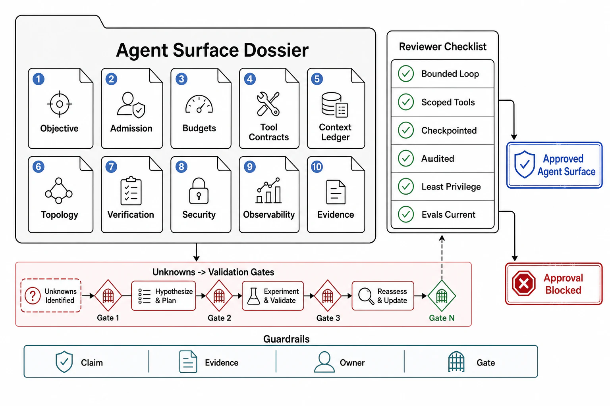

# Agent Review Templates



## Abstract

This file assembles the chapter into its executable form: the dossier a team completes to put an agent system — admission verdict to blast-radius envelope — in front of an architecture review, and the checklist the reviewer walks to approve it. The organizing principle is the chapter's root discipline made procedural: autonomy is an envelope the harness enforces, so every dossier section forces the written answer where the model's discretion would otherwise decide — is a loop even warranted, what does the pⁿ arithmetic project, what may each tool do with whose authority, how is context kept small and memory kept owned, where do outputs merge, how is success actually verified, what does a steered agent reach, and how is any of it observed. Evidence citations must satisfy file 10's stamp discipline: dated, six-field episode-generation-stamped, adversarial where safety is the claim, and re-minted by the canary spine where the pipeline can carry them.

## 1. Dossier Assembly

```text
Figure 1. Dossier assembly: each section is produced by one file's
gates; the checklist consumes the whole.

  f01 ─► §A admission & loop         f06 ─► §F routing & tiers
  f02 ─► §B failure & economics      f07 ─► §G verify/repair/ckpt
  f03 ─► §C tool contracts           f08 ─► §H security & blast radius
  f04 ─► §D context & memory         f09 ─► §I observability & evals
  f05 ─► §E topology                 f10 ─► §J evidence ledger
                     │
                     v
        reviewer checklist (§3) ─► approve agent / findings
```

## 2. The Agent Surface Dossier

**§A Admission and loop (file 01).** The workflow-vs-agent verdict per task with the simpler-rung analysis, the verifiability precondition, and a re-decision date. The six-phase loop with owners/artifacts/exits; the harness-owned property list (budgets, tools, context, checkpoints, traces).

**§B Failure and economics (file 02).** Measured per-step p, step-count distribution, the pⁿ projection vs target, and the verification lift. pass^k at deployment k. The token ledger (quadratic + cache/compaction/hygiene discounts); budgets derived from the n-distribution with tail multipliers; the wall-clock decomposition.

**§C Tool contracts (file 03).** The registry: one complete row per tool (schema, timeout, idempotency, side-effect class, response budget, authority, fallback). Ergonomics eval rates; curation/naming; version pinning; the §2 import checklist per MCP/third-party tool.

**§D Context and memory (file 04).** The context ledger (tenants, budgets, owners, cache-ordering); curation/compaction with information-loss evals and rot-curve tuning; every memory class mapped to owner/schema/retention/deletion/write-gate/read-label.

**§E Topology (file 05).** The merge-criterion analysis (findings vs decisions) with the topology derived; single-agent default stated; delegation briefs as artifacts; merge discipline; the fan-out economics and threshold; federation under file 08 if present.

**§F Routing and tiers (file 06).** Task-router classes/thresholds with eval coverage; the step-class tier map; the escalation ladder with signal triggers and the human interface; every cost win paired to a quality delta.

**§G Verify/repair/checkpoint (file 07).** The verification mechanism per rung with executable/structural anchors and the verifier-gap admission; judge calibration; verification placement at decisive steps; bounded informed repair with rollback; phase-boundary checkpoints with resume re-verification.

**§H Security and blast radius (file 08).** The injection-surface inventory with per-agent trifecta vertices; least-privilege delegated credentials; approval gates on declared action classes; sandboxing with egress allowlists; destructive-rate caps; audit coverage.

**§I Observability and evals (file 09).** The episode-trace schema (args/authority/approval/tokens/cost/stamp per step); the SLI set per task/tenant; the three-layer eval harness; the canary gate over all four change types; stated eval blind spots and their online monitoring.

**§J Evidence ledger (file 10).** T1–T10 status: date, result, six-field stamp; capability paired with safety; pass^k over large-N; the evidence half-life stated; the canary spine's gates.

## 3. Reviewer Checklist

| # | Check | Source gate | Common failure it catches |
|---:|---|---|---|
| 1 | Agent earned over workflow/one-call; verifiability precondition met; re-decision dated | f01 admission | Agents by fashion; unverifiable tasks owned; frameworks seeking tasks |
| 2 | Six phases with owners/artifacts/exits; plans and verifications visible in traces | f01 phase | No distinct verify phase; termination by model whim |
| 3 | Harness owns budgets/tools/context/checkpoints/traces; model requests, harness grants | f01 harness | The model extending its own limits; side effects outside the tool layer |
| 4 | pⁿ projection vs target; verification lift quantified; failure correlation addressed | f02 exponential + correlation | Demos at n=5 sold at n=30; independence assumed |
| 5 | pass^k (not pass@k) at deployment k | f02 + f09 | Best-of-k marketed as reliability |
| 6 | Token ledger with discounts; budgets from measured distribution; δ (tool responses) bounded | f02 economics | The 2.8M-token episode on the invoice; 50k-token tool dumps |
| 7 | Every tool a complete registry row; retries respect declared idempotency | f03 contract | Bare function bindings; retries re-executing payments |
| 8 | Tool descriptions/errors as steering text, eval-tested; registry curated | f03 ergonomics + registry | Stack-trace errors; near-duplicate tools; registry sprawl |
| 9 | MCP/third-party tools through the trust/quality/authority checklist | f03 import | Servers on vibes; imported descriptions unreviewed |
| 10 | Context ledger with budgets/owners/cache-ordering; hoarding checked | f04 ledger | Pass-everything harnesses; the rot curve ignored |
| 11 | Structured compaction with measured loss; memory owned/retained/deletable/write-gated/read-labeled | f04 compaction + memory | Naive truncation; accretion stores; memory as an instruction channel |
| 12 | Topology by merge criterion; single-agent default; briefs schema'd; findings not transcripts | f05 criterion + brief + merge | Multi-agent by fashion; vague briefs; transcript re-coupling |
| 13 | Fan-out bill priced vs gain; threshold stated | f05 economics | 15× token bills on single-loop tasks |
| 14 | Task/step routing under eval; tiers by auditable class map; cheap tiers same verification | f06 routing + tier | Self-routing; discounted verification; misroute-down uncaught |
| 15 | Escalation ladder signal-triggered; human handoff carries resumable state | f06 escalation + human | Self-assessed stuck-ness; escalations that lose the work |
| 16 | Verification per rung with executable/structural anchors; verifier gap admitted; judges calibrated | f07 ladder + judge | Self-assessment as verification; judge-gated irreversible actions |
| 17 | Verification at decisive steps; repair bounded/informed with rollback-before-retry | f07 placement + repair | Naked irreversible steps; doom loops; retry on debris |
| 18 | Phase checkpoints with resume re-verification and idempotent steps; deploys drain via checkpoint | f07 checkpoint | Episodes dying with processes; the budget cliff losing everything |
| 19 | Injection-surface inventory; no single agent holds the whole trifecta without a structural control | f08 trifecta | The GitHub-MCP shape; private+untrusted+egress in one agent |
| 20 | Least-privilege delegated creds; no ambient secrets; approval gates on irreversible actions | f08 least-privilege + approval | God-credentials; the Replit shape; gate-everything rubber-stamping |
| 21 | Untrusted code sandboxed with egress allowlists; destructive rates capped; all actions audited | f08 sandbox + blast + audit | Code on the host; open egress; un-investigable incidents |
| 22 | Episode trace replays any decision; SLIs per task/tenant with cost/latency distributions | f09 trace + SLI | Log-string debugging; scalar success hiding the tail |
| 23 | Three-layer eval harness; canary over prompt/tool/model/route changes; blind spots + monitoring stated | f09 eval + canary | Prompt edits to prod; "the evals pass" as sufficient |
| 24 | T1–T10 with six-field stamps; capability paired with safety; evidence half-life stated | f10 all | Stale-generation evals cited as current; safety assumed |

## 4. Approval Statement

Approval of an agent surface dossier asserts: the loop is warranted and bounded by a harness that owns every limit; its failure and cost arithmetic are measured and budgeted; its tools act under contract and least-privilege authority; its context is curated and its memory owned; its topology follows the merge criterion; its work is verified at the decisive steps and checkpointed into resumable state; its blast radius is bounded on the assumption of compromise; and its behavior is traced and evaluated under a canary spine. It asserts *nothing* about the APIs the tools wrap (Chapter 07), the serving fleet beneath (Chapter 10), the admission machinery above (Chapter 09), or the retrieval pipelines it consults (Chapter 12) — those approvals are prerequisites, cited by reference, never re-argued here.

## Output

The output of this file — and the chapter — is an executable review instrument: a ten-section dossier that forces autonomy into a written, harness-enforced envelope, and a twenty-four-point checklist that converts this chapter's gates into findings a review can actually produce.

## References

- [Chapter 11 file map — the approval dependency graph this dossier assembles](00-chapter-file-map.md)
- [Chapter 01 file 11 — evidence classification the ledger inherits](../01-architectural-objective-and-system-boundary/11-evidence-classification-and-architecture-review.md)
- [Anthropic, "Building effective agents" — the design discipline this template operationalizes](https://www.anthropic.com/research/building-effective-agents)
