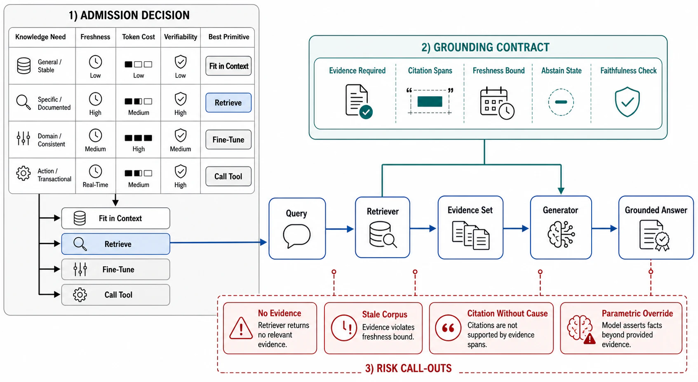

# The Retrieval Admission Decision and the Grounding Contract



## Abstract

Retrieval augments a model with knowledge it was not trained on — fresher, private, larger, or more attributable than its weights — and this chapter's opening move is, as always, the admission decision: retrieval is machinery with a cost, a failure surface, and a quality ceiling, and it must be earned against the alternatives. The four contenders and the honest arithmetic that chooses among them: **retrieve** (RAG — inject fetched passages, best when knowledge is large/fresh/private/must-be-attributable), **fit in context** (long-context — hand the model the whole corpus, best when it is small enough that the token bill and the lost-in-the-middle degradation are tolerable; the measured trade is that long context wins on average quality for self-contained material while RAG is **8–82× cheaper in tokens** for typical workloads — [LaRA, ICML 2025](https://icml.cc/virtual/2025/poster/46069)), **train it in** (fine-tune — best for skills/format/tone, worst for facts, because a fine-tune is a lossy expensive cache of knowledge that goes stale the moment the corpus changes), and **call for it** (tools/APIs — best when the answer is computed or transactional, not retrieved from a document). The chapter's second foundational move is the **grounding contract**: RAG's whole promise is that outputs are *attributable to retrieved evidence*, and that promise is only real if it is a designed, measured contract — which passages grounded which claims, whether a citation *supports* the claim (correctness) and whether it *caused* the claim (faithfulness — up to 57% of RAG citations are post-rationalized: the model generated from parametric memory and cited a superficially matching document afterward, [correctness ≠ faithfulness](https://arxiv.org/abs/2412.18004)), and what the system does when retrieval returns nothing relevant (say "I don't know," never smoothly hallucinate). The file fixes the pipeline anatomy every later file details — ingest → chunk → embed → index → retrieve → rerank → pack → generate-with-citations — and its governing property, developed arithmetically in file 02: it is a *chain of recall stages*, and the answer is only as available as the weakest link that had to carry it.

## 1. The Admission Table — Retrieve, Fit, Train, or Call

| Situation | Verdict | The checkable condition |
|---|---|---|
| Large / fresh / private knowledge, attribution required | **Retrieve (RAG)** — the design case | Corpus exceeds context or changes faster than fine-tuning cycles; outputs must cite sources; the token math beats long-context (8–82×) at the corpus size |
| Corpus small and self-contained; attribution optional; budget tolerant | **Fit in context** (long-context) | Whole relevant set fits with room to spare *and* the per-query token bill × volume is affordable; watch lost-in-the-middle for the parts that matter |
| Need behavior/format/skill, not facts | **Fine-tune** (and *still* retrieve facts) | The gap is *how* the model responds, not *what* it knows; fine-tuning facts is a stale, unattributable, expensive knowledge cache |
| Answer is computed, transactional, or real-time | **Call a tool** (Chapter 11 file 03) | The truth lives in a system of record or a computation, not a document — retrieval of a stale snapshot is the wrong shape |
| Knowledge is tiny, stable, and universal | **Put it in the prompt** | A 200-token policy does not need a vector index; the pipeline is overhead |
| Retrieval cannot be evaluated for this domain | **Do not ship ungrounded** | If faithfulness/recall cannot be measured (file 10), the system is a confident-hallucination generator with a vector index — the verifier gap of Ch11, restated for knowledge |

Two traps the table exists to catch. **RAG-by-reflex**: a vector database added because "we're doing AI," when the corpus fits in context or the answer is a tool call — pipeline complexity with no knowledge problem to solve. **Fine-tune-for-facts**: the recurring expensive mistake of baking a knowledge base into weights, producing a model that is confidently wrong the day the knowledge changes and cannot cite a source ever — facts belong in retrievable, attributable, updatable stores, and the re-decision date (model long-context windows grow quarterly; the RAG-vs-long-context line moves) is in the dossier.

## 2. The Grounding Contract and the Pipeline

```text
Figure 1. The pipeline — a chain of recall stages feeding a
grounded generation. Each arrow can DROP the answer; file 02
makes the composition arithmetic explicit.

  INGEST TIME (offline, the corpus is engineered):
   source docs ─► parse ─► chunk ─► embed ─► INDEX
     (f03: fidelity)  (f03: the first  (f04)   (f04)
                       recall ceiling)

  QUERY TIME (online, per request):
   query ─► [retrieve: dense+sparse, f05] ─► candidates
         ─► [rerank: precision, f05] ─► top-k
         ─► [pack: order/dedup/budget, f06] ─► context
         ─► GENERATE with citations (Ch10 serves; Ch11 may loop)
         ─► [ground: claims↔sources, f08] ─► attributed answer
                                             or "I don't know"
  ─────────────────────────────────────────────────────────────
  the grounding contract, per answer:
   · every factual claim traceable to a retrieved passage
     (or flagged as model-knowledge / unsupported)
   · citation SUPPORTS (correctness) and CAUSED (faithfulness)
     the claim — both measured, not assumed (f08)
   · empty/low-confidence retrieval → abstain, never smooth over
   · the corpus is a KNOWN, GOVERNED set (freshness f03, access
     control, and the injection surface of Ch11 f08)
```

The contract's non-negotiable clauses, stated here and enforced through file 08: **attribution is a first-class output**, not a UI afterthought — the system knows which passage grounds which claim or it is not grounded, it is decorated; **abstention is a designed path** — "the retrieved context does not answer this" is a correct, required response, and a pipeline that always produces a fluent answer regardless of retrieval quality has no grounding contract at all; and **the corpus is governed** — its freshness, its access boundaries (a retrieval that returns a document the asking user may not see is Chapter 07 file 08's authorization failure, executed by the index), and its trust level (every retrieved passage is potential attacker text — Chapter 11 file 08's injection surface *is* the corpus) are all design inputs, not ingestion accidents.

## 3. Approval Gates

| Gate | Evidence Required | Failure Condition |
|---|---|---|
| Admission gate | §1 verdict per knowledge need with the retrieve/fit/train/call arithmetic; the token-cost comparison; a re-decision date | RAG by reflex; facts fine-tuned into weights; a vector DB with no knowledge problem |
| Grounding-contract gate | Per answer class: attribution required or not; the abstention path defined; faithfulness (not just correctness) in scope | Fluent answers regardless of retrieval; citations as decoration; no "I don't know" path |
| Governance gate | Corpus freshness policy, access-control-at-retrieval, and trust classification (injection surface) declared | Retrieval returning documents the user cannot see; the corpus as an unaudited attacker channel |
| Pipeline gate | The stage chain instantiated with owners; each stage identified as a recall multiplier for file 02 | "It retrieves" with no stage-level ownership or quality attribution |
| Evaluability gate | Retrieval and grounding measurable for this domain before launch (file 10) | Shipping a pipeline whose quality cannot be measured — the confident-hallucination generator |

## Output

The output of this file is the chapter's frame: a retrieve-vs-fit-vs-train-vs-call admission decision made with token arithmetic and a re-decision date, and a grounding contract — attribution required and measured, abstention designed, corpus governed — that turns "it does RAG" into a chain of owned recall stages feeding an answer whose every claim is traceable to evidence or honestly marked as not.

## References

- [Lewis et al., "Retrieval-Augmented Generation for Knowledge-Intensive NLP Tasks" (NeurIPS 2020) — the RAG formulation](https://arxiv.org/abs/2005.11401)
- [Li et al., "Retrieval Augmented Generation or Long-Context LLMs? A Comprehensive Study and Hybrid Approach" (2024)](https://arxiv.org/abs/2407.16833)
- [LaRA — "Benchmarking RAG and Long-Context LLMs: No Silver Bullet" (ICML 2025) — the routing trade](https://icml.cc/virtual/2025/poster/46069)
- [Rashkin et al., "Measuring Attribution in Natural Language Generation Models" (AIS) — the grounding definition](https://arxiv.org/abs/2112.12870)
- ["Correctness is not Faithfulness in RAG Attributions" (2024) — the post-rationalized-citation finding](https://arxiv.org/abs/2412.18004)
