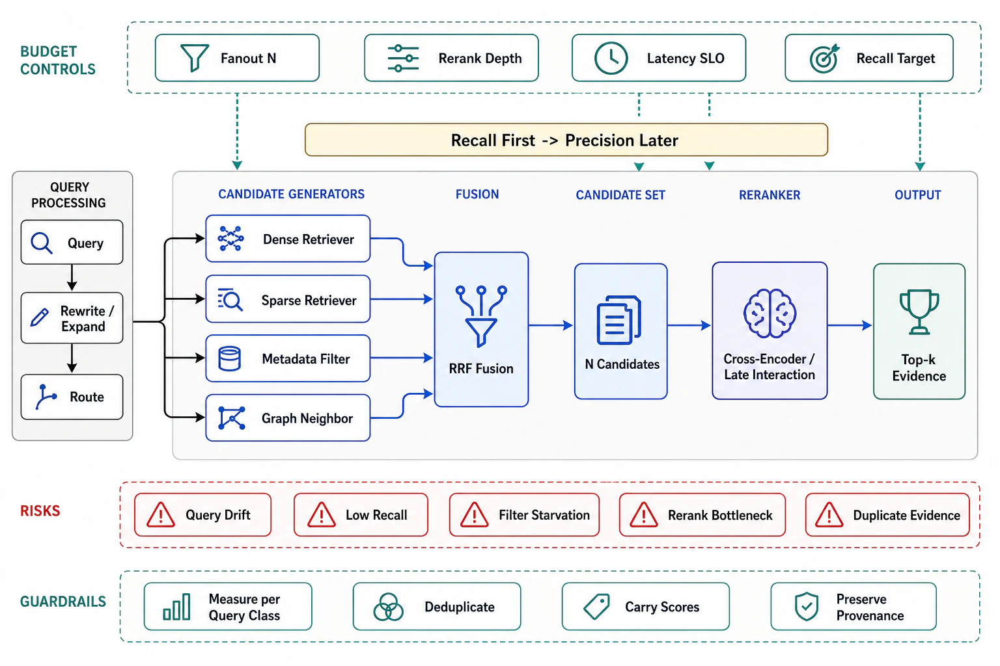

# Retrieval, Hybrid Search, and Reranking



## Abstract

Query-time retrieval is a two-stage cascade whose shape is dictated by file 02's recall/precision split: a wide, cheap, **recall-oriented** first stage that catches the answer among many candidates, then a narrow, expensive, **precision-oriented** rerank that concentrates the truly-relevant passages at the top where the generator (and lost-in-the-middle, file 06) can use them. This file owns both stages and the query processing around them. **First stage — hybrid search**: dense retrieval (embeddings) and sparse retrieval (BM25/SPLADE) fail on *different* queries — dense excels at semantic/paraphrase matching but misses exact terms (a product SKU, an error code, a rare name it never embedded well), sparse nails exact terms but misses synonyms and paraphrase — so production retrieval runs both and fuses them, canonically with **Reciprocal Rank Fusion** (RRF: each doc scores Σ 1/(k+rank) across retrievers, k≈60, no score calibration needed — [Cormack et al.](https://plg.uwaterloo.ca/~gvcormack/cormacksigir09-rrf.pdf)), and the hybrid consistently beats either alone because it unions their complementary recall. **Second stage — reranking**: the first stage returns N candidates (N≈50–200) optimized for recall; a **cross-encoder** (which reads query and passage *together*, unlike the bi-encoder that embedded them separately — far more accurate, far too slow to run over the whole corpus, exactly right over N candidates) or a **late-interaction** model (ColBERT: per-token vectors with MaxSim — [Khattab & Zaharia](https://arxiv.org/abs/2004.12832), between bi-encoder speed and cross-encoder quality) reorders them, and the top-k after reranking is what gets packed. The measured payoff stacks with the corpus work: contextual retrieval + BM25 + reranking reached ~67% reduction in top-20 failures (file 03) — reranking was the largest single increment. **Query processing** is the recall multiplier most pipelines skip: the user's raw query is often not the best retrieval query — rewriting (resolve pronouns and context from conversation), expansion (add synonyms/HyDE-style hypothetical answers), and decomposition (split a multi-part question into sub-queries, each retrieved separately — the bridge to file 09's multi-hop) each lift first-stage recall, and each is an eval-gated addition (file 10) because a bad rewrite *lowers* recall.

## 1. The Two-Stage Cascade

```text
Figure 1. Recall-first, precision-later — the shape file 02
prescribes.

  query ─► [query processing: rewrite/expand/decompose] ─► q'
     │
     ├─► DENSE retrieve (embeddings, ANN f04)  ─┐
     │     semantic / paraphrase                │  RRF fuse
     ├─► SPARSE retrieve (BM25 / SPLADE)  ──────┤  Σ 1/(k+rank)
     │     exact terms / rare tokens            │  k≈60
     │                                          ▼
     │                              N candidates (recall-optimized,
     │                              N≈50-200; wide net, cheap)
     │                                          │
     └───────────────────► RERANK (cross-encoder / ColBERT) ──►
                              precision-optimized reorder
                              top-k (k≈3-10) → pack (f06)
  ─────────────────────────────────────────────────────────────
  the two knobs, both budget-derived (file 02 §3):
   N  (candidate count): ↑ recall, ↑ rerank cost + latency
   k  (final passages):  ↑ context recall, ↑ tokens + lost-in-
                         the-middle risk (f06)
```

The stage rationale, stated as the design law: **the first stage optimizes recall because a passage it drops is unrecoverable** (the reranker can only reorder what it receives — this is file 02's composition made a pipeline shape), so the first stage is tuned wide (high N, hybrid union, ANN recall measured per file 04) and the reranker is where precision is *bought*, over a candidate set small enough to afford the cross-encoder's per-pair cost. Getting this backwards — a precise, narrow first stage — caps end-to-end recall at the first stage's aggressive cutoff and no reranker can recover it.

## 2. Hybrid Fusion, Reranking, and Query Processing — the Choices

**Hybrid is the default, and fusion is the design choice**: RRF (rank-based, robust, no tuning — the safe default) versus weighted score fusion (needs calibration across incomparable dense/sparse score scales — more control, more failure modes) versus learned fusion; the review wants the fusion method named and its recall measured against each retriever alone (the hybrid must *beat* both, or one retriever is miscalibrated and is adding noise, not recall). **Reranking is where the precision budget goes**: cross-encoders (highest quality, run over N≈50–100, latency scales with N — the quality default), ColBERT/late-interaction (near cross-encoder quality, faster, but a heavier index — the scale option), and LLM-as-reranker (a generation call scoring passages — highest quality, highest cost/latency, and it inherits the generator's failure modes) — chosen against the latency SLO and the recall/precision target, with the depth (how many of N the reranker scores) a budget knob. **Query processing is eval-gated recall**: rewriting resolves conversational context ("what about its pricing?" needs "its" resolved to retrieve anything useful — the agent-loop bridge to Chapter 11 file 04), expansion and HyDE broaden a sparse query's reach, decomposition turns a multi-part question into separately-retrieved sub-queries whose results union — and each is measured through file 10's R-drills because query transformation is a double-edged recall lever (a rewrite that drifts from user intent, or an expansion that adds noise, *lowers* the very recall it was meant to raise). The Ch11 seam: an agentic retriever (file 09) makes query processing *iterative* — retrieve, inspect, re-query — which is this section's static techniques placed inside the agent loop, priced by the episode arithmetic of Chapter 11 file 02.

## 3. Approval Gates

| Gate | Evidence Required | Failure Condition |
|---|---|---|
| Cascade gate | Recall-first wide retrieval → precision-later rerank; N and k derived from the quality target and latency SLO | Narrow precise first stage capping recall; single-stage retrieval with no rerank; N/k as defaults |
| Hybrid gate | Dense + sparse fused (RRF or calibrated); the hybrid measured to beat each retriever alone; fusion method named | Dense-only (missing exact-term queries); a miscalibrated retriever adding noise; fusion untested |
| Rerank gate | Reranker chosen against the latency SLO and precision target; rerank depth stated; the reranking recall/precision lift measured (R4) | No reranker where the corpus is large; reranker latency blowing the SLO; depth by default |
| Query-processing gate | Rewrite/expand/decompose additions each eval-gated (R5); conversational rewriting where the agent loops (Ch11) | Raw queries retrieving on unresolved pronouns; a query transform lowering recall, unmeasured |
| Budget gate | N, k, rerank depth, and query-processing cost priced against latency and token budgets (file 02 §3) | Candidate/rerank/rewrite costs discovered in the latency p99, not the design |

## Output

The output of this file is a query-time retrieval design shaped by the composition law: a wide hybrid first stage that unions dense and sparse recall so no query class is systematically missed, a precision-buying reranker over a candidate set small enough to afford it, and eval-gated query processing that raises first-stage recall without drifting from intent — every knob (N, k, rerank depth) derived from the quality target and the latency SLO rather than set by default.

## References

- [Cormack, Clarke, Büttcher, "Reciprocal Rank Fusion" (SIGIR 2009)](https://plg.uwaterloo.ca/~gvcormack/cormacksigir09-rrf.pdf)
- [Khattab & Zaharia, "ColBERT: Efficient and Effective Passage Search via Contextualized Late Interaction over BERT" (SIGIR 2020)](https://arxiv.org/abs/2004.12832)
- [Gao et al., "Precise Zero-Shot Dense Retrieval without Relevance Labels" (HyDE, 2022) — query expansion by hypothetical answers](https://arxiv.org/abs/2212.10496)
- [Chapter 04 file 07 — the hybrid-search paths and ANN recall this stage builds on](../04-data-modeling-storage-engines-and-query-paths/07-vector-and-hybrid-search-paths.md)
- [Chapter 11 file 04 — conversational context the query rewriter resolves](../11-agentic-orchestration-and-tool-routing/04-context-engineering-and-agent-memory.md)
