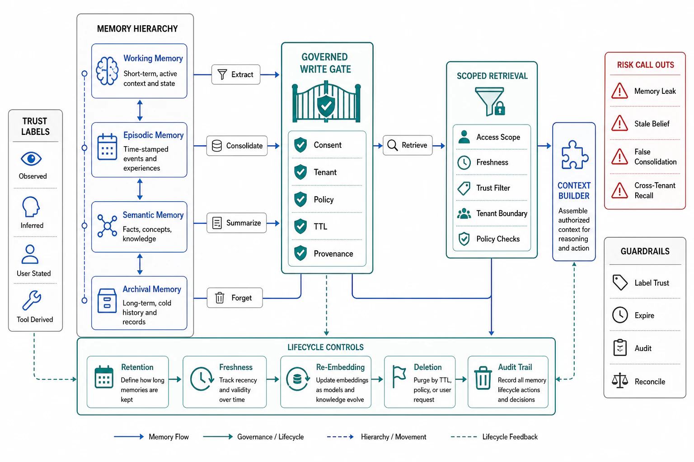

# Memory Architecture for Agents



## Abstract

Memory is retrieval pointed at the system's own history instead of an external corpus — what the agent said, did, learned, and was told across turns and sessions — and this file owns its architecture, building on two foundations already laid: Chapter 03 file 09 established that agent memory is *derived state with ownership, retention, and deletion*, and Chapter 11 file 04 established the *write gate* (persistence is earned) and *read gate* (recalled memory is labeled background, not instruction). This file adds the structural design, and the reference model the field converged on is OS-inspired: **MemGPT/Letta's memory hierarchy** ([Packer et al., 2023](https://arxiv.org/abs/2310.08560)) — *core* memory (a small block always in context, like RAM: the agent's persistent identity and the current task's key facts), *recall* memory (searchable conversation history, like a disk cache), and *archival* memory (unbounded long-term store queried by tool call, like cold storage) — with the LLM itself managing the paging between tiers via tool calls, which is the insight: memory is not a database bolted on, it is a *managed hierarchy* the agent reads and writes deliberately. The operational shape (Mem0-class systems, now a funded infrastructure layer) is an **extract → consolidate → retrieve** loop: extract salient facts from interactions, consolidate them against existing memory (dedup, update, resolve contradictions — the step that separates a memory *store* from an append-only log that poisons context with stale contradictions), and retrieve the relevant subset per turn (the same recall/precision arithmetic of file 02, now over the memory store). The whole thing is governed by the contracts of Chapter 03: memory is owned (whose memory, what schema), retained and deleted (GDPR-grade, including derived copies — Chapter 03 file 09's crypto-shredding), scoped (per-user/tenant isolation — one user's memory retrieved for another is Chapter 07 file 08's leak, and a semantic memory store's fuzzy matching makes the leak *easier*), and trust-labeled on read-back (a memory injected in a past session, Chapter 11 file 08's persistence attack, must not read back as authoritative instruction).

## 1. The Memory Hierarchy

```text
Figure 1. The OS-inspired hierarchy (MemGPT/Letta) — memory as a
managed hierarchy, not a bolted-on database.

  ┌─ CORE (in-context, always) ──────── like RAM ──────────────┐
  │ agent identity + current task's key facts; small, curated; │
  │ the agent EDITS it deliberately (a tool call, not osmosis) │
  └───────────────────────────┬────────────────────────────────┘
                              │ page in/out (LLM-managed)
  ┌─ RECALL (searchable history) ────── like disk cache ───────┐
  │ conversation/episode history; retrieved per turn by        │
  │ relevance (file 02's recall/precision, over history)       │
  └───────────────────────────┬────────────────────────────────┘
                              │ consolidate ↑ / query ↓
  ┌─ ARCHIVAL (unbounded store) ─────── like cold storage ─────┐
  │ long-term facts, learned procedures; tool-queried;         │
  │ the extract→consolidate→retrieve loop maintains it         │
  └────────────────────────────────────────────────────────────┘
  every tier obeys Ch03 f09: owned, retained/deletable, scoped,
  and read-back TRUST-LABELED (Ch11 f04's read gate)
```

The design rules the hierarchy encodes. **Core is scarce and curated** (it costs context budget every turn — Chapter 11 file 04's ledger — so it holds identity and task-critical facts, not accumulated trivia). **Consolidation is the load-bearing step**: an extract-and-append loop with no consolidation grows an archival store full of stale, contradictory facts that retrieve together and poison context (the memory equivalent of file 08's conflicting-source problem) — consolidation dedups, updates supersedes, and resolves contradictions, and its quality is an eval target (a memory system's retrieval accuracy is only as good as its consolidation discipline). **The write gate decides what earns each tier**: not every utterance is a memory; persistence is earned by salience and verified by the write gate (Chapter 11 file 04 — a failed approach must not persist as a learned procedure, an unverified claim must not persist as a fact).

## 2. Memory as Governed Derived State

Every clause of Chapter 03's state discipline applies, and this file's contribution is making the mapping explicit because "memory" tempts teams to treat it as magic rather than as the governed store it is. **Ownership**: whose memory is this (a user's, a tenant's, a shared team's), what is its schema, who may write it — a memory store without an owner is Chapter 03's unowned-state anti-pattern with an LLM writing to it. **Retention and deletion**: memory is personal data (it is literally what the system remembers about a person), so retention policy, deletion-on-request, and — the hard part — deletion of *derived* copies (a fact consolidated into a summary, an embedding in the archival index) are Chapter 03 file 09's obligations in full, and "the model remembered it" is not an exemption from GDPR. **Scope and isolation**: memory retrieval is filtered retrieval (file 04) with an access-control filter that is a *hard security boundary* — cross-user memory leakage is worse than corpus leakage because the memory is private-by-nature, and a *semantic* memory store makes the leak more likely (fuzzy match retrieves a similar user's memory), so per-user/tenant partitioning is mandatory, tested by file 10's R7. **Read-back trust**: recalled memory enters context labeled with provenance and confidence ("recorded session X, unverified"), never as an instruction — because the agent's own memory is an injection surface (Chapter 11 file 08: a prompt injection saved in session N fires in session N+k), and the label is the structural defense. The synthesis: **memory is retrieval over a governed, consolidated, access-scoped, trust-labeled store the agent manages as a hierarchy** — every word of that sentence a contract from an earlier chapter, assembled here into the memory architecture.

## 3. Approval Gates

| Gate | Evidence Required | Failure Condition |
|---|---|---|
| Hierarchy gate | Tiered memory (core/recall/archival or equivalent) with paging policy; core budget governed against the context ledger (Ch11 f04) | A flat memory dump; core memory accreting trivia; memory as an unmanaged database |
| Consolidation gate | An extract→consolidate→retrieve loop with dedup/update/contradiction-resolution; consolidation quality as an eval target | Append-only memory poisoning context with stale contradictions; retrieval accuracy capped by no consolidation |
| Governance gate | Memory owned, schema'd, retained/deletable including derived copies (Ch03 f09); deletion tested | Unowned memory; "the model remembered it" as a GDPR exemption; undeletable derived copies |
| Isolation gate | Per-user/tenant memory partitioning as a hard boundary; cross-scope retrieval tested (R7); semantic-match leak risk addressed | Cross-user memory leakage; fuzzy match retrieving another user's private memory |
| Read-trust gate | Recalled memory labeled (provenance + confidence), non-instructional; memory in Ch11 f08's injection-surface inventory | The agent's past as an authoritative instruction channel; the session-N injection firing in session N+k |

## Output

The output of this file is a memory architecture: a managed hierarchy the agent pages deliberately, maintained by an extract-consolidate-retrieve loop whose consolidation keeps the store coherent, and governed in every dimension Chapter 03 requires — owned, retained, deletable to its derived copies, access-scoped as a hard boundary, and trust-labeled on read-back — so that what the agent remembers is engineered state under contract rather than an accreting, leaking, injectable database with a language model writing to it.

## References

- [Packer et al., "MemGPT: Towards LLMs as Operating Systems" (2023) — the core/recall/archival hierarchy (now Letta)](https://arxiv.org/abs/2310.08560)
- [Chapter 03 file 09 — AI-native state: ownership, retention, deletion (incl. derived copies) memory inherits](../03-state-ownership-and-consistency-model/09-ai-native-state.md)
- [Chapter 11 file 04 — the write gate, read gate, and context ledger this file's tiers obey](../11-agentic-orchestration-and-tool-routing/04-context-engineering-and-agent-memory.md)
- [Chapter 11 file 08 — memory as a persistence-attack injection surface](../11-agentic-orchestration-and-tool-routing/08-security-sandboxing-and-blast-radius.md)
