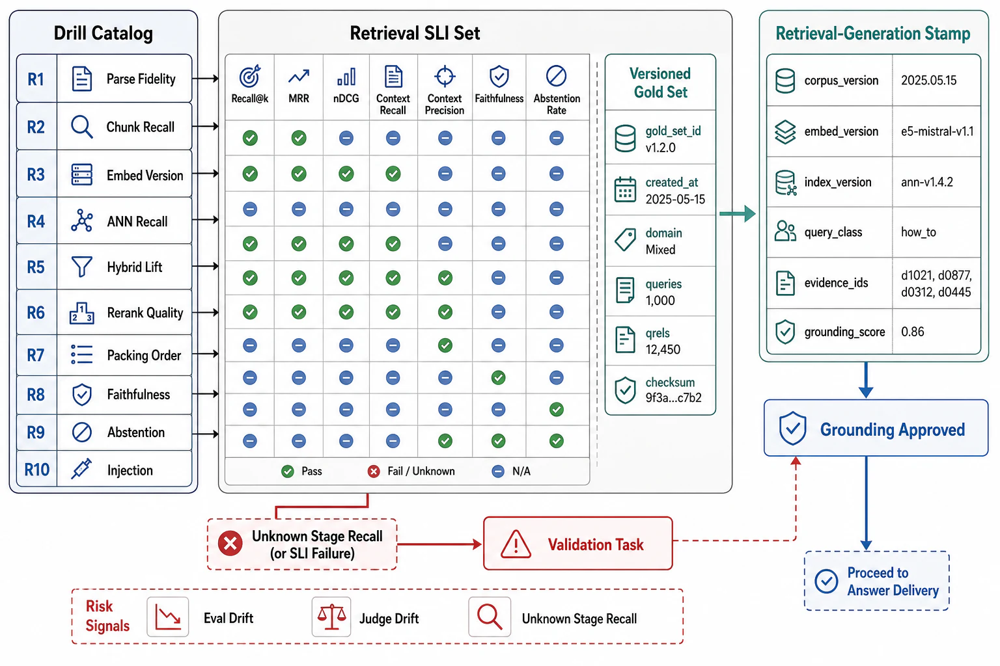

# Verification of Retrieval and Grounding



## Abstract

Retrieval verification has a decisive advantage the rest of the AI stack envies and must exploit: much of it is *measurable against ground truth* — a labeled set of queries with known gold passages makes recall, precision, and per-stage survival (file 02) computable numbers rather than judge-dependent estimates — so this chapter's catalog anchors on **the gold set** as its central instrument and treats everything downstream of retrieval (faithfulness, abstention) with the calibrated-judge discipline inherited from Chapter 11 file 07. Ten drills (R1–R10) instrument file 02's composition law stage by stage — because the chapter's core claim is that end-to-end quality is a product of stage recalls, and the *only* way to fix the product is to measure each factor — plus the grounding SLIs that measure the generation half. The stamp discipline: every piece of evidence carries a **retrieval-generation stamp** `{corpus version + ingest/chunk config, embedder + index config (+ ANN params), retriever/reranker/query-processing config, generator serving-generation (Ch10's five fields) + prompt version, gold-set version}` — because a recall number measured against last month's corpus with last month's chunker on last month's embedder certifies a pipeline that no longer exists, and — the coupling this chapter adds — a *generator* change resets the *grounding* evidence exactly as Chapter 10's engine change reset output-stability evidence (faithfulness is a generation property). The postures inherited: gold-set drills run **standing in CI** (cheap, ground-truth, re-mintable on every corpus/config change), faithfulness/abstention run as **calibrated-judge canaries** (Chapter 11 file 07's judges, agreement measured and expiring), and the whole thing gates every change to the six stamp fields — the canary spine, now over the retrieval pipeline.

## 1. The Drill Catalog

```text
Figure 1. The evidence loop, mapped to file 02's composition. Each
R-drill measures one stage's recall term so the product is
attributable; grounding drills measure the generation half.

  R1 ingest ─► R2 embed ─► R3 index ─► R4 rerank ─► R6 pack
   (per-stage recall: the survival chain, measured)
        │                                    │
        └──► R8 faithfulness / R9 abstention ◄┘  (generation half)
  stamp: corpus/embedder/index/retriever/generator/gold-set
  any field changes → dependent R-drills reset (assumed, expiring)
```

| Drill | Hypothesis under test | Procedure | Pass condition | Cadence |
|---|---|---|---|---|
| R1 Ingest recall | The answer survives parsing+chunking (file 03) | Gold set: is the answer present in some cleanly-parsed chunk? | Ingest recall ≥ target; parse fidelity on hard formats verified | Standing, CI + per corpus/chunker change |
| R2 Embedder quality | The chosen embedder retrieves this domain (file 04) | Retrieval nDCG@10 on the domain gold set; vs candidate embedders | Chosen embedder wins on domain (not just MTEB); dims on the recall curve | Per embedder change |
| R3 Index recall | ANN recall vs exact search (file 04) | Brute-force exact top-k on a sample; measure ANN recall@k against it | Recall@k ≥ the stated floor; tuning point is a chosen quality decision | Per index/param change + quarterly |
| R4 Rerank lift | Reranking raises precision without dropping recall (file 05) | Measure recall/precision pre- and post-rerank; the lift | Reranking improves precision@k; recall@k held; depth justified | Per reranker change |
| R5 Query processing | Rewrite/expand/decompose raise recall (file 05) | A/B each transform on the gold set; measure recall delta | Each transform lifts recall (or is removed); no intent drift | Per query-processing change |
| R6 Packing utilization | Packed context is usable, not just present (file 06) | Vary k and order; measure answered-rate vs recall@k; lost-in-the-middle probe | Answered-rate tracks usable context; more passages don't lower it | Per packing change + quarterly |
| R7 Access-control filter | No retrieval of forbidden documents (files 04/07) | Cross-scope probe: user-A query retrieves only A-permitted docs; memory partitioning | Zero forbidden-doc retrievals; memory isolation holds | Standing, synthetic + per release |
| R8 Faithfulness | Answers are grounded, not post-rationalized (file 08) | Claim-decomposition faithfulness (calibrated judge) per answer class; correctness-vs-faithfulness split | Faithfulness ≥ target; post-rationalized-citation rate bounded | Canary, per generator/prompt change + standing sample |
| R9 Abstention | The system declines when retrieval fails (file 08) | Inject unanswerable + out-of-corpus queries; measure abstention and false-abstention | Abstains on unanswerable; false-abstention (had the answer) bounded | Canary + quarterly |
| R10 Injection resistance | Poisoned documents don't steer the model (file 08; Ch11 f08) | Adversarial corpus: passages with embedded instructions; measure adherence to injection | No injection-following; retrieved passages treated as data; trifecta contained | Standing adversarial + quarterly red-team |

## 2. The Retrieval SLI Set

| SLI | Definition | What it catches |
|---|---|---|
| Per-stage recall (ingest/retrieve/rerank/pack) | Recall at each stage boundary (file 02) | Which stage drops the answer — the attribution the end-to-end number can't give |
| End-to-end answer availability | Product of stage recalls; answered-query rate | The composition (0.9⁴=0.66) as a watched number |
| Precision@k / context precision | Relevant fraction of returned/packed passages | Noise diluting the generator; budget waste |
| ANN recall vs exact | Index recall@k against brute force | The "fast index" silently dropping r_retr |
| Faithfulness / answer relevancy | Grounded-claim fraction; query-addressing (judge) | Post-rationalized citations; the generation half failing |
| Abstention / false-abstention rate | Declines-when-unanswerable; declines-when-answerable | Fluent hallucination; unhelpful over-abstention |
| Freshness lag (corpus→index) | Age from source update to retrievability (file 03/Ch06) | Stale answers from an un-updated index |
| Access-control violations | Forbidden-doc retrievals; cross-user memory hits | The index-executed authorization leak |
| Query latency chain | Embed + ANN + rerank + generation, per stage | Where the latency budget goes (file 02 §3) |
| Cost per query + re-embed campaign cost | Online token/compute; offline ingest campaigns | The RAG-cost-advantage rationale, watched |

The inherited rules: slice by query class (factoid vs multi-hop vs global — file 09's classes fail differently) before averaging; print the target beside each measurement; alert on derivatives (per-stage recall sagging, faithfulness drifting, freshness lag growing) — and the chapter-specific one: **always report retrieval recall and generation faithfulness as the two separate halves** (file 02 §2), because their average hides which one broke.

## 3. Evidence Classes and the Retrieval-Generation Stamp

The taxonomy — *tested* (an R-drill, dated), *observed* (standing SLI over a window), *assumed* (declared, expiring) — with the six-field stamp's reset rules: **corpus/ingest** resets R1 and everything downstream (a re-chunk changes every recall number); **embedder** resets R2/R3 (and forces a re-embed — Chapter 08 file 09); **index config** resets R3; **retriever/reranker/query-processing** resets R4/R5/R6; **generator/prompt** resets R8/R9/R10 (the grounding half — the coupling this chapter adds: a *serving* change resets *faithfulness* evidence); **gold-set** resets *interpretation* of all of them (a stale gold set certifies against stale ground truth — the gold set itself is versioned and refreshed as the corpus and query distribution drift). The gold set is the chapter's evidentiary backbone and its maintenance is a first-class task: it drifts from production (the queries users actually bring evolve), so it is refreshed from real query logs (with new gold labels) on a cadence, and the drills are only as honest as the gold set is current — a point the dossier must state, because a pristine 2024 gold set measuring a 2026 pipeline against 2026 traffic is measuring the wrong thing precisely.

## 4. Approval Gates

| Gate | Evidence Required | Failure Condition |
|---|---|---|
| Gold-set gate | A labeled query→gold-passage set, versioned, refreshed from production query logs on a cadence | No gold set (quality by anecdote); a stale gold set measuring current traffic |
| Composition gate | Per-stage recall measured (R1–R6); the product computed; the weakest stage identified | End-to-end quality with no stage attribution; embedding-model roulette |
| Two-halves gate | Retrieval recall (R1–R6) and generation faithfulness (R8) reported separately; investigations localize the broken half | The blended quality number hiding which half failed |
| Grounding-canary gate | R8/R9/R10 as calibrated-judge canaries gating every generator/prompt change; judges calibrated and expiring | Faithfulness assumed; a prompt edit dropping grounding, unmeasured |
| Stamp gate | Six-field retrieval-generation stamps; generator change resets grounding evidence; gold-set version recorded | Recall from a prior corpus/embedder cited as current; grounding evidence surviving a generator swap |

## Output

The output of this file is the chapter's evidence base: ten drills instrumenting file 02's composition stage by stage against a versioned gold set, grounding drills measuring the generation half under calibrated judges, and a six-field retrieval-generation stamp that resets recall evidence on corpus/embedder change and grounding evidence on generator change — with the gold set maintained as the evidentiary backbone whose currency is the honesty of every number above it.

## References

- [Es et al., "RAGAS: Automated Evaluation of Retrieval Augmented Generation" (2023) — the decomposed retrieval+generation metric set](https://arxiv.org/abs/2309.15217)
- [Manning et al., *Introduction to Information Retrieval* — the recall/precision/gold-set evaluation foundations](https://nlp.stanford.edu/IR-book/)
- [Chapter 11 file 07 — the calibrated-judge discipline R8's faithfulness scoring inherits](../11-agentic-orchestration-and-tool-routing/07-verification-repair-and-checkpoint-discipline.md)
- [Chapter 10 file 10 — the serving-generation stamp this chapter's retrieval-generation stamp extends](../10-inference-runtime-and-gpu-serving-architecture/10-verification-of-serving-contracts.md)
