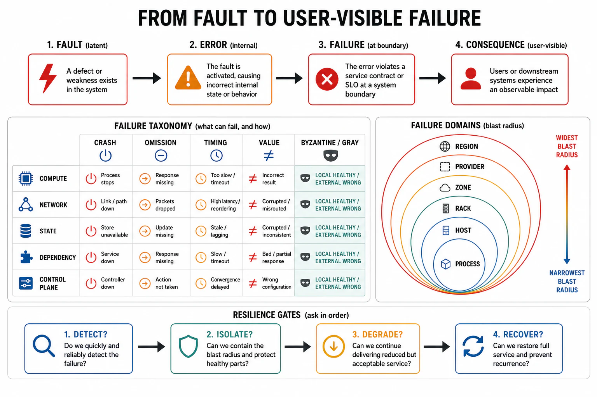

# The Failure Model and Domain Taxonomy



## Abstract

Reliability engineering is impossible without a vocabulary that separates three things teams routinely conflate, and the separation is the foundational move of this chapter: a **fault** is a defect (a bug, a bad config, a dying disk, a poisoned document), an **error** is the corrupted internal state that fault produces when activated, and a **failure** is the moment that error crosses the service boundary and the system delivers a result that violates its Chapter 01 contract ([Avizienis et al., IEEE TDSC 2004](https://ieeexplore.ieee.org/document/1335465), the canonical taxonomy). The distinction is operational, not academic: faults are latent and countless, errors are the window where mitigation is still cheap, and only failures are what the user experiences — so reliability work is the discipline of *preventing faults from becoming errors, errors from becoming failures, and failures from becoming unbounded* — Avizienis' four means: fault prevention, fault tolerance, fault removal, fault forecasting. The second foundational move is the **failure domain**: the blast-radius unit within which a single fault's consequences are contained — a request, a session, a shard, a cell, an availability zone, a region, or (the failure that ends companies) *everything*. A domain is not a deployment artifact; it is the answer to "when this breaks, what else breaks with it," and the entire rest of the chapter is the engineering of small, independent domains. The third move is honest classification of *how* things fail: crash-stop (clean, detectable), omission (silent drops), timing (too slow is a failure), Byzantine (arbitrary/wrong), and the one distributed systems actually die of — **gray failure**, where the system is partially and differentially broken (healthy to its own health check, broken to its users), which is why detection (file 02) is a first-class reliability lever and not a monitoring afterthought. The eight failure classes the root README enumerates — malformed input, model error, tool timeout, queue saturation, retry storm, stale index, schema drift, deployment regression — are instances of this taxonomy, and this file's output is the taxonomy that forces each of them into the same four-question discipline the chapter runs.

## 1. The Fault → Error → Failure Chain

```text
Figure 1. The chain, with the intervention point at each arrow.
Reliability is engineered at the arrows, not at the boxes.

  FAULT ──activation──► ERROR ──propagation──► FAILURE ──?──► IMPACT
  (latent defect)      (bad state)           (contract      (blast
                                              violated)      radius)
     │                    │                      │              │
  prevent:            tolerate:              contain:       bound:
  review, types,      redundancy,            circuit        cells,
  canary, config      checkpoints,           breakers,      bulkheads,
  validation          idempotent retry,      fallbacks,     shuffle
  (fault removal      voting                 degraded       sharding
  before deploy)      (Ch05, Ch06)           mode (f05)     (f03)

  Cost of intervention rises left→right by orders of magnitude:
  a fault caught in review costs an hour; the same fault as a
  regional failure costs a postmortem and a quarter of trust.
```

The chain is not deterministic — most faults never activate (dormant bugs on unexecuted paths), most errors never propagate (masked by redundancy or overwritten before read), and this is *why systems work at all* despite being full of faults. Reliability engineering is the deliberate management of the transition probabilities: fault prevention lowers the fault count, fault tolerance lowers activation→propagation, and the containment machinery of files 03–06 lowers propagation→unbounded-impact. The number that matters is not "how many faults" (uncountable and irreducible) but "what is the conditional blast radius given that one activates" — the quantity files 03 and 09 make arithmetic.

## 2. The Failure-Mode Taxonomy — How Things Actually Fail

| Failure mode | What the component does | Detectability | Why it matters here |
|---|---|---|---|
| **Crash-stop (fail-stop)** | Halts cleanly; produces nothing further | High — absence is observable | The *easy* mode; most fault-tolerance assumes it, and reality rarely obliges |
| **Omission** | Silently drops some requests/messages | Low — a missing result looks like no request | Poison events (Ch06), dropped retries; needs end-to-end accounting to detect |
| **Timing** | Correct result, too late to be useful | Medium — only if latency SLOs are enforced | "Too slow is broken" (Ch09's tail); a p99.9 breach is a partial failure |
| **Byzantine / arbitrary** | Wrong, inconsistent, or actively misleading output | Very low — output looks plausible | Corrupted state, split-brain (Ch05), and *the AI default* — a confident wrong answer (Ch12 f08) |
| **Gray failure** | Differentially broken: healthy to some observers, failed to others | Lowest — the health check passes while users fail | [Huang et al., HotOS 2017](https://www.microsoft.com/en-us/research/publication/gray-failure-achilles-heel-cloud-scale-systems/); the mode that defeats naive monitoring and the reason for file 02's differential observability |

The taxonomy's engineering consequence: **a reliability design that only handles crash-stop is a design for a system that does not exist.** Real production failure is dominated by gray and Byzantine modes — the slow node that stays in rotation, the replica that serves stale data while reporting healthy, the model that returns fluent nonsense with a 200 status — and every mechanism in this chapter is judged by whether it detects and contains the *silent* modes, not just the clean ones. This is the through-line to file 02: detection is hard precisely because the failures that hurt are the ones designed (by nature, not malice) to look like health.

## 3. The Eight Root-README Failure Classes, Placed

```text
Figure 2. The chapter's failure classes mapped onto the taxonomy
and to the file that owns each one's four-question answer.

  class                  mode(s)              owned in
  ─────────────────────  ───────────────────  ─────────────
  malformed input        Byzantine/omission   f01 boundary + Ch07 f01
  model error            Byzantine (silent)   f08 (AI-native)
  tool timeout           timing/omission      f05 degrade + Ch11 f03
  queue saturation       timing→crash         f06 metastability + Ch09
  retry storm            timing (amplifying)  f06 breakers/buckets
  stale index            Byzantine (stale)    f08 + Ch12 freshness
  schema drift           Byzantine (silent)   f07 rollout + Ch03 f07
  deployment regression  any mode, globally   f07 (highest blast radius)
```

Two observations the placement forces. First, **most of the classes are silent modes** (Byzantine or omission), which is why the chapter weights detection so heavily — the classes that are easy to detect (crash-stop) are underrepresented in real incident corpora. Second, **deployment regression is the only class that can manifest as *any* mode at *global* blast radius simultaneously**, which is why file 07 treats deployment as the single highest-leverage reliability control surface: it is the one fault source that a human introduces deliberately, on a schedule, to every domain at once — and therefore the one most worth gating, staging, and making instantly reversible.

## 4. Failure Domains — The Blast-Radius Unit

A failure domain is the set of components that fail *together* because they share a fault source — a process, a host, a rack, a power supply, an availability zone, a shared database, a common config, a single library version, a control-plane dependency. The reliability question is never "will this domain fail" (it will) but "**how much of the system is in the same domain as this fault**," and the answer is the availability ceiling: a system whose components all share one domain has the availability of that domain, no matter how much redundancy sits inside it. The domains that matter are the *non-obvious* ones — two "independent" replicas behind one power feed, two regions sharing one global config push (Meta 2021), two services sharing one connection pool (Ch09), a fleet sharing one model version (Ch10) — and file 09's correlated-failure analysis exists to find them, because the domain you did not know you had is the one that takes down the redundancy you paid for.

## 5. Approval Gates

| Gate | Evidence Required | Failure Condition |
|---|---|---|
| Vocabulary gate | The design distinguishes fault/error/failure; mitigations placed at the correct arrow (prevent/tolerate/contain/bound) | "Reliability" treated as fault-count reduction alone; no containment for faults that will activate |
| Failure-mode gate | Each component's failure modes enumerated including gray/Byzantine, not just crash-stop | Fault-tolerance that assumes fail-stop; slow/stale nodes staying in rotation undetected |
| Class-coverage gate | All eight (or the workload's actual) failure classes present, each mapped to an owning mechanism | A failure class with no detection/containment/recovery answer — undesigned, not unlikely |
| Domain gate | Failure domains enumerated including shared/non-obvious ones; blast radius per domain stated | Hidden shared domains (power, config, pool, model version) collapsing paid-for redundancy |

## Output

The output of this file is a shared vocabulary and a taxonomy: fault, error, and failure separated so mitigations land at the right arrow; the failure modes named with gray and Byzantine treated as the default rather than the exception; the workload's failure classes enumerated and each assigned an owning mechanism; and the failure domains — especially the shared ones — made explicit as the blast-radius units the rest of the chapter bounds. Every later file answers the four questions (detect, isolate, degrade, recover) *for the classes and domains named here*.

## References

- [Avizienis, Laprie, Randell, Landwehr, "Basic Concepts and Taxonomy of Dependable and Secure Computing," IEEE TDSC 2004](https://ieeexplore.ieee.org/document/1335465)
- [Huang et al., "Gray Failure: The Achilles' Heel of Cloud-Scale Systems," HotOS 2017](https://www.microsoft.com/en-us/research/publication/gray-failure-achilles-heel-cloud-scale-systems/)
- [Cristian, "Understanding Fault-Tolerant Distributed Systems," CACM 1991 — the failure-mode hierarchy](https://dl.acm.org/doi/10.1145/102792.102801)
- [AWS Well-Architected — Reducing the Scope of Impact with Cell-Based Architecture (failure domains)](https://docs.aws.amazon.com/wellarchitected/latest/reducing-scope-of-impact-with-cell-based-architecture/reducing-scope-of-impact-with-cell-based-architecture.html)
