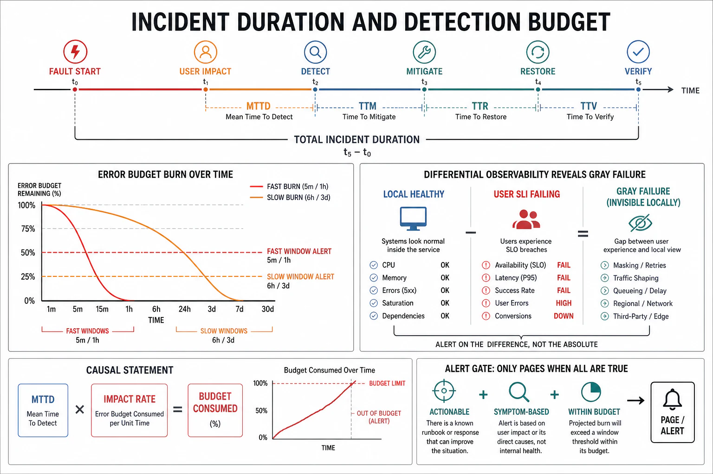

# Detection and Time-to-Detect



## Abstract

Every incident's duration decomposes into **time-to-detect (MTTD) + time-to-mitigate (MTTM) + time-to-repair (MTTR-full)**, and the first term is the one teams systematically underinvest in and the one that dominates the worst outages — because an undetected failure has *unbounded* duration, and a failure detected in fifteen minutes has already burned fifteen minutes of blast radius before any mitigation began. Detection is therefore the highest-leverage reliability lever, and it is engineered, not assumed: it requires **signals that observe the failure the way users experience it** (not the way the component reports itself), which is the whole problem, because the failure modes that matter (gray, Byzantine — file 01 §2) are precisely the ones that keep the component's own health check green while users fail. This file builds detection as three layers: **health checks** (liveness/readiness/deep — the coarse binary that decides rotation membership, and its trap: a shallow check that passes while the deep dependency is dead), **differential observability** (comparing what the system thinks against what users get — the [gray-failure](https://www.microsoft.com/en-us/research/publication/gray-failure-achilles-heel-cloud-scale-systems/) defense: the health-check plane and the data plane must be observed *separately* and *reconciled*, because their divergence is the failure), and **error-budget burn-rate alerting** (the SRE discipline that converts an SLO into a small set of alerts that fire fast on fast burns and slow on slow burns, without the pager fatigue of static thresholds — [Google SRE Workbook](https://sre.google/workbook/alerting-on-slos/), the multiwindow multi-burn-rate method: page at 14.4× burn over a 1h/5m window pair, ticket at 1× over 3d/6h). The governing number, made arithmetic below: **MTTD sets the floor on blast radius**, because nothing downstream — isolation, degradation, recovery — can start until detection fires, so a detection budget is a reliability budget, and "we found out from Twitter" is the failure this file exists to prevent.

## 1. The Incident-Duration Decomposition

```text
Figure 1. Where an incident's minutes go. Each segment is a
separately engineerable budget; MTTD gates everything after it.

  fault      detected      mitigation     service         root cause
  activates    │           begins          restored        removed
    │          │             │                │               │
    ▼          ▼             ▼                ▼               ▼
    ├──MTTD────┼────react────┼───MTTM─────────┼────MTTR-full──┤
    │          │             │                │               │
    │  signal  │  human/auto │  shed, fail    │  fix, redeploy│
    │  fires   │  decides    │  over, roll    │  backfill     │
    │          │             │  back (f05,f07)│               │
    └──────────┴─────────────┴────────────────┴───────────────┘
       ▲                          ▲
       │                          │
   blast radius accrues       blast radius stops accruing
   the ENTIRE time here       roughly here (degraded ≠ failed)

  Availability lost ≈ (incident duration) × (fraction of domain
  affected). Halving MTTD halves the pre-mitigation blast for
  every incident — a fleet-wide multiplier no single fix matches.
```

The decomposition's discipline: measure the segments *separately* in every postmortem, because they have different fixes. Long MTTD is a signals problem (you were not watching the right thing). Long react time is an alerting or runbook problem (the page was ambiguous, or nobody knew the move). Long MTTM is a tooling problem (rollback took 40 minutes because it was never drilled — file 07, file 10). Long MTTR-full is a state problem (backfilling the corrupted rows — file 04). A team that reports only "the incident lasted 90 minutes" cannot improve; a team that reports "MTTD 47m, MTTM 8m, repair 35m" knows to spend its next quarter on detection.

## 2. Worked Detection Budget — Why MTTD Dominates

Consider a service at a **99.9% availability SLO**: the monthly error budget is 0.1% of ~43,200 minutes = **43.2 minutes** of full outage per month. Now compare two detection regimes against one total-outage incident:

- **Detection by static threshold + human triage**: alert fires after a 5-minute averaging window breaches, on-call acknowledges in 5 minutes, diagnoses the need to roll back in 10 → **MTTD-to-action ≈ 20 min**. One such incident consumes **46% of the entire month's budget** before mitigation even starts.
- **Detection by fast-burn-rate alert on user-facing SLI**: the 1-hour/5-minute multiwindow alert at 14.4× burn fires within ~2–5 minutes of a hard failure (it is watching the SLI directly, not a proxy), auto-rollback (file 07) triggers on the same signal → **MTTD-to-action ≈ 3–5 min**. The same incident consumes ~10% of the budget.

The arithmetic is the argument: at a 99.9% SLO, **detection latency is denominated in double-digit percentages of your monthly reliability budget per incident.** This is why the burn-rate method (§3) and differential observability (§4) are not monitoring-team niceties — they are the difference between an SLO you can hold and one you breach on the first bad deploy. (The number scales brutally with tighter SLOs: at 99.99%, the monthly budget is 4.3 minutes, and a 20-minute MTTD blows *four months* of budget in one incident.)

## 3. Burn-Rate Alerting — Detecting at the Right Speed

Static thresholds force an impossible choice: set them tight and drown in false pages, set them loose and detect slow burns too late. The error-budget **burn rate** — how fast, as a multiple of the SLO-sustainable rate, the budget is being consumed — resolves this by making detection speed proportional to failure speed ([SRE Workbook, "Alerting on SLOs"](https://sre.google/workbook/alerting-on-slos/)):

| Alert tier | Burn rate | Windows (long / short) | Budget consumed to fire | Response |
|---|---|---|---|---|
| Fast burn | 14.4× | 1 h / 5 m | 2% of monthly budget in 1 h | **Page** — a hard failure in progress |
| Medium burn | 6× | 6 h / 30 m | 5% in 6 h | **Page** — a serious degradation |
| Slow burn | 1× | 3 d / 6 h | 10% over 3 d | **Ticket** — a chronic drain, not urgent |

The **multiwindow** refinement — require both a long window *and* a short window (1/12 its length) to breach — is what makes this deployable: the long window gives significance (not a blip), the short window gives fast reset (the alert clears quickly once the burn stops, so a resolved incident does not keep paging). The design consequence for this chapter: burn-rate alerts *are* the detection signal that files 05 and 07 act on automatically — the same SLI breach that pages a human can trigger load shedding or auto-rollback, closing the detect→mitigate gap to seconds for the failures that warrant it.

## 4. Differential Observability — Catching Gray Failure

The gray-failure defeat of naive monitoring (file 01 §2) has a specific structural cause: the system observes itself through the *same* path that is failing. A node whose disk is returning errors on 30% of reads may pass a liveness check that hits a cached endpoint; a model server reporting healthy may be emitting fluent wrong answers no infra metric sees. The defense is **differential observability** — observe the system from at least two vantage points and treat their *divergence* as the signal:

- **Self-reported health** (the component's own check) vs **externally observed health** (a prober or real user traffic from outside the failure domain) — divergence means gray failure: the thing thinks it is fine, users disagree.
- **Control-plane truth** (what the scheduler/registry believes) vs **data-plane reality** (what requests actually experience) — the Ch02 plane split observed for *reconciliation*, where a gap is the incident.
- **Infra SLIs** (latency, error rate, saturation) vs **outcome SLIs** (did the user get a correct, useful result) — the AI-critical pair (file 08), where every infra metric is green and the answer quality has silently regressed.

The health-check design that follows: **liveness** (is the process alive — restart if not) must be *shallow and independent* of dependencies (or a downstream outage triggers a restart storm that makes it worse — a metastable trigger, file 06); **readiness** (should this instance receive traffic — pull from rotation if not) must be *deep enough* to reflect real serving capability; and neither replaces the external, user-perspective probe that is the only thing that catches the gray mode where both checks lie.

## 5. Approval Gates

| Gate | Evidence Required | Failure Condition |
|---|---|---|
| Decomposition gate | Incidents measured as MTTD/MTTM/MTTR-full separately; MTTD tracked as its own budget | "Incident lasted N minutes" with no decomposition; detection latency invisible and unimproved |
| Budget-arithmetic gate | Detection latency costed against the SLO's error budget; the per-incident budget fraction known | Detection latency untied to the SLO; a 20-min MTTD under a 99.99% SLO nobody flagged |
| Burn-rate gate | Multiwindow multi-burn-rate alerts on user-facing SLIs (fast page / slow ticket), not static thresholds | Static-threshold alerting; pager fatigue from blips or slow burns detected days late |
| Differential-observability gate | At least two vantage points reconciled (self vs external, infra vs outcome); liveness shallow, readiness deep, external prober present | Self-reported health only; gray failure invisible; liveness coupled to dependencies causing restart storms |
| Outcome-SLI gate (AI) | Quality/correctness observed as an SLI distinct from infra health (file 08) | All infra green while answer quality regressed silently — the AI gray failure |

## Output

The output of this file is a detection design in which incident duration is decomposed and MTTD is budgeted as its own reliability quantity, detection latency is costed in explicit fractions of the SLO's error budget, alerting is burn-rate-based so detection speed matches failure speed, and observability is *differential* — self versus external, infra versus outcome — so the silent gray and Byzantine modes that defeat single-vantage monitoring are the ones the system is designed to catch. Detection fires the signal that every downstream response — isolate (f03), degrade (f05), recover (f04), roll back (f07) — depends on; nothing starts until this file's machinery does.

## References

- [Google SRE Workbook — "Alerting on SLOs" (multiwindow, multi-burn-rate)](https://sre.google/workbook/alerting-on-slos/)
- [Huang et al., "Gray Failure: The Achilles' Heel of Cloud-Scale Systems," HotOS 2017](https://www.microsoft.com/en-us/research/publication/gray-failure-achilles-heel-cloud-scale-systems/)
- [Google SRE Book — "Monitoring Distributed Systems" (the four golden signals; symptom-based alerting)](https://sre.google/sre-book/monitoring-distributed-systems/)
- [Dean & Barroso, "The Tail at Scale," CACM 2013 — why slow-is-failed and tail SLIs](https://cacm.acm.org/research/the-tail-at-scale/)
