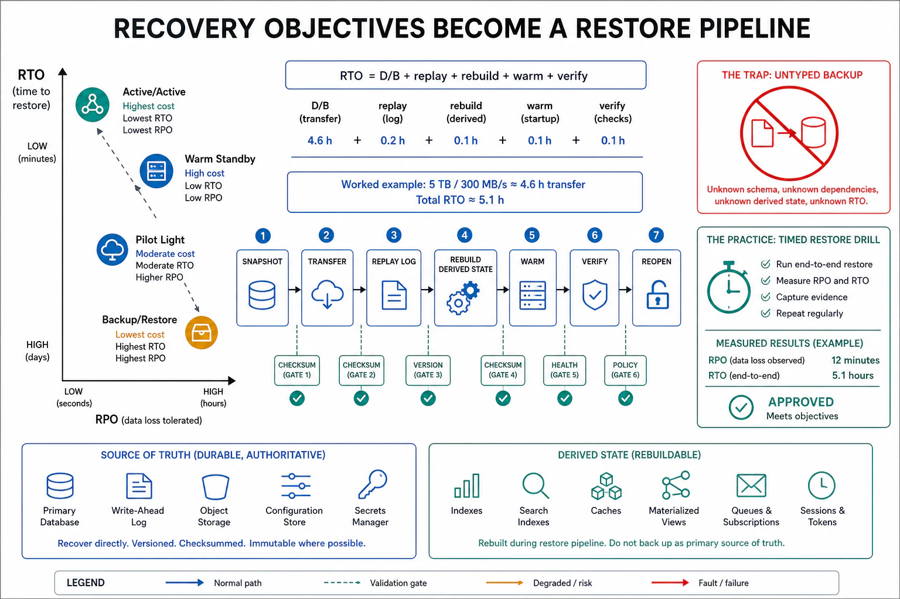

# Recovery Objectives and State Restoration



## Abstract

When containment (file 03) fails or a fault corrupts state that isolation cannot un-corrupt, reliability becomes *recovery*, and recovery is governed by two numbers that must be chosen deliberately rather than discovered during the incident: **RPO (recovery point objective)** — how much recent data you are willing to lose, i.e. the maximum age of the state you can restore to — and **RTO (recovery time objective)** — how long restoration is allowed to take. These are not aspirations; they are *derived from arithmetic and validated by drills*, and the central failure this file attacks is the team that has a backup but no measured RTO — because the restore they never timed takes six hours when the RTO they assumed was thirty minutes, and they discover the gap while the system is down. RPO is set by the *backup/replication cadence*: continuous replication (Ch05) or a change log (Ch06) gives near-zero RPO; nightly snapshots give an RPO of up to 24 hours, meaning a corruption at 23:59 loses a full day. RTO is set by the *restore mechanism's bandwidth against the data volume* — a first-principles calculation (standard 9) done below: 5 TB restored over a 500 MB/s pipe is ~2.8 hours of pure transfer *before* index rebuild, cache warming (Ch08), and validation, so an RTO claim untethered from `data_size / restore_bandwidth + rebuild + warm + verify` is fiction. The file's three hard truths: **(1) a backup is not a recovery capability until a restore has been timed end-to-end** — untested backups fail (silent corruption, missing dependencies, wrong-order restores) at exactly the moment they are needed, which is why restore drills (file 10) are the only evidence that counts; **(2) recovery is itself a workload** that competes for the same I/O, CPU, and network the failing system needs, and a recovery plan that ignores its own resource cost (a restore that saturates the database the survivors are still serving from) makes the incident worse; **(3) different state classes recover differently** — Chapter 03's ephemeral/persistent/shared/derived taxonomy maps directly onto recovery: derived state (caches, indexes, embeddings) is *recomputed* not restored (Ch08 f09, Ch12), persistent state of record is restored from backup + log replay, and ephemeral state is *abandoned*, and conflating them either wastes hours restoring what could be recomputed or loses what could not.

## 1. RPO and RTO — The Two Recovery Numbers

```text
Figure 1. RPO and RTO on the incident timeline. RPO looks
backward (data lost); RTO looks forward (time to serve again).

         last good        fault/         recovery
         backup/replica   corruption     complete
            │                │               │
   ─────────┼────────────────┼───────────────┼─────────►  time
            │◄────RPO────────►│◄─────RTO──────►│
            │  data written   │  system down / │
            │  since last     │  restoring     │
            │  recoverable    │                │
            │  point = LOST   │                │

  RPO is bought with backup/replication CADENCE (cost: write
  amplification, replication bandwidth — Ch05/Ch06).
  RTO is bought with restore MECHANISM (cost: standby capacity,
  warm replicas, faster storage — the DR-strategy spectrum, §3).
  Neither is free; both are chosen per data class against its
  business cost of loss and downtime.
```

The discipline is to set RPO and RTO **per state class, from its cost of loss**, not one number for the whole system: the ledger of record may demand RPO≈0 (every committed transaction durable) and RTO in minutes; a derived analytics rollup may tolerate RPO of a day and RTO of hours because it is recomputable. A single global "we back up nightly" imposes the analytics-grade RPO on the ledger — a 24-hour data-loss window on money — which is the misconfiguration that turns a recoverable incident into an unrecoverable one.

## 2. Worked RTO — Recovery Is Arithmetic, Then Drilled

Deriving RTO from first principles for a 5 TB primary datastore, restore-from-backup strategy:

```text
  data volume          D  = 5 TB = 5,000 GB
  restore bandwidth    B  = 500 MB/s (object store → DB, realistic
                            sustained, not peak line rate)
  transfer time        = D / B = 5,000,000 MB / 500 MB/s
                       = 10,000 s ≈ 2.8 h   ← pure bytes only

  then, NOT optional:
    + index / constraint rebuild     ≈ 1.0 h  (write-heavy, CPU-bound)
    + cache / KV warm-up (Ch08)      ≈ 0.5 h  (cold-cache miss storm)
    + integrity validation (§4)      ≈ 0.5 h  (verify before serving)
    + coordination / decision lag    ≈ 0.3 h  (detect→decide, f02)
  ─────────────────────────────────────────────
    realistic RTO      ≈ 5.1 h   ← the number to compare to the SLA
```

The lesson in the gap between 2.8 h (the number teams quote) and ~5.1 h (the number reality delivers): **RTO is dominated by the steps after the bytes land.** A design that wants a 1-hour RTO cannot get there by a faster restore pipe alone — it needs a *hot or warm standby* (§3) that skips the transfer and rebuild entirely, because you cannot arithmetic your way to 1 hour when the byte transfer alone is 2.8. This is the calculation that selects the DR strategy: the RTO target, run against `D/B + rebuild + warm + verify`, tells you whether backup-restore is even admissible or whether you must pay for standby capacity.

## 3. The Recovery-Strategy Spectrum

| Strategy | RPO | RTO | Standing cost | When it is the right call |
|---|---|---|---|---|
| **Backup & restore** | Hours (snapshot cadence) | Hours (§2 arithmetic) | Cheapest — storage only | Recomputable/derived state; tolerant workloads; cost-dominated |
| **Pilot light** | Minutes (async replica) | ~1 h (scale up the dormant copy) | Low — minimal standby | Core data replicated, compute spun up on demand |
| **Warm standby** | Seconds (continuous replication) | Minutes (scale a running-small copy) | Medium — always-on reduced fleet | Revenue-bearing services with minutes-scale RTO |
| **Hot standby / multi-site active-active** | ~0 (synchronous or tight async) | Seconds (failover routing) | Highest — full duplicate capacity | RPO≈0, RTO≈0 mandates; the ledger, the control plane |

The spectrum is the honest cost curve of recovery: **RTO and RPO are bought with standing capacity**, and the strategy is chosen by comparing the business cost of downtime/loss against the standing cost of the tier that prevents it. The when-NOT admission (standard 3): active-active is over-engineering for a recomputable derived store, and backup-restore is negligence for a payment ledger — the failure is applying one tier uniformly instead of matching each state class to the tier its loss cost justifies.

## 4. Restore Integrity and the Untested-Backup Trap

A backup's existence proves nothing; only a *timed, validated restore* proves a recovery capability. The failure modes of the untested backup are numerous and all silent until the incident: the backup captured a corrupt or inconsistent state (backing up a database mid-write without a consistent snapshot), the backup omitted a dependency (the schema, the encryption key — restore succeeds and the data is unreadable), the restore procedure has bit-rotted (the runbook references a decommissioned tool), or the restore *works* but takes 4× the assumed RTO. The defenses are non-negotiable and belong in the drill set (file 10): **restore drills** on a real cadence that time the full RTO and validate the restored data against a checksum or business-invariant (not just "the restore command exited 0"); **backup integrity verification** independent of the primary (a corruption that replicated into the backup — the [GitLab 2017](https://about.gitlab.com/blog/postmortem-of-database-outage-of-january-31/) shape, where five backup methods all silently failed and were discovered only during an incident); and **consistency-aware backups** (snapshot isolation or log-based capture so the restored state is a point-in-time-consistent image, not a smear across concurrent writes). The one-line law: **the only backup that counts is one you have restored from and timed.**

## 5. Approval Gates

| Gate | Evidence Required | Failure Condition |
|---|---|---|
| Objectives gate | RPO and RTO set *per state class* from cost of loss/downtime; not one global number | One "nightly backup" RPO imposed on the ledger; RTO unspecified |
| RTO-arithmetic gate | RTO derived as `D/B + rebuild + warm + verify + coordination`, not the transfer time alone | RTO quoted as pure byte-transfer; the post-transfer steps uncounted |
| Strategy-fit gate | DR tier (backup/pilot/warm/hot) matched to each state class's cost; standing cost justified | Active-active on recomputable state; backup-restore on a payment ledger |
| State-class gate | Derived state recomputed not restored; persistent state restored + log-replayed; ephemeral abandoned | Hours spent restoring recomputable indexes; ephemeral state "recovered" into inconsistency |
| Restore-drill gate | Timed end-to-end restore on a cadence; restored data validated against invariants; backup integrity checked independently | Backups never restored from; GitLab-2017 silent-backup-failure exposure; RTO assumption never measured |

## Output

The output of this file is a recovery design in which RPO and RTO are chosen per state class from the cost of loss, RTO is derived from first-principles arithmetic including the post-transfer steps that dominate it, the DR strategy tier is matched to each class's justified standing cost, state classes are recovered by their nature (recompute derived, restore-and-replay persistent, abandon ephemeral), and every backup is proven by a timed, validated restore drill rather than assumed. Recovery stops being a hopeful runbook and becomes a measured, drilled capability with numbers the SLA can be checked against.

## References

- [AWS Well-Architected — Disaster Recovery of Workloads (backup/pilot-light/warm-standby/multi-site RPO-RTO spectrum)](https://docs.aws.amazon.com/whitepapers/latest/disaster-recovery-workloads-on-aws/disaster-recovery-options-in-the-cloud.html)
- [GitLab, "Postmortem of database outage of January 31 2017" (five backup methods silently failed)](https://about.gitlab.com/blog/postmortem-of-database-outage-of-january-31/)
- [Google SRE Book — "Data Integrity: What You Read Is What You Wrote" (recovery as defense-in-depth; restore testing)](https://sre.google/sre-book/data-integrity/)
- [Candea & Fox, "Crash-Only Software," HotOS 2003 (recovery as the normal path)](https://www.usenix.org/legacy/events/hotos03/tech/full_papers/candea/candea.pdf)
