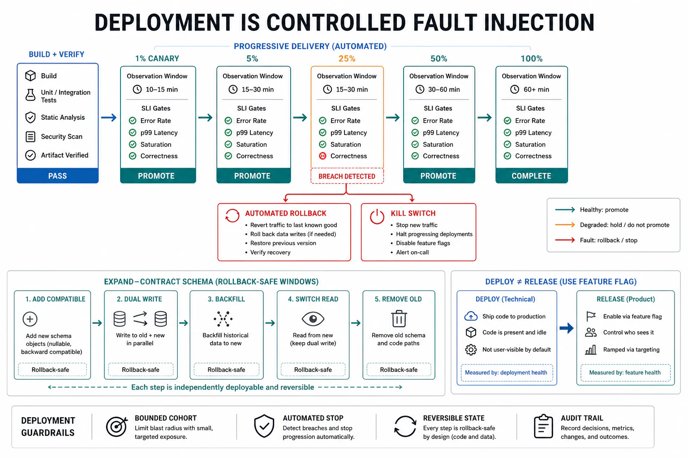

# Deployment Safety and Rollback



## Abstract

Deployment is the single highest-leverage reliability control surface because it is the one fault source that is *deliberate, scheduled, and global*: a human introduces a change, on purpose, and (absent controls) applies it to every failure domain at once — which is why change is the largest single cause of incidents in every production corpus that measures it, and why "what changed?" is the first question of every outage investigation. The reliability reframing: **a deploy is a controlled fault injection**, and the entire discipline is to make that injection *small, observed, and instantly reversible*. Four mechanisms compose the defense. **Progressive delivery** exposes the change to an increasing fraction of traffic — one cell (file 03), then 1%, 5%, 25%, 100% — with a *validation checkpoint at each stage* that can halt or reverse before the blast radius grows ([progressive delivery / canary](https://docs.cloud.google.com/deploy/docs/deployment-strategies/canary)); the change's blast radius is thereby capped at the stage it fails in, converting deployment regression from a global fault into a 1%-of-traffic fault. **Automated rollback** ties the promotion decision to the file-02 SLIs: if the canary's error rate, latency, or burn-rate breaches, the system reverts *automatically* without waiting for a human to notice — the difference, measured, between resolving a bad deploy in seconds and in the tens of minutes a human-in-the-loop takes. **Rollback-first, roll-forward-second**: the default response to a regression is to return to the known-good version, *not* to debug-and-fix-forward under incident pressure — which requires every deploy to be reversible by construction, the constraint that shapes the two hardest cases: **schema migrations** (a column drop is not reversible — hence expand/contract, Ch03 f07: add-new before remove-old across separate deploys so every intermediate state is rollback-safe) and **stateful/config changes**. **Feature flags and kill switches** (Ch02 f06) decouple *deploy* from *release* — ship the code dark, enable it by flag, and disable it instantly without a redeploy — giving a sub-second reversal path for the behavior a full rollback would take minutes to undo. The incident corpus is the argument, not anecdote: [Cloudflare's July 2019 outage](https://blog.cloudflare.com/details-of-the-cloudflare-outage-on-july-2-2019/) (a single regex config deployed globally with no staged rollout, CPU to 100% everywhere at once) and [Meta's October 2021 outage](https://engineering.fb.com/2021/10/05/networking-traffic/outage-details/) (a config change that passed an audit tool's bug and took down the backbone *and* the tooling needed to fix it) are both the same failure: a global, unstaged, hard-to-reverse change — exactly the shape this file's four mechanisms exist to make impossible.

## 1. Deploy as Controlled Fault Injection

```text
Figure 1. The deployment blast-radius staircase. Each stage caps
the fault at its traffic fraction and gates promotion on SLIs.
A regression is caught at the stage it appears — not globally.

  stage      traffic   gate before promotion        on breach
  ─────────  ───────   ──────────────────────────   ──────────────
  1 cell     ~1/N      SLIs healthy for bake time    auto-rollback,
  canary 1%  1%        error/latency/burn-rate (f02) blast = 1%
  canary 5%  5%        + quality SLIs (f08 for AI)    halt + revert
  25%        25%       + downstream dependency load   halt + revert
  100%       100%      full soak, then retire old     roll back all

  Contrast — the outage shape (Cloudflare 2019, Meta 2021):
  ┌──────────────────────────────────────────────────────────┐
  │  change ───────────────────────────────► 100% instantly   │
  │  no stages, no per-stage gate, no automated revert →       │
  │  global failure the moment it deploys                      │
  └──────────────────────────────────────────────────────────┘
```

The staircase's discipline is that **blast radius is bounded by the stage a regression is caught in**, so the reliability of a deploy is set by two things: how small the first stage is (1 cell, not 100%) and how fast and automatic the revert is (SLI-triggered, not human-noticed). A deploy system without stages has no blast-radius control — every change is a potential global outage — which is why "it passed CI" is necessary but never sufficient: CI tests the code against known cases; the canary tests it against *production*, which is the only environment that contains the fault the canary is there to catch.

## 2. Automated Rollback — Tying Promotion to SLIs

The promotion decision at each canary stage must be **automatic and SLI-driven**, because the human alternative is too slow: a person watching dashboards notices a regression in minutes, decides in more minutes, and executes a rollback in more still — during which the canary (if it has been promoted on a timer rather than held on a gate) may already be at 100%. The automated design:

- **Promotion gates on outcome SLIs, not just liveness**: the canary must show healthy error rate, latency percentiles, burn-rate (file 02), *and* — for AI systems — quality/correctness SLIs (file 08), because a model deploy can be perfectly healthy on infra metrics and 15% worse on answer quality, a regression only an outcome SLI catches.
- **Automatic reversion on breach**: a canary that breaches its gate is reverted by the delivery system without a human in the critical path (the measured effect: deployment incidents resolved dramatically faster when rollback is automated rather than manual).
- **The rollback path is itself tested**: rollback is a code path (file 04's lesson), and a rollback that has never been exercised fails when first used — so rollback is drilled (file 10), and "can we roll this back, and how long does it take?" is answered *before* the deploy, not during the incident.

## 3. Reversibility — Rollback-First, and the Schema Problem

The default incident response to a regression is **return to known-good**, not fix-forward — because rolling back is fast and low-risk (the previous version worked), while fixing forward under incident pressure writes new, untested code into a live outage. This makes *reversibility* a property every change must have by construction, and the hard cases are stateful:

```text
Figure 2. Expand/contract makes an irreversible schema change into
a sequence of reversible deploys (Ch03 f07, invoked as a rollback-
safety requirement). Every intermediate state is rollback-safe.

  UNSAFE (one deploy, not reversible):
    rename column  old → new   ← old code rolled back = broken query

  SAFE (expand/contract, each step independently rollback-safe):
    1. EXPAND  add `new` column; write BOTH old+new; read old
               (rollback-safe: old still authoritative)
    2. BACKFILL copy old→new; switch reads to new; still write both
               (rollback-safe: old still written)
    3. CONTRACT stop writing old; later drop old column
               (only after step 2 has soaked and won't roll back)

  Rule: never deploy a change whose rollback would break the
  version you are rolling back TO. Decouple the irreversible step
  (drop column) from the risky step (new code) across deploys.
```

The principle generalizes past schemas to every stateful change: a migration, a data format change, a protocol version bump must each be sequenced so that at every point, rolling the *code* back leaves the *state* still readable by the version you return to. This is the constraint that makes fast rollback possible — and a change that cannot be made reversible (a genuine one-way door) is precisely the change that demands the slowest, most-staged rollout and an explicit, drilled recovery plan, because rollback will not be available when it regresses.

## 4. Kill Switches — Decoupling Deploy From Release

```text
Figure 3. Deploy ≠ release. Code ships dark; a flag releases it;
a kill switch retracts it in sub-second without a redeploy.

  DEPLOY (code present, behavior OFF)  ──► minutes, staged (§1)
        │
        │  flag ON (progressive: 1% → 100% of users)
        ▼
  RELEASE (behavior active)
        │
        │  KILL SWITCH (flag OFF) ──► sub-second, no redeploy,
        ▼                             no rebuild, instant revert
  RETRACTED (behavior OFF, code still deployed)

  Why it matters for reliability: a full rollback redeploys and
  takes the deploy pipeline's minutes; a kill switch is the
  fastest reversal path there is — the right tool when a FEATURE
  (not the whole build) is the regression. Flags are themselves
  config (Ch02 f06): versioned, staged, and audited, or the flag
  system becomes its own global-blast-radius change surface.
```

Kill switches give the sub-second reversal that rollback cannot, at the granularity of a single behavior — which is why risky features ship behind flags defaulted off, released progressively, and retractable instantly. The caveat this file insists on: **the flag system is itself a control-plane change surface** (Ch02 f06) with global blast radius — a bad flag push is a bad config push (Cloudflare/Meta shape) — so flags are versioned, staged, and audited with the same discipline as any deploy, and the kill switch's own availability must exceed that of the thing it can kill (static stability, file 03 §4), or the safety mechanism fails exactly when the feature it guards does.

## 5. Approval Gates

| Gate | Evidence Required | Failure Condition |
|---|---|---|
| Staged-rollout gate | Progressive delivery (cell → 1% → 5% → 25% → 100%) with a per-stage SLI gate; first stage small | Global/unstaged deploys (Cloudflare/Meta shape); "passed CI" as sufficient; timer-based promotion without gates |
| Automated-rollback gate | Promotion gated on outcome SLIs (incl. quality for AI); automatic reversion on breach; rollback path drilled | Human-in-the-loop as the only revert; promotion on liveness only; untested rollback that fails when first used |
| Reversibility gate | Every change reversible by construction; schema/stateful changes via expand/contract so each step is rollback-safe | A change whose rollback breaks the version rolled back to; fix-forward-under-pressure as the default |
| Kill-switch gate | Risky features behind flags (deploy≠release), progressively released, instantly retractable; flag system versioned/staged/audited; switch more available than the feature | No sub-second reversal for feature-level regressions; an ungoverned flag system as a hidden global-blast change surface |
| One-way-door gate | Genuinely irreversible changes identified, given the slowest staged rollout + an explicit drilled recovery plan | An irreversible change deployed at normal cadence with rollback assumed but unavailable |

## Output

The output of this file is a deployment discipline that treats every change as a controlled fault injection: progressively delivered so blast radius is capped at the stage a regression appears, automatically rolled back on SLI breach so reversal is measured in seconds not minutes, reversible by construction so rollback-first is always an option (expand/contract sequencing the stateful changes that resist it), and decoupled deploy-from-release by flags and kill switches so a feature-level regression retracts in sub-second. The largest historical outages share one shape — a global, unstaged, hard-to-reverse change — and this file is the set of controls that makes that shape unreachable.

## References

- [Cloudflare, "Details of the Cloudflare outage on July 2, 2019" (global unstaged regex config)](https://blog.cloudflare.com/details-of-the-cloudflare-outage-on-july-2-2019/)
- [Meta Engineering, "More details about the October 4 outage" (config change, audit-tool bug, global blast)](https://engineering.fb.com/2021/10/05/networking-traffic/outage-details/)
- [Google Cloud Deploy — Canary deployment strategy (progressive delivery, per-stage verification)](https://docs.cloud.google.com/deploy/docs/deployment-strategies/canary)
- [Google SRE Book — "Release Engineering" (hermetic builds, staged rollout, the change-is-risk discipline)](https://sre.google/sre-book/release-engineering/)
