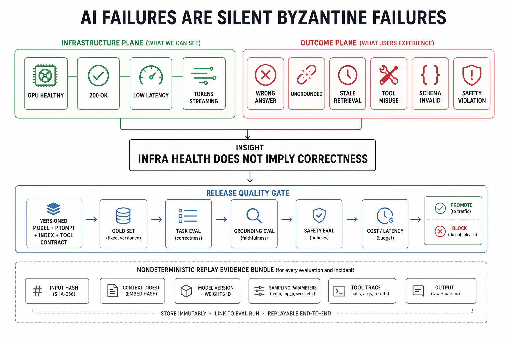

# AI-Native Failure Modes



## Abstract

An AI system inherits every failure class in this chapter and adds a set whose defining property is that they are **silent Byzantine failures by default** (file 01 §2): the system returns a fluent, well-formed, 200-status answer that is *wrong*, and no infrastructure signal fires because the infrastructure worked perfectly — the model, the retriever, the tools all did exactly what they were asked, and the output is still a failure of the Chapter 01 contract. This is the reliability-defining fact of AI systems and it inverts the detection posture of the whole book: for a database, healthy infra strongly implies correct output; for an AI system, **healthy infra implies nothing about correctness**, so the outcome SLI (file 02 §4) is not a refinement but the *primary* reliability signal, and the eval is the detector. The AI-native failure classes: **model error / hallucination** — confident wrong output, the base rate that grounding (Ch12 f08) reduces but never eliminates, making abstention (Ch12) a designed reliability behavior rather than a quality nicety; **silent quality regression** — a model, prompt, retriever, or dependency change that leaves every infra metric green while answer quality drops, invisible without a quality eval in the deploy gate (file 07 §2); **stale index / retrieval failure** — the grounding corpus goes stale or the retriever silently drops recall (Ch12 f02's composition), so the model answers fluently from stale or missing context; **schema/prompt drift** — an upstream prompt-template, tool-schema, or output-format change that silently breaks parsing or shifts behavior (the AI form of Ch03 f07's schema drift); **tool failures in agent loops** — timeouts, wrong results, and the pⁿ reliability collapse (Ch11 f02) where each tool call is a failure opportunity compounding across a chain; **non-deterministic failure** — the same input producing different outputs run-to-run (batch-dependent numerics, sampling, Ch10's batch-invariance frontier), which breaks reproduction, defeats regression testing, and makes "we fixed it" unverifiable; and **the model as an unpatched dependency** — a provider model update or deprecation you do not control changing behavior under you, the supply-chain reliability risk unique to consuming a model you did not train. The file's synthesis: AI reliability is **eval-gated reliability** — the quality eval is the deploy gate (file 07), the outcome SLI (file 02), the regression detector, and the canary signal, all at once — and a system that ships model or prompt changes on infra-health alone is flying blind through exactly the failure modes that define the medium.

## 1. The AI Failure-Class Set

| Class | Manifests as | Detection (the only signal that catches it) | Mitigation home |
|---|---|---|---|
| Model error / hallucination | Confident, fluent, wrong | Grounding + faithfulness eval; abstention rate | Ch12 f08; abstention as a designed mode (f05) |
| Silent quality regression | Infra green, quality down after a change | Quality eval in the deploy gate; outcome SLI | f07 §2 gate; f02 outcome SLI |
| Stale index / retrieval failure | Fluent answer from stale/missing context | Retrieval recall SLI; freshness SLO; groundedness | Ch12 f02/f10; freshness (Ch06 f06) |
| Schema / prompt drift | Broken parsing; shifted behavior after upstream change | Contract tests on prompt/tool schemas; output-format validation | f07; Ch03 f07; Ch11 f03 |
| Tool failure in agent loop | Timeout, wrong result, pⁿ collapse over the chain | Per-step verification; episode success eval (pass^k) | Ch11 f02/f07; f05 degrade |
| Non-deterministic failure | Same input → different output run-to-run | Determinism posture declared; batch-invariance (Ch10) | Ch10; regression harness design |
| Model-as-unpatched-dependency | Provider update/deprecation shifts behavior | Version pinning; eval on every model version; deprecation calendar | f07; Ch10 stamp discipline |

The table's organizing truth, restated: **every detection column is an eval or an outcome SLI, never an infra metric** — because the infra is not failing. This is why the AI-native reliability investment is disproportionately in *evaluation infrastructure* (the gold sets, the judge models, the quality SLIs) rather than in more infra monitoring, which would watch a plane that is not the one crashing.

## 2. Silent Quality Regression — The Deploy Gate That Infra Cannot Provide

```text
Figure 1. Two deploy gates for the same model change. The infra
gate passes a regression the quality gate catches. For AI, only
the second gate is watching the failure that matters.

  model / prompt / retriever change
        │
        ├──────────────► INFRA GATE (f07 canary)
        │                error rate: OK   latency: OK   5xx: OK
        │                → PROMOTE ✓   (but answer quality −15%)
        │
        └──────────────► QUALITY GATE (eval on gold set)
                         faithfulness: 0.91 → 0.78  ✗
                         task success (pass^k): 0.86 → 0.72  ✗
                         abstention-when-unsure: 0.4 → 0.05 ✗
                         → HALT, auto-rollback (f07 §2)

  The regression is invisible to the infra gate BY CONSTRUCTION
  (the model served every request successfully). The quality gate
  is the ONLY thing standing between the change and production.
```

The consequence for the deploy discipline (file 07): **an AI deploy gate must include an outcome-quality eval, or it is not a gate for the failure class AI systems actually have.** This requires a versioned gold set (Ch12 f10) that the change is evaluated against, quality SLIs with thresholds (faithfulness, task success, abstention calibration), and the same automated-rollback wiring as infra SLIs — so a quality regression reverts as automatically as a latency regression. The failure this prevents is the most common AI production incident: a "safe" prompt tweak or model-version bump that ships green and silently degrades every answer, discovered days later from user complaints because nothing was measuring the thing that broke.

## 3. Non-Determinism — The Failure That Breaks Debugging

Non-determinism is a *second-order* reliability failure: it does not just cause wrong outputs, it destroys the ability to *investigate* wrong outputs. If the same input produces different outputs run-to-run — from sampling temperature, from batch-dependent floating-point numerics (Ch10's batch-invariance work), from concurrent-state races — then a reported failure cannot be reliably reproduced, a regression test cannot reliably detect the regression, and "we fixed it" cannot be verified because the next run might differ for reasons unrelated to the fix. The reliability requirements this imposes: **declare the determinism posture** (Ch10's mandatory stance — is this serving path reproducible, and under what conditions), **pin the controllable sources** (temperature, seed, model version, and — where it matters — batch-invariant kernels) for the paths that need reproducibility (evals, regression suites, incident investigation), and **design the regression harness for statistical rather than exact assertions** where determinism is genuinely unavailable (assert quality-metric distributions over N runs, not a single golden output). A system that cannot reproduce its own failures cannot systematically improve its reliability — non-determinism is therefore a reliability property to *control*, not an inherent trait to accept.

## 4. The Model as an Unpatched Dependency

Consuming a model you did not train (a provider API, a downloaded checkpoint) introduces a reliability risk with no analog in traditional dependencies: **the dependency's behavior can change under you, on the provider's schedule, in ways no version constraint fully captures** — a model update that shifts output distributions, a deprecation that forces a migration, a silent server-side change to defaults. The traditional software defenses translate but must be applied deliberately: **pin the model version explicitly** (never "latest" in production — the AI form of the un-pinned dependency), **evaluate every version on the gold set before adopting it** (a new model version is a deploy, gated by §2's quality eval — a better benchmark score is not evidence it is better on *your* task), **track the provider's deprecation calendar** as an operational obligation (a deprecated model is a scheduled outage you must migrate ahead of), and **keep a fallback model** (file 05) qualified and ready so a provider incident or a bad version has a designed degraded path rather than a hard outage. The stamp discipline (Ch10) makes this auditable: every AI output is attributable to a specific model version + prompt + retrieval config, so when behavior shifts, the changed variable is identifiable rather than a mystery.

## 5. Approval Gates

| Gate | Evidence Required | Failure Condition |
|---|---|---|
| Outcome-SLI gate | Correctness/quality observed as the *primary* reliability signal, distinct from and above infra health | Infra-health-only monitoring; the silent Byzantine answer invisible on every dashboard |
| Quality-deploy-gate | Model/prompt/retriever changes gated on a quality eval against a versioned gold set, with automated rollback on regression | AI deploys promoted on infra SLIs alone; silent quality regressions shipping green |
| Grounding/abstention gate | Hallucination base rate reduced by grounding (Ch12); abstention a designed, SLI'd reliability behavior | A system that never abstains, always answers, hallucination unmeasured |
| Determinism gate | Determinism posture declared; controllable sources pinned for reproducible paths; regression harness designed for the actual determinism level | Un-reproducible failures; regression tests that flake; "we fixed it" unverifiable |
| Model-dependency gate | Model version pinned; every version eval-gated before adoption; deprecation calendar tracked; fallback model ready | "latest" in production; a provider change shifting behavior undetected; no fallback for a provider incident |

## Output

The output of this file is the AI-native failure-class set handled as what it is — a family of silent Byzantine failures that healthy infrastructure cannot detect — with the reliability posture inverted accordingly: the outcome/quality eval is the primary SLI, the deploy gate, the regression detector, and the canary signal; abstention is a designed degraded mode; non-determinism is controlled so failures remain reproducible; and the model is treated as an unpatched external dependency, version-pinned, eval-gated, and backed by a ready fallback. AI reliability is eval-gated reliability, and a system without the eval is undefended against precisely the failures that define the medium.

## References

- [Ji et al., "Survey of Hallucination in Natural Language Generation," ACM Computing Surveys 2023](https://dl.acm.org/doi/10.1145/3571730)
- [Thinking Machines, "Defeating Nondeterminism in LLM Inference" (batch-invariant reproducibility)](https://thinkingmachines.ai/blog/defeating-nondeterminism-in-llm-inference/)
- [Meta, "The Llama 3 Herd of Models" (fleet-scale reliability: 419 interruptions in 54 days)](https://arxiv.org/abs/2407.21783)
- [Google, "Hidden Technical Debt in Machine Learning Systems," NeurIPS 2015 (the ML-system reliability-debt taxonomy)](https://papers.nips.cc/paper/2015/hash/86df7dcfd896fcaf2674f757a2463eba-Abstract.html)
