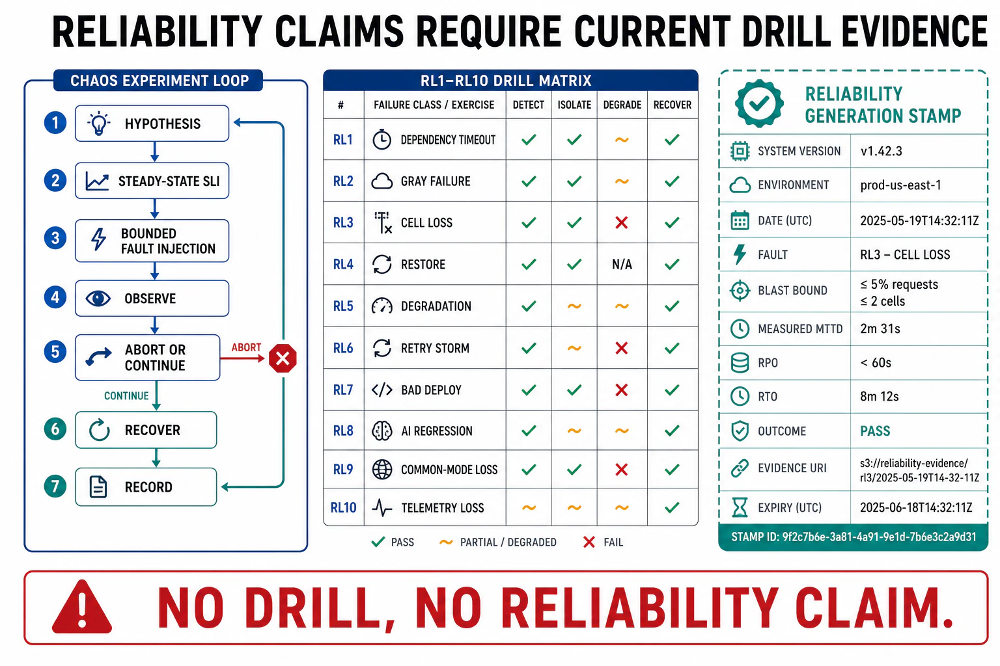

# Verification of Reliability



## Abstract

A reliability design is a set of *claims* — "this fault is detected in under five minutes," "this cell contains that blast," "this backup restores in under an hour," "this deploy rolls back automatically" — and every claim is worthless until it has been *tested against reality*, because the recurring lesson of this chapter is that untested reliability machinery fails at the exact moment it is invoked (the untested backup, file 04; the untested fallback, file 05; the untested rollback, file 07). Verification is therefore not a phase but a standing practice, and its instrument is **failure injection**: deliberately causing the fault to confirm the response, in an environment real enough to contain the failure the test is for — which, for the failures that matter (gray, correlated, metastable), means *production or a production-faithful replica*, because staging cannot reproduce the scale, load, and shared-domain structure where these failures live. This is **chaos engineering** ([Principles of Chaos](https://principlesofchaos.org/); Netflix's lineage from the 2008 database-corruption incident through Chaos Monkey): define the system's steady state as a measurable outcome, hypothesize that it holds under a specific fault, inject the fault with a *bounded blast radius and an abort switch*, and either confirm the hypothesis or find the weakness before an incident does. The file assembles the chapter into a **drill set RL1–RL10** — one executable exercise per reliability claim, spanning detection latency, blast-radius containment, degraded modes, recovery time, rollback, retry-storm defense, correlated-failure surfacing, and the AI-native quality-regression gate — each producing dated evidence with a **reliability-generation stamp** `{fault injected, blast scope, detection signal + MTTD, mitigation + MTTM, recovery + RTO/RPO measured, environment}` so a reliability claim is backed by *when it was last proven and what the numbers were*, not by assertion. The governing standard: **a reliability property that has not been drilled is a hypothesis, not a guarantee** — and the review (file 11) accepts hypotheses only with a date attached and a drill scheduled to convert them.

## 1. Chaos Engineering — The Verification Method

```text
Figure 1. The chaos experiment loop. Steady-state hypothesis →
bounded injection → observe → learn. The abort switch and blast
bound make it safe to run in production, where the failures live.

  1. STEADY STATE   define normal as a measurable outcome SLI
     │              (order rate, answer quality, p99 latency)
     ▼
  2. HYPOTHESIS     "steady state holds when <fault X> occurs"
     │              (a specific, falsifiable claim about a mitigation)
     ▼
  3. BLAST BOUND    smallest scope that tests the claim; abort switch
     │              armed; run in prod (or prod-faithful replica)
     ▼
  4. INJECT         cause the real fault: kill the node, add latency,
     │              expire the cache, drop the AZ, corrupt the index,
     │              ship the bad canary, saturate the queue
     ▼
  5. OBSERVE        did steady state hold? did detection fire (MTTD)?
     │              did containment/degrade/recover work as claimed?
     ▼
  6. LEARN          confirmed → evidence stamped; refuted → a weakness
                    found in a drill, not an incident. Widen scope,
                    repeat, and automate into continuous chaos.
```

The method's two disciplines that separate chaos engineering from "breaking things": a **falsifiable hypothesis** (you are testing a specific reliability *claim*, not injecting random faults hoping to learn something), and a **bounded, abortable blast radius** (the experiment cannot itself become the incident — it runs on a small scope with a kill switch, graduating to wider scope only as confidence builds). Run in production because that is where the gray-failure differential (file 02), the correlated shared domains (file 09), and the metastable feedback (file 06) actually exist — a staging environment tests the code, but the failures this chapter is about are properties of scale, load, and shared infrastructure that only production has.

## 2. The Reliability Drill Set — RL1–RL10

| # | Drill | Injects | Confirms the claim of | Evidence (measured) |
|---:|---|---|---|---|
| RL1 | **Detection-latency drill** | A real fault (bad canary, latency injection) | file 02 — MTTD budget | Time from fault to alert; burn-rate alert fired; differential signal caught gray mode |
| RL2 | **Blast-radius containment** | Kill a cell / saturate a shard / poison one tenant's input | file 03 — 1/N containment | Impact stayed within the boundary; other cells/tenants unaffected; shuffle-shard overlap held |
| RL3 | **Node/AZ failure** | Terminate instances / drop an availability zone | file 03 §4 — static stability | Data plane served on last-known assignment; control-plane outage did not unwind isolation |
| RL4 | **Degraded-mode drill** | Fail a dependency | file 05 — graceful degradation | Fallback served (independent of the failure); feature ladder shed correctly; degradation was observable |
| RL5 | **Fail-open/closed drill** | Take down a gating component (limiter, auth) | file 05 §3 — correct default | Limiter failed open (no self-outage); auth failed closed (no breach) — as declared |
| RL6 | **Restore/DR drill** | Restore from backup end-to-end | file 04 — RTO/RPO | Measured RTO vs target; restored data validated against invariants; backup integrity confirmed |
| RL7 | **Rollback drill** | Deploy a known-bad canary | file 07 — automated rollback | SLI breach auto-reverted; time-to-rollback measured; expand/contract kept state rollback-safe |
| RL8 | **Retry-storm / metastability** | Slow a dependency under load | file 06 — feedback-loop defense | Breaker opened; retry budget capped amplification; system did NOT enter sustained metastable state |
| RL9 | **Correlated-failure surfacing** | Fail a suspected shared domain (config, pool, CA) | file 09 — common-mode audit | Which "independent" components failed together; hidden shared domain identified |
| RL10 | **Quality-regression gate (AI)** | Ship a subtly worse model/prompt to canary | file 08 — eval-gated deploy | Quality eval caught the regression infra metrics missed; auto-rollback fired on the outcome SLI |

The set's design mirrors the chapter's structure: each drill verifies one file's central claim by *injecting the fault that claim is about* and *measuring the response*, so passing the whole set is evidence that every reliability property has been proven under real fault conditions rather than asserted. RL1, RL6, and RL10 are the standing canaries — detection latency, restore capability, and (for AI) quality-regression catching drift over time and must run on a *cadence*, not once, because reliability decays: a backup that restored last quarter may not this quarter (schema changed), a detection budget met last month may not now (a new silent dependency), a quality gate that worked may have a stale gold set (Ch12 f10).

## 3. The Reliability-Generation Stamp

```text
Figure 2. Every drill's evidence carries a stamp, so a reliability
claim is backed by WHEN it was last proven and WHAT the numbers
were — not by an assertion in a design doc.

  reliability evidence stamp {
    fault injected   : what real fault was caused (RL#, parameters)
    blast scope      : the bounded scope + abort switch used
    detection        : signal that fired + MEASURED MTTD
    mitigation       : response taken (auto/manual) + MEASURED MTTM
    recovery         : RTO / RPO MEASURED against target
    environment      : prod / prod-faithful replica (+ scale, load)
    date + result    : dated; confirmed or weakness-found + follow-up
  }

  A claim with no recent stamp = a hypothesis. The review (f11)
  treats an un-stamped reliability property as UNVERIFIED, however
  confident the design prose.
```

The stamp is the reliability analog of the evidence discipline every chapter carries (Ch01 f11's classification, Ch10's serving stamp, Ch12's retrieval stamp): it converts "the system is reliable" into a ledger of *dated, measured, environment-qualified* proofs, each traceable to the drill that produced it. Its enforcement rule is the one that makes reliability auditable: **an SLO or availability claim is only as current as its last drill** — a five-nines claim backed by a DR drill from eighteen months ago on an architecture that has since changed is not evidence, and the stamp's date is what surfaces that staleness before an incident does.

## 4. Approval Gates

| Gate | Evidence Required | Failure Condition |
|---|---|---|
| Method gate | Chaos experiments with falsifiable steady-state hypotheses, bounded abortable blast radius, run in prod/prod-faithful env | Random fault injection with no hypothesis; chaos in staging only (missing the failures that need scale); no abort switch |
| Drill-coverage gate | RL1–RL10 (or the workload's equivalents) each mapped to a file's central claim and executed | Reliability claims with no corresponding drill; untested backups/fallbacks/rollbacks assumed to work |
| Cadence gate | Standing canaries (detection, restore, quality-regression) run on a schedule, not once | A drill passed once and never repeated; reliability decay (stale backup, stale gold set, new silent dependency) undetected |
| Stamp gate | Every reliability claim backed by a dated, measured stamp (MTTD/MTTM/RTO/RPO, environment) | Availability/SLO claims asserted without a recent drill; an 18-month-old stamp on a changed architecture |
| Measurement gate | Drills measure the numbers (MTTD, MTTM, RTO, RPO, blast fraction), not just pass/fail | "The rollback worked" with no time measured; "restore succeeded" with no RTO |

## Output

The output of this file is the verification instrument that converts every reliability claim in the chapter into a proven property: chaos engineering as the method — falsifiable hypotheses, bounded blast, injected in the environment where the failures actually live — and the drill set RL1–RL10 as its executable form, each drill injecting the fault its target claim is about and measuring the response, standing canaries run on cadence to catch reliability decay, and a dated reliability-generation stamp making every property auditable by when it was last proven and what the numbers were. A reliability property that has not been drilled is, by this file's standard, a hypothesis awaiting a date.

## References

- [Principles of Chaos Engineering](https://principlesofchaos.org/)
- [Basiri et al., "Chaos Engineering," IEEE Software 2016 (the Netflix method formalized)](https://ieeexplore.ieee.org/document/7436642)
- [Google SRE Workbook — "Disaster Role Playing" / DiRT-style testing](https://sre.google/workbook/eliminating-toil/)
- [Google SRE Book — "Data Integrity" (restore testing as the only proof of a backup)](https://sre.google/sre-book/data-integrity/)
