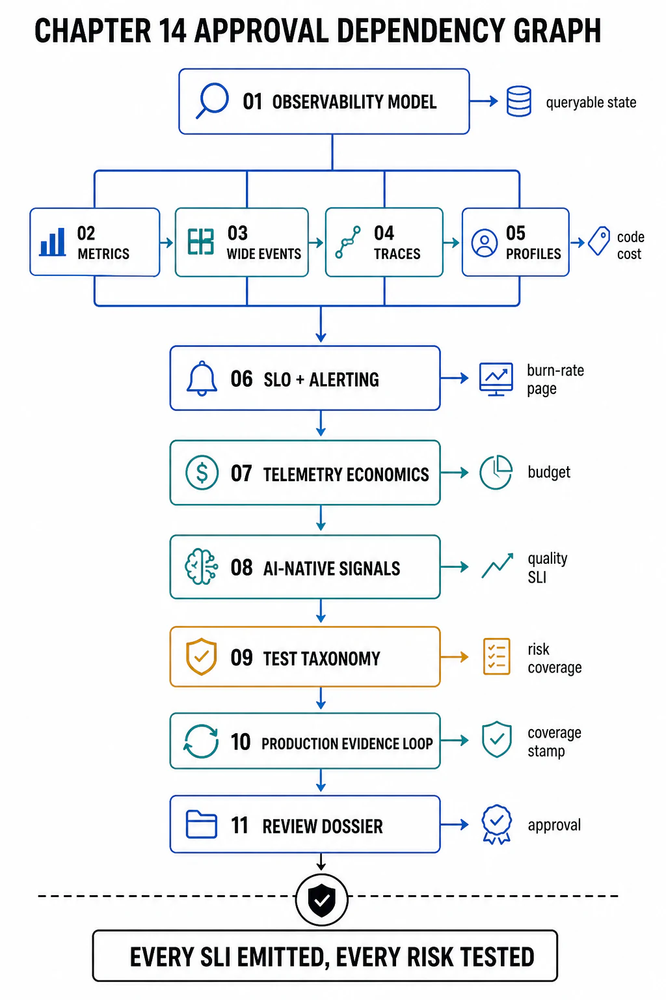

# Chapter 14 — File Map and Reading Order



## What This Chapter Owns

Chapter 13 designed the *responses* to failure — detection signals, blast-radius bounds, degraded modes, recovery paths — and every one of them rests on an unstated dependency: a signal that fires the response, and evidence that proves the response worked. This chapter owns that dependency. **Observability** is the property that you can answer questions about the system's internal state — including questions you did not anticipate when you built it — from the telemetry it emits; **verification** is the practice of proving, before and during production, that the system does what its contracts (Chapter 01) claim. The two are one discipline because they answer the same question at different times: verification asks "does it work?" against a test, observability asks "is it working?" against production, and both are worthless if the system emits nothing to check. The chapter's root claim: **a reliability design you cannot observe is a set of claims you cannot check, and a system you cannot verify is a hypothesis you are running in production** — so instrumentation and testability are architecture decisions made at design time, not operational features bolted on after an incident proves them missing. What this chapter does **not** own: the specific SLIs and drills defined in every prior chapter (TTFT and MBU in Chapter 10, retrieval recall in Chapter 12, the RL-drills in Chapter 13) — those are *cited* here as the signals this chapter's machinery carries, never redefined. This chapter owns the *substrate* — how signals are emitted, propagated, stored, queried, sampled, and paid for, and how tests map to the architecture's risks — that makes every prior chapter's SLI observable and every prior chapter's claim verifiable.

## Reading Order

```text
Figure 1. Dependency graph. File 01 sets the model (observability
as queryable state, verification as proof). Files 02–05 are the
signal types (metrics, logs/events, traces, profiles). 06–07 turn
signals into alerts and pay for them. 08 is the AI-native signal
set. 09–10 are verification. 11 templates.

  01 observability model & the verification boundary
        │  (queryable internal state; telemetry vs queries; signals
        ▼   as lenses; instrumentation as a design obligation)
  ┌───────────┬───────────┬───────────┐
  ▼           ▼           ▼           ▼
  02 metrics  03 logs &   04 traces & 05 profiling
  (RED/USE/   wide events context     (continuous,
  golden)     (the        propagation eBPF, flame
              substrate)  (causal)    graphs)
        └───────────┴─────┬─────┴───────────┘
                          ▼
  06 SLO instrumentation & alerting
        │  (SLI→SLO; symptom-based; burn-rate)
        ▼
  07 telemetry economics (cardinality, sampling, cost)
        │
        ▼
  08 AI-native observability (token/quality/eval/LLM-trace)
        │
        ▼
  09 verification & the test taxonomy
        │  (unit→integration→contract→load→chaos→regression)
        ▼
  10 production verification & the evidence loop
        ▼
  11 review templates (dossier + checklist)
```

## Approval Dependency Graph

| File | Produces | Consumes (prerequisite, cited not re-argued) |
|---|---|---|
| 01 | The observability model and the verification boundary | Ch13 (the responses this triggers); Ch01 f11 evidence classes |
| 02 | The metrics discipline (RED/USE/golden signals, percentiles) | Ch07 f-tail; Ch09 saturation; Dean & Barroso tails |
| 03 | Structured logs and the wide-event substrate | Ch03 f09 PII governance; Ch06 event discipline |
| 04 | Distributed tracing and context propagation | W3C Trace Context; Ch02 plane boundary |
| 05 | Continuous profiling and hotspot attribution | Ch10 GPU/roofline; Ch09 resource accounting |
| 06 | SLO instrumentation and symptom-based alerting | Ch13 f02 burn-rate; every chapter's SLIs |
| 07 | Telemetry economics (cardinality, sampling, retention) | Ch08 cost discipline; Ch01 f02 cost accounting |
| 08 | The AI-native telemetry set | Ch10 token economics; Ch12 retrieval SLIs; Ch13 f08 outcome-SLI |
| 09 | The test taxonomy mapped to architecture risks | Ch07 contract tests; Ch09 load model; Ch13 f10 chaos |
| 10 | Production verification and the evidence loop | Ch13 f07 canary; Ch13 f10 drill stamps |
| 11 | The review dossier and checklist | every file above |

## Chapter Rule

A system is approved as observable and verified only when **every SLI a prior chapter defined has an emission path** (a signal that carries it from where it happens to where it is queried), **every alert pages on a symptom a user feels** (not a cause a machine noticed), and **every architecture risk has a test that exercises it**. The chapter's discipline is that observability is not "we have dashboards" and verification is not "we have tests" — it is that the *specific* questions an incident will ask can be answered from the telemetry, and the *specific* risks the design carries are each exercised by a test that can fail. A signal nobody queries, an alert nobody can act on, and a test that exercises no real risk are all cost without coverage — and coverage, not volume, is what this chapter approves.

## References

- [Sridharan, *Distributed Systems Observability* (O'Reilly) — observability as queryable internal state](https://www.oreilly.com/library/view/distributed-systems-observability/9781492033431/)
- [OpenTelemetry — specification and semantic conventions (the telemetry substrate)](https://opentelemetry.io/docs/specs/otel/)
