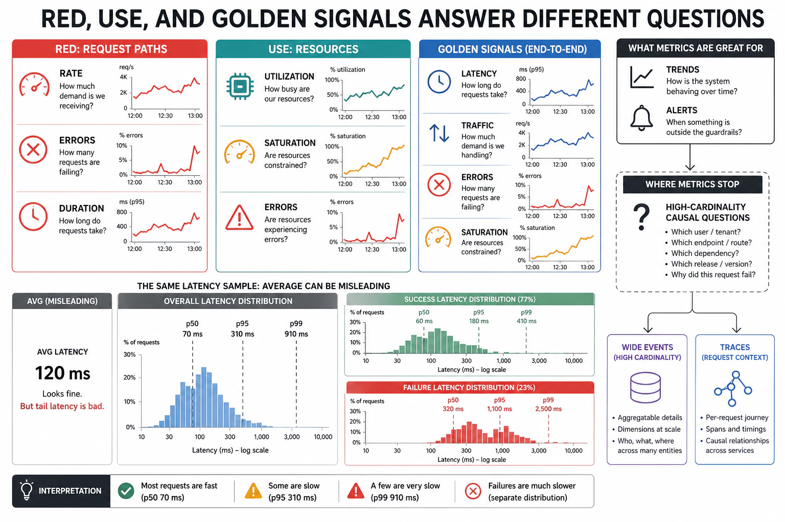

# Metrics — RED, USE, and the Golden Signals



## Abstract

Metrics are the cheapest, oldest, and most-abused observability signal: a metric is a numeric measurement aggregated over a time window, and its virtue (cheap, low-cardinality, fast to query — the right substrate for the *anticipated* dashboard) is inseparable from its vice (aggregation discards the individual events, so a metric can tell you *that* the p99 rose but never *which* requests or *why* — the file-01 limitation that sends you to traces and wide events). This file establishes what to measure, using the three battle-tested methodologies that answer three different questions. **RED** ([Tom Wilkie, Weaveworks 2015](https://www.weave.works/blog/the-red-method-key-metrics-for-microservices-architecture/)) — **R**ate, **E**rrors, **D**uration — is the request-centric view: for every service, how many requests, how many failed, how long they took; it is the *user-happiness* signal and the first dashboard every service needs. **USE** ([Brendan Gregg](https://www.brendangregg.com/usemethod.html)) — **U**tilization, **S**aturation, **E**rrors — is the resource-centric view: for every resource (CPU, memory, disk, network, GPU, connection pool), how busy, how backed-up, how many errors; it is the *machine-happiness* signal and the one that localizes a saturation to the resource causing it (Chapter 09's queueing made observable). **The Four Golden Signals** ([Google SRE](https://sre.google/sre-book/monitoring-distributed-systems/)) — **Latency, Traffic, Errors, Saturation** — are the superset framing that reminds you to carry saturation (which RED omits) and to separate the latency of *successful* requests from failed ones (a fast 500 must not flatter your latency graph). The unifying discipline, and the single most important measurement rule in the chapter: **measure distributions, not averages** — the mean latency is a lie the tail tells (Chapter 07, Dean & Barroso's tail-at-scale), so latency is a *histogram* reported at p50/p95/p99/p99.9, because the average hides the tail that is the actual user experience of your worst-served and often most-valuable requests. The when-NOT admission (standard 3): metrics are for the questions you can name in advance and want cheaply and continuously; the moment the question becomes "which requests / which users / why," metrics have hit their aggregation ceiling and the investigation belongs in traces (file 04) and wide events (file 03) — and a team that tries to answer high-cardinality questions by minting ever-more label combinations discovers file 07's cardinality explosion instead.

## 1. The Three Methods — Three Questions

```text
Figure 1. RED, USE, and Golden Signals answer different questions.
Use RED for services, USE for resources, Golden as the checklist
that neither forgets saturation nor blends success with failure.

  method   scope        measures                    the question
  ───────  ───────────  ──────────────────────────  ─────────────────
  RED      per service  Rate, Errors, Duration      "are my USERS
           (request-     (requests/s, fail/s,        happy with this
            driven)      latency distribution)       service?"
  USE      per resource Utilization, Saturation,    "is this RESOURCE
           (CPU, mem,    Errors                      the bottleneck?"
            disk, pool,  (% busy, queue depth,
            GPU)         error count)
  GOLDEN   per service  Latency, Traffic, Errors,   "the SRE checklist
  SIGNALS  (superset)   Saturation                   — did I miss
                                                      saturation or
                                                      blend 500s in?"

  Wilkie's synthesis: use BOTH. RED cares about users' happiness;
  USE cares about machines' happiness. A user-facing latency spike
  (RED) is explained by a saturated resource (USE) — you need both
  signals to go from "slow" to "slow BECAUSE the pool is exhausted."
```

The pairing is the diagnostic method: **RED tells you the symptom, USE tells you the cause.** A rising Duration in RED ("requests are slow") is localized by USE ("the connection pool is at 100% utilization with a growing saturation queue" — Chapter 09's ρ→∞ made visible), turning an alert into a diagnosis. This is why mature dashboards carry both: the service's RED on top (what the user feels), the resources' USE below (what to fix), and the golden-signal checklist ensuring saturation — the leading indicator of the cascade (Chapter 13 f06) — is never omitted because RED alone does not carry it.

## 2. Measure Distributions, Not Averages

```text
Figure 2. Why the average latency is a lie. Two services, identical
mean, opposite user experience. Only the distribution reveals it.

  latency samples (ms), both services mean = 100 ms:

  Service A:  [95,98,100,102,105,98,101,99,103,99]
              tight; p99 ≈ 105 ms; every user sees ~100 ms

  Service B:  [10,10,10,10,10,10,10,10,10,910]
              mean 100 ms; p90 = 10 ms; p99 = 910 ms
              → 1 in 10 users waits 910 ms; the mean HID it

  Rule: latency is a HISTOGRAM, reported at percentiles:
     p50 (typical) · p95 · p99 · p99.9 (the tail = the worst-served
     and, at scale, a LARGE ABSOLUTE COUNT of real users)

  Corollary (Ch07, tail-at-scale): a request that fans out to N
  services waits for the SLOWEST; p99 of the fan-out ≈ the p99 of
  the components AMPLIFIED — so tail latency COMPOUNDS, and the
  average never sees it coming.
```

The rule is non-negotiable because the failure it prevents is systemic: averages are computed and alerted on by default in most tooling, and they structurally hide the tail — and the tail is not an edge case, it is (at a million requests, a p99.9 event happens a thousand times) a large population of real users having a bad experience the mean says does not exist. Two further disciplines follow. **Percentiles do not average**: you cannot average two servers' p99s to get the fleet p99 (a common tooling error) — percentiles must be computed from merged histograms, which is why latency is emitted as histogram buckets, not pre-computed percentiles. **Separate success from failure latency**: a fast-failing 500 is *quick*, and blending it into the latency graph makes an outage look like a performance *improvement* — so latency percentiles are reported for successful requests, with errors counted separately (the golden-signal discipline RED's single "Duration" can blur).

## 3. What Metrics Are For — and Where They Stop

Metrics are the correct signal for a bounded, valuable set of questions and the wrong signal for everything past it, and knowing the boundary is what keeps observability affordable (file 07):

| Question | Right signal | Why |
|---|---|---|
| "Is the error rate up right now?" (anticipated, continuous) | **Metric** (RED errors) | Cheap, fast, low-cardinality; the dashboard/alert substrate |
| "Is any resource saturating?" (anticipated, continuous) | **Metric** (USE saturation) | Leading indicator; cheap to watch always |
| "What is the p99 latency trend over 30 days?" | **Metric** (latency histogram) | Aggregation over time is exactly what metrics do well |
| "*Which* requests are slow, and what do they share?" | **Wide event / trace** (f03/f04) | High-cardinality; metrics aggregated the answer away |
| "*Why* is this specific request slow?" | **Trace + profile** (f04/f05) | Causal, per-request; no metric holds this |
| "Did *this tenant on this build* regress?" | **Wide event** (f03) | The dimensions are high-cardinality; minting labels for them explodes cost (f07) |

The discipline the table enforces: **do not try to make metrics answer high-cardinality questions by adding labels.** Each new label dimension multiplies the metric's time-series count (file 07's cardinality arithmetic: series = ∏ of label cardinalities), so "add user_id as a label" turns one series into millions and bankrupts the metrics store — the exact question (per-user, per-request) that wide events (file 03) answer cheaply because they store the dimension once per event instead of as a permanent series. Metrics stop where cardinality starts; that boundary is a design decision, not a tooling limit.

## 4. Approval Gates

| Gate | Evidence Required | Failure Condition |
|---|---|---|
| RED+USE gate | Every service has RED (rate/errors/duration); every resource has USE (utilization/saturation/errors); symptom (RED) paired to cause (USE) | Services with no error/latency metric; saturation unmonitored (the cascade's leading indicator missing) |
| Distribution gate | Latency emitted as histograms, reported at p50/p95/p99/p99.9; percentiles computed from merged histograms, not averaged | Mean latency as the headline; averaged percentiles; the tail invisible |
| Success/failure-split gate | Latency of successful requests separated from failed; errors counted independently | Fast 500s flattering the latency graph; an outage looking like a speedup |
| Saturation gate | Saturation carried explicitly (golden signals), not omitted as RED alone would | A cascade's leading indicator absent; discovering saturation only after the collapse |
| Cardinality-boundary gate | High-cardinality questions routed to wide events/traces, not answered by minting metric labels | user_id/request_id as metric labels; cardinality explosion (f07) from forcing metrics past their ceiling |

## Output

The output of this file is a metrics discipline: RED for user-facing service health, USE for resource-level cause, the Four Golden Signals as the checklist that carries saturation and separates success from failure, and above all the rule that latency is a distribution reported at percentiles — because the average hides the tail that is the real experience of the worst-served requests. Metrics answer the anticipated, continuous, low-cardinality questions cheaply and stop precisely where cardinality begins, handing the "which" and "why" to the wide events and traces of the next two files rather than bankrupting themselves trying to answer them.

## References

- [Wilkie, "The RED Method: key metrics for microservices architecture" (Weaveworks 2015)](https://www.weave.works/blog/the-red-method-key-metrics-for-microservices-architecture/)
- [Gregg, "The USE Method"](https://www.brendangregg.com/usemethod.html)
- [Google SRE Book — "Monitoring Distributed Systems" (the Four Golden Signals)](https://sre.google/sre-book/monitoring-distributed-systems/)
- [Dean & Barroso, "The Tail at Scale," CACM 2013 (why percentiles, why the tail compounds)](https://cacm.acm.org/research/the-tail-at-scale/)
