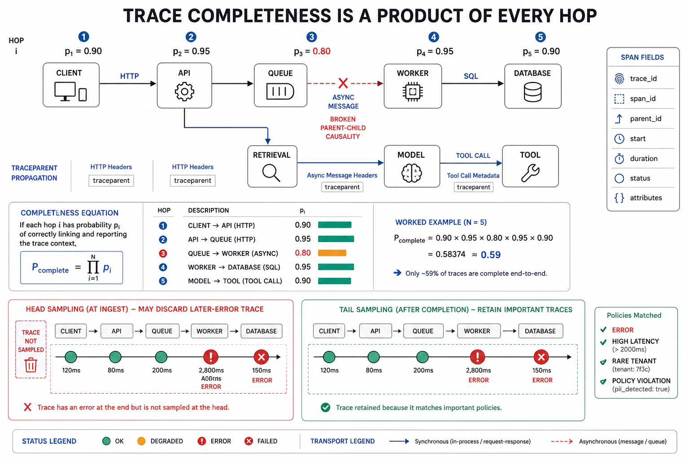

# Distributed Tracing and Context Propagation



## Abstract

A metric says the p99 is up and a wide event says *which* requests are slow, but neither says *where in a request's journey across services the time went* — and in a system where one user action fans out to a dozen services, three caches, a queue, and a model call, "where did the latency come from" is the question every performance investigation asks and only a **distributed trace** answers. A trace is the causal graph of one request: a tree of **spans**, each span a timed operation (an HTTP handler, a DB query, a cache lookup, a model call) annotated with attributes and linked to its parent, so the trace reconstructs the request's full path with the duration and outcome of every hop. The mechanism that makes this possible across process and network boundaries is **context propagation**: a trace identifier (and the parent span id) is injected into every outbound call and extracted on every inbound one, so spans emitted by different services on different machines reassemble into one tree — standardized by [W3C Trace Context](https://www.w3.org/TR/trace-context/) (the `traceparent` header) so propagation works across vendors and languages, and carried by [OpenTelemetry](https://opentelemetry.io/docs/specs/otel/) as the instrumentation layer. This file's central quantitative claim (standard 6, the chapter's composition law): **trace completeness is a product of per-hop instrumentation** — a trace that crosses *n* hops, each independently instrumented to propagate context with probability *pᵢ*, is fully reconstructable only with probability **∏ pᵢ**, so a single un-instrumented hop that drops the context breaks the chain and orphans everything downstream, and a path that is "90% instrumented" at each of five hops yields only 0.9⁵ ≈ 59% complete traces — which is why the un-instrumented service is exactly where every investigation stalls (the trace goes dark at the one hop nobody wired up). The file's other hard problem is **sampling**: full-fidelity tracing of every request is often unaffordable (file 07), so the system samples — and *which* requests it keeps is a design decision with a trap, because **head-based sampling** (decide at ingress) is cheap but blind to outcome (it may discard the very request that later errored or ran slow), while **tail-based sampling** (decide after the trace completes, keeping errors and slow tails) keeps the interesting traces at the cost of buffering every span until the outcome is known. The synthesis: tracing is what turns "the system is slow" into "the system is slow *at this span, on this service, because of this downstream call*" — but only to the completeness its least-instrumented hop and its sampling policy permit.

## 1. The Trace as a Causal Graph

```text
Figure 1. One request's trace: a tree of spans with durations. The
trace localizes latency to the hop that spent it and preserves the
causal parent→child structure a flat log cannot.

  trace_id = abc123          [═══ total: 812 ms ═══════════════]
   │
   ├─ span: POST /checkout            [812 ms] (root, service=api)
   │   ├─ span: auth.verify            [ 12 ms]
   │   ├─ span: cart.load (DB)         [ 45 ms]
   │   ├─ span: inventory.check (RPC)  [640 ms] ◄── the culprit
   │   │   └─ span: inventory.db.query [610 ms]     (slow query,
   │   │                                             not the network)
   │   ├─ span: payment.authorize (RPC)[ 95 ms]
   │   └─ span: order.write (DB)       [ 18 ms]
   │
   Reading: the 812 ms is not spread evenly — 640 ms is one RPC,
   and within it 610 ms is ONE DB query. The trace turns "checkout
   is slow" into "inventory.db.query is slow" in one view. A flat
   log of these events, un-parented, could not show the nesting or
   attribute the time.
```

The trace's power is *attribution*: it assigns the request's total latency to the specific span that spent it, across service boundaries, preserving the parent-child causality that says *this* call was waiting on *that* one. This is the signal that answers "why is this request slow" (as opposed to file 02's "requests are slow" and file 03's "which requests"), and — critically for the systems of this book — it is the only view that makes a **fan-out** (Chapter 07's tail-at-scale, where the request waits for the slowest of N parallel calls) or a **deep call chain** (the serial-dependency erosion of Chapter 13 f09) visible as structure rather than as an aggregate number. Each span carries attributes (the same high-cardinality context as file 03's events — indeed a span *is* a wide event with a parent link), so a trace is sliceable by tenant, build, and model version exactly as the event substrate is.

## 2. Context Propagation — The Composition Law of Trace Completeness

```text
Figure 2. Trace completeness = ∏ per-hop instrumentation. One dark
hop orphans everything below it. This is the chapter's composition
law (standard 6): coverage composes multiplicatively along the path.

  request path, per-hop context-propagation rate pᵢ:

   API ──0.99──► auth ──0.99──► inventory ──0.70──► db ──0.99──► cache
    │             │              │(legacy,        │
    │             │              │ un-wired)       │
    ▼             ▼              ▼                 ▼
  full trace reconstructable only if EVERY hop propagated context:
    P(complete) = 0.99 × 0.99 × 0.70 × 0.99 × 0.99 ≈ 0.67

  The 0.70 hop (a legacy service that drops traceparent) caps the
  whole trace: everything BELOW it is orphaned — emitted, but
  un-linkable to the request. The investigation "goes dark" exactly
  there. Worked: five hops each at 0.90 → 0.9⁵ ≈ 0.59 complete.

  Consequence: instrument the WHOLE path or accept that traces
  break at the weakest hop. Coverage is the product, not the average
  — "mostly instrumented" is not "traces mostly work."
```

The composition law is the file's actionable core: **a trace is only as complete as its least-instrumented hop**, because context propagation is a chain and a chain breaks at its weakest link — so the reliability of tracing as an investigative tool is a *product* of per-hop coverage, and the single un-wired legacy service (the one that does not forward `traceparent`) is not a 10% gap, it is the point where every trace passing through it goes dark below. This reframes the instrumentation priority: the highest-value tracing work is not richer spans on already-instrumented services but *eliminating the dark hops* — the un-wired service, the async queue that drops context across the enqueue/dequeue boundary (Chapter 06), the third-party call that does not propagate — because each dark hop's fix restores the *entire subtree* below it to visibility. Propagation must cross every boundary the request does: process, network (W3C `traceparent`), *and* asynchronous handoffs (a job pulled from a queue must carry the enqueuing request's trace context, or the async work is un-attributable to what caused it).

## 3. Sampling — Keeping the Traces Worth Keeping

Tracing every request at full fidelity is often unaffordable (each span is stored, indexed, and retained — file 07), so the system samples, and the sampling strategy determines whether the traces you keep are the ones you needed:

| Strategy | Decides when | Keeps | Cost / trap |
|---|---|---|---|
| **Head-based** | At ingress, before outcome known | A fixed % of all requests (e.g. 1%) | Cheap, simple; but **blind to outcome** — likely to discard the rare request that errored or ran slow (the one you wanted) |
| **Tail-based** | After the trace completes, outcome known | Errors, slow tails, + a baseline sample of normal | Keeps the interesting traces; but must **buffer all spans** until the outcome is known — memory + collector cost |
| **Head + dynamic** | Ingress, but rate varies by route/tenant | More of the rare/valuable routes, less of the noisy bulk | Balances cost and coverage; needs the routes classified in advance |

The discipline mirrors file 03's logging rule: **keep the rare and interesting, sample the common** — which structurally favors tail-based sampling for the traces that matter (an error trace and a p99.9 trace are exactly what you cannot reconstruct after the fact, so they must be kept when they occur), accepting its buffering cost as the price of not discarding the evidence. A head-based 1% sample that happens not to include the outage's traces is observability spend that bought nothing when it was needed — the sampling analog of file 04's dark-hop problem: the trace existed, and the policy threw it away before the question was asked.

## 4. Tracing the Systems of This Book — Agents and Pipelines

Distributed tracing generalizes cleanly to the AI-native control flows of Chapters 11–12, and is the primary tool for making them debuggable:

- **The agent loop (Chapter 11)** is a trace: each observe→plan→act→verify step is a span, each tool call a child span with its latency and outcome, each model call a span with its token counts (file 08) — so an agent episode's trace shows *where the turns went*, which tool call failed, and how the pⁿ failure (Ch11 f02) accumulated across steps. An un-traced agent loop is a black box whose failures are un-attributable to the step that caused them.
- **The RAG pipeline (Chapter 12)** is a trace: parse→chunk→embed→retrieve→rerank→pack→generate as spans, each carrying its stage recall (Ch12's composition law), so the trace *is* the per-stage attribution file 12 demanded — the trace shows which stage dropped the answer.
- **The [OpenTelemetry GenAI semantic conventions](https://opentelemetry.io/blog/2026/genai-observability/)** (file 08) standardize these spans — `chat`, `embeddings`, `execute_tool`, `invoke_agent` — so agent and retrieval traces are portable across tools and carry a shared grammar for prompts, completions, token usage, and tool calls.

The point: the trace is not just a microservice-latency tool; it is the causal-attribution substrate for *every* multi-step control flow in the book, and instrumenting the agent loop and the retrieval pipeline as traces is what makes their composition-law failures (pⁿ, product-of-recalls) observable per-step rather than visible only as a degraded end-to-end number.

## 5. Approval Gates

| Gate | Evidence Required | Failure Condition |
|---|---|---|
| Trace-structure gate | Requests traced as span trees with parent-child causality; latency attributable to the span that spent it | Flat un-parented events; "the request is slow" with no per-hop attribution |
| Propagation-completeness gate | Context propagated across every hop (process, network via W3C traceparent, async queue boundaries); dark hops identified and eliminated | A dark hop orphaning its subtree; async handoffs dropping trace context; ∏pᵢ far below 1 |
| Sampling gate | Keep-the-rare policy (errors, slow tails) via tail-based or dynamic sampling; not a blind head-based % that discards the interesting traces | Head-based 1% that throws away the outage's traces; sampling errors away |
| AI-control-flow gate | Agent loops and RAG pipelines traced as span trees (per-step, per-stage), using GenAI semantic conventions | Agent/retrieval as black boxes; composition-law failures visible only as end-to-end degradation |
| Span-context gate | Spans carry high-cardinality attributes (tenant/build/model-version) so traces are sliceable like the event substrate | Bare spans with timing only; traces un-sliceable by the dimension the incident needs |

## Output

The output of this file is distributed tracing as the causal-attribution signal: requests reconstructed as span trees that localize latency and failure to the exact hop and downstream call, made possible by context propagation across every boundary — with the composition law making explicit that trace completeness is the *product* of per-hop instrumentation, so a single dark hop breaks the chain and eliminating dark hops is the highest-value tracing work. Sampling keeps the rare and interesting traces the investigation will need, and the same span machinery traces the agent loops and retrieval pipelines of Chapters 11–12, making their composition-law failures observable step by step rather than only as a degraded aggregate.

## References

- [W3C Trace Context (the traceparent propagation standard)](https://www.w3.org/TR/trace-context/)
- [OpenTelemetry — Traces data model and context propagation](https://opentelemetry.io/docs/specs/otel/)
- [OpenTelemetry, "Inside the LLM Call: GenAI Observability" (agent/RAG spans)](https://opentelemetry.io/blog/2026/genai-observability/)
- [Sigelman et al., "Dapper, a Large-Scale Distributed Systems Tracing Infrastructure" (Google 2010)](https://research.google/pubs/dapper-a-large-scale-distributed-systems-tracing-infrastructure/)
