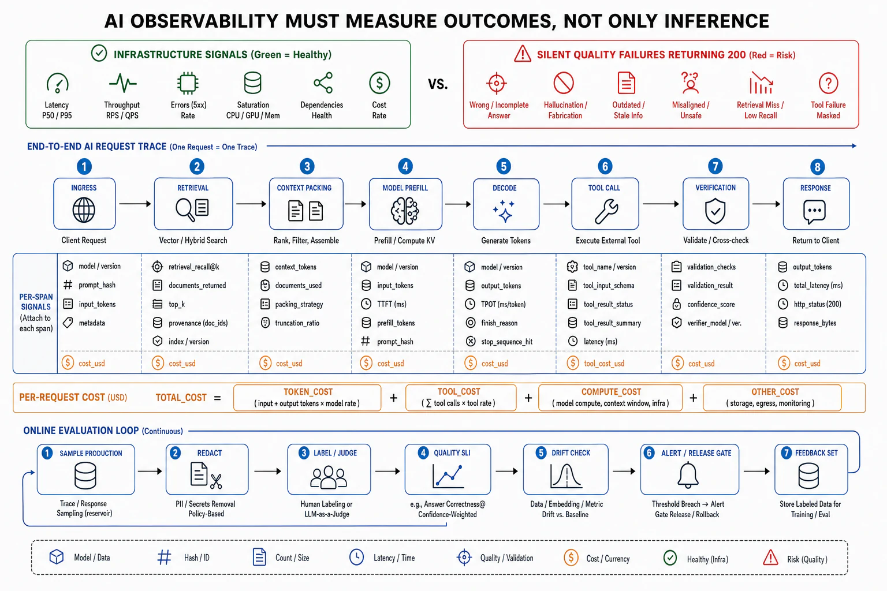

# AI-Native Observability



## Abstract

An AI system's observability inherits every signal in this chapter and adds a category the traditional stack has no slot for, because of the reliability fact Chapter 13 f08 established: **AI failures are silent — a fluent wrong answer returns a 200 status**, so the infrastructure signals (latency, error rate, saturation) are all green while the thing that actually failed (the answer was wrong, unfaithful, or harmful) is invisible to every metric, trace, and profile in files 02–07. The defining move of AI-native observability is therefore to make **the outcome a first-class telemetry signal** — to measure and emit *whether the system produced a correct, faithful, useful result*, continuously, in production, as the primary SLI (file 06) — because for an AI system that is the only signal watching the failure that matters. This file establishes the AI telemetry set. **Token and cost telemetry**: every model call emits its input/output token counts, model version, and derived cost (Chapter 10's economics made observable per request), because tokens are the unit of both latency and spend and an un-instrumented token path is an un-budgetable bill. **Quality/eval telemetry**: the outcome measured by online evals (a sample of production traffic scored — by a judge model, a heuristic, or deferred human review — for faithfulness, correctness, and task success, Chapter 12's retrieval SLIs and Chapter 13's quality gate as a *standing production signal*, not just a deploy gate), which is the AI form of the RED "errors" signal for failures that carry no error. **LLM/agent tracing**: the agent loop and RAG pipeline traced as span trees (file 04) using the [OpenTelemetry GenAI semantic conventions](https://opentelemetry.io/blog/2026/genai-observability/) — `chat`, `embeddings`, `execute_tool`, `invoke_agent` spans carrying prompts, completions, token usage, and tool calls — so an episode's behavior is inspectable step by step. **Non-determinism as an observability constraint** (Chapter 13 f08): the same input yielding different outputs means telemetry must capture enough of the generation context (model version, sampling params, retrieved context, seed where fixed) to make a logged failure *reproducible*, or the investigation has nothing to re-run. The synthesis and the chapter's AI-native instantiation (standard 1): traditional observability watches the machine and infers the service is fine; AI-native observability watches the *output's quality* directly, because the machine can be perfectly healthy while the service is confidently wrong — and the eval, run continuously on production traffic, is the monitor that closes the gap the 200-status hides.

## 1. The AI Telemetry Set

| Signal | What it emits | The failure it catches (that infra misses) |
|---|---|---|
| **Token/cost** | Input+output tokens, model version, $/request per call | Runaway cost; a prompt-bloat regression; the un-budgetable bill (Ch10) |
| **Quality/eval (online)** | Faithfulness, correctness, task-success scores on sampled prod traffic | The silent wrong answer — the 200-status Byzantine failure (Ch13 f08) |
| **Retrieval SLIs** | Per-stage recall, groundedness, context relevance (Ch12) | The stale/missing-context answer; the composition-law failure (Ch12 f02) |
| **LLM/agent trace** | chat/embeddings/tool/agent spans w/ prompts + completions | Which agent step or RAG stage failed; the pⁿ accumulation (Ch11 f02) |
| **Abstention/refusal rate** | How often the system declined vs answered | A system that stopped abstaining (hallucinating instead) or over-refuses |
| **Guardrail/safety** | Blocked inputs/outputs, policy-verdict rates | A safety regression; a jailbreak surge (Ch11 f08) |
| **Determinism context** | Model version, sampling params, retrieved context, seed | Un-reproducible failures — investigation with nothing to re-run |

The table's organizing truth restated from Chapter 13 and made concrete here: **every AI-specific signal is an outcome or a cost signal, never an infra signal** — because the infra is not what is failing. A team that adds AI features to a system and monitors only the traditional stack (latency, errors, saturation) has instrumented the plane that is not crashing; the AI observability investment is the outcome-eval and token pipelines, which the traditional stack has no equivalent of and which must be *built*, not bought as a dashboard.

## 2. Quality as a Production Signal — The Online Eval Loop

```text
Figure 1. The online eval loop: quality measured continuously on
production traffic, not just at deploy. This is the monitor for the
failure the 200-status hides.

  production traffic ──► sample (e.g. 1–5%, or 100% for high-stakes)
        │
        ▼
  score each sampled output:
    · heuristic checks (format valid? cited a source? refused when
      it should? — cheap, run on all)
    · judge model (faithfulness, correctness, helpfulness — Ch12's
      calibrated LLM-judge, itself validated against human labels)
    · deferred human review (a small sample, the ground truth that
      calibrates the judge)
        │
        ▼
  emit as SLIs ──► SLO + burn-rate alert (f06):
    "faithfulness dropped below 0.85 over 1h" → PAGE
    "abstention collapsed 0.4 → 0.05" → PAGE (hallucinating now)
        │
        ▼
  same signal gates deploys (Ch13 f07) AND monitors production —
  offline eval (gold set, pre-deploy) + online eval (prod, standing)
  are the SAME instrument at two times (the f01 verification boundary)
```

The online eval loop is the AI-native answer to "how do you alert on a failure that returns 200": you *measure the outcome* on a sample of real traffic and alert on its degradation, exactly as RED alerts on error rate — except the "error" is a quality score a judge or heuristic computes, because the model call itself reports success. This is the file-06 SLI discipline applied to the signal that matters most for AI: the SLI is *faithfulness* or *task success*, not *200-rate*, and its burn-rate breach pages. The loop unifies offline and online evaluation as the file-01 verification boundary predicted — the *same* gold sets and judges that gate the deploy (Chapter 13 f07) run continuously on production traffic as the standing monitor, so a regression that the deploy-time gold set missed (because production traffic drifted from it — Chapter 12's gold-set treadmill) is caught by the online eval on the real distribution.

## 3. Cost and Token Observability — The Bill as a Signal

For AI systems the request cost is dominated by tokens and GPU-seconds (Chapter 10), and unlike a traditional service — where cost is roughly proportional to request count and rarely surprises — an AI system's per-request cost varies by orders of magnitude with prompt length, context size, output length, model choice, and agent-loop depth, so **cost is a signal that must be observed per request, not estimated in aggregate**. The instrumentation: every model call emits input tokens, output tokens, model version, and cached-token count (Chapter 08's prompt-cache economics), from which cost is derived and attributed — per request, per tenant, per feature, per agent-episode. The failures this catches that no traditional signal does: a **prompt-bloat regression** (a context-packing change, Chapter 12 f06, that doubles input tokens with no quality gain — invisible to latency if the model keeps up, but a doubled bill), an **agent-loop runaway** (an episode that loops far more than expected, Chapter 11's episode economics, spending tokens without progress), and a **model-mix drift** (traffic silently shifting to the expensive frontier model when the cheaper one would serve — Chapter 11 f06's routing made observable). Token/cost telemetry turns the invoice from a monthly surprise into a real-time signal with per-request attribution, so a cost regression pages like a latency regression instead of arriving four weeks later on the bill.

## 4. Approval Gates

| Gate | Evidence Required | Failure Condition |
|---|---|---|
| Outcome-as-signal gate | Output quality (correctness/faithfulness/task-success) emitted as the primary AI SLI, distinct from and above infra health | Monitoring only the traditional stack; the silent 200-status wrong answer invisible |
| Online-eval gate | A standing production eval loop (heuristic + judge + human-calibrated sample) emitting quality SLIs with burn-rate alerts | Quality checked only at deploy (or not at all); production drift uncaught by the stale gold set |
| Token/cost gate | Per-request token counts, model version, cached tokens, and derived cost emitted and attributed (tenant/feature/episode) | Cost estimated in aggregate; prompt-bloat, loop-runaway, and model-drift regressions arriving on the monthly bill |
| LLM-trace gate | Agent loops and RAG pipelines traced with GenAI semantic conventions (prompts, completions, tool calls, per-step) | Agent/retrieval as black boxes; step-level failures un-attributable |
| Reproducibility gate | Generation context (model version, sampling params, retrieved context, seed) captured so logged failures are re-runnable | Un-reproducible production failures; an investigation with nothing to replay (Ch13 f08 non-determinism) |
| Safety-telemetry gate | Abstention rate, guardrail verdicts, and refusal rates observed as signals | A hallucination surge (abstention collapse) or jailbreak spike unmonitored |

## Output

The output of this file is the AI-native telemetry set that watches the failure traditional observability cannot see: the output's *quality* measured continuously on production traffic as the primary SLI — because the model reports 200 while being wrong — alongside per-request token and cost telemetry that turns the bill into a real-time signal, LLM/agent traces that make multi-step control flows inspectable, and enough captured generation context to make silent failures reproducible. The online eval loop is the monitor for the silent Byzantine failure, unifying the deploy-gate and the production-monitor as one instrument at two times — and it is the AI-native instantiation of this chapter's discipline: instrument the *outcome*, because the machine can be perfectly healthy while the service is confidently wrong.

## References

- [OpenTelemetry, "Inside the LLM Call: GenAI Observability with OpenTelemetry" (2026)](https://opentelemetry.io/blog/2026/genai-observability/)
- [OpenTelemetry — GenAI semantic conventions (chat/embeddings/execute_tool/invoke_agent spans, token metrics)](https://opentelemetry.io/docs/specs/semconv/gen-ai/)
- [Es et al., "RAGAS" (2023) — the decomposed quality metrics the online eval loop emits](https://arxiv.org/abs/2309.15217)
- [Chapter 13 file 08 — the silent-Byzantine failure class this observability watches](../13-reliability-recovery-and-failure-domains/08-ai-native-failure-modes.md)
