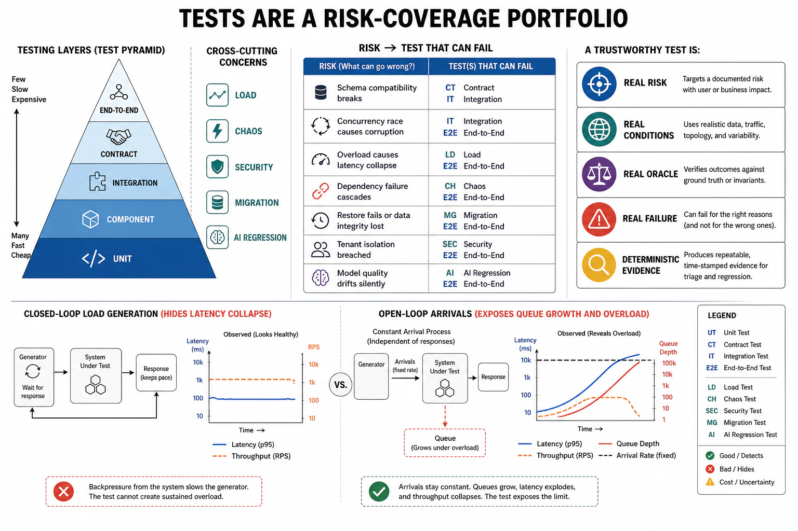

# Verification and the Test Taxonomy



## Abstract

Verification is the other half of the file-01 boundary: observability proves a claim *is* working in production, verification proves it *does* work before it gets there — and the discipline is not "have tests" but **map every architecture risk to a test that exercises it**, because test count is vanity and coverage of *risks* is the metric that matters. A thousand unit tests that all exercise the happy path leave the timeout, the retry storm, the partial failure, and the schema drift — the risks this book has spent thirteen chapters naming — completely unverified, and the system passes CI and fails production. This file lays out the test taxonomy as a *ladder of widening scope*, each rung verifying a different class of risk, and insists the ladder be complete against the design's actual failure modes rather than deep on the cheap rungs and absent on the expensive ones (the "ice-cream cone" anti-pattern: many slow brittle end-to-end tests, few fast unit tests — the inversion of the healthy [test pyramid](https://martinfowler.com/articles/practical-test-pyramid.html)). The rungs: **unit** (a function's logic, fast and many), **integration** (components together, the wiring), **contract** (Chapter 07 — the API's schema and semantics honored across producer/consumer, so a provider change that breaks a consumer fails a test not a customer), **load** (Chapter 09 — behavior under offered load, using the *open-loop* model that reproduces real overload rather than the closed-loop model that hides it), **chaos** (Chapter 13 f10 — behavior under injected failure, verifying the reliability responses actually fire), and **regression** (the previously-fixed bug stays fixed, and — the AI-native rung — the previously-good *quality* stays good, verified by eval suites over gold sets). The through-line and the reason verification lives in the same chapter as observability: a test is only trustworthy if it exercises the *real* risk under *real* conditions and *fails* when the risk materializes — a load test that never reaches saturation, a chaos test that injects a fault the system never sees, or an AI regression test with a gold set that has drifted from production all give the false assurance that is worse than no test, because it converts an unverified risk into a *believed-verified* one. The file's output is a coverage map from architecture risks to the tests that exercise them, with the gaps named — because an unmapped risk is not "probably fine," it is untested, and untested is how production finds it first.

## 1. The Test Ladder — Scope, Risk, and the Pyramid

```text
Figure 1. The test taxonomy as a ladder of widening scope. Each
rung verifies a risk class the rung below cannot reach. Healthy
shape: many fast narrow tests, few slow wide ones (the pyramid).

  scope ▲                                          cost/slowness ▲
        │   ┌──────────────────────────────┐
  widest│   │ chaos / DR / game-day (Ch13)  │  few, slow, highest
        │   │ verifies: reliability RESPONSES fire under real fault
        │   ├──────────────────────────────┤
        │   │ load / stress (Ch09)          │
        │   │ verifies: behavior at/over saturation (OPEN-loop)
        │   ├──────────────────────────────┤
        │   │ end-to-end / journey          │
        │   ├──────────────────────────────┤
        │   │ contract (Ch07)               │  ← the seam tests:
        │   │ verifies: producer/consumer schema+semantics
        │   ├──────────────────────────────┤
        │   │ integration                   │
        │   ├──────────────────────────────┤
  narrow│   │ unit                          │  many, fast, cheapest
        │   └──────────────────────────────┘
        ▼   verifies: one function's logic

  ANTI-PATTERN (ice-cream cone): many slow brittle e2e tests, few
  unit tests → slow CI, flaky signal, and STILL misses the risks
  the middle rungs (contract, load, chaos) verify. Depth on cheap
  rungs ≠ coverage of risks.
```

The ladder's discipline is **coverage of risk classes, not test count**: each rung verifies something the others structurally cannot — a unit test cannot catch a producer/consumer schema mismatch (that is contract), a contract test cannot catch congestive collapse under load (that is load, open-loop), a load test cannot catch whether the circuit breaker actually opens during a dependency failure (that is chaos) — so a design is verified only when *every* risk class it carries has its rung populated. The pyramid shape is an efficiency claim on top of that completeness requirement: put the volume on the fast, cheap, narrow tests and keep the slow, wide, expensive ones few and targeted — because the ice-cream-cone inversion gives slow flaky CI *and* poor risk coverage, the worst of both, a suite that is expensive to run and still lets the real failures through.

## 2. The Rungs That Verify This Book's Risks

The middle and upper rungs are where the architecture risks of prior chapters get verified, and they are the ones most often missing:

| Rung | Verifies the risk of | Done right (the trap it avoids) |
|---|---|---|
| **Contract (Ch07)** | A producer change silently breaking a consumer | Provider and consumer both test against the shared contract in CI; a breaking change fails the build, not a customer |
| **Load (Ch09)** | Saturation, tail latency, congestive collapse | **Open-loop** load generation (arrivals independent of responses) that reproduces real overload — a closed-loop test throttles itself and *hides* the collapse |
| **Chaos (Ch13)** | Whether the reliability responses actually fire | Inject the real fault (kill the node, slow the dependency) with bounded blast; verify the breaker opens, the fallback serves, the failover happens — a hypothesis tested, not a hope |
| **Regression** | A fixed bug returning | Every fixed bug gets a test reproducing it; the suite is the accreted memory of past failures |
| **Regression, AI** | A previously-good *quality* silently degrading | Eval suites over versioned gold sets, run on every model/prompt change (Ch13 f07); statistical assertions where output is non-deterministic (Ch13 f08) |

Two traps deserve the file's emphasis because they are the ones that produce *false* assurance (worse than no test). **The closed-loop load test**: a load generator that waits for each response before sending the next request (closed-loop) cannot produce overload — when the system slows, the generator slows with it, so the offered load self-throttles and the test never reaches the saturation it was meant to verify (Chapter 09's open-vs-closed distinction is a *testing* correctness issue, not just a modeling one). **The drifted AI gold set**: an eval suite whose gold set no longer resembles production traffic (Chapter 12's treadmill) passes while production quality regresses, because it is verifying against a distribution that no longer exists — the regression test gives a green check for a system that is failing real users.

## 3. What Makes a Test Trustworthy — Real Risk, Real Conditions, Real Failure

A test earns trust only if it can *fail when the risk materializes*, and the file names the properties, because a test that cannot fail is documentation pretending to be verification:

- **It exercises a real risk**: mapped to an actual failure mode the design carries (a timeout, a partial failure, a schema change), not just the happy path that was easy to write.
- **Under realistic conditions**: the load test reaches real saturation (open-loop), the chaos test injects the real fault, the AI eval runs on a production-representative distribution — a test under unrealistic conditions verifies a system that does not exist.
- **With a meaningful assertion that can fail**: it checks the *outcome that matters* (the contract honored, the SLO held under load, the breaker opened, the quality maintained), and a change that breaks that outcome turns the test red — a test with no failing assertion (or one that flakes so often it is ignored) is a green light wired to nothing.
- **Fast and deterministic enough to be run and trusted**: a test too slow to run in CI is run rarely; a test so flaky it is muted is not run at all — both are absent tests wearing a passing badge, which is why the pyramid (fast narrow volume) and non-determinism control (Chapter 13 f08, statistical assertions for AI) are trustworthiness requirements, not just efficiency ones.

The synthesis: **the purpose of a test is to fail when something is wrong**, so a test that cannot fail — because it exercises no real risk, runs under unrealistic conditions, asserts nothing meaningful, or is muted for flaking — is not verification, it is the *appearance* of verification, and it converts an untested risk into a believed-safe one, which is the specific way test suites lie.

## 4. Approval Gates

| Gate | Evidence Required | Failure Condition |
|---|---|---|
| Risk-coverage gate | A map from each architecture risk (this book's failure classes) to a test that exercises it; gaps named | Test count as the metric; happy-path-only coverage; named risks with no verifying test |
| Pyramid gate | Volume on fast narrow tests; few targeted wide ones; not the ice-cream-cone inversion | Many slow brittle e2e tests, few unit tests; slow flaky CI that still misses middle-rung risks |
| Seam-and-stress gate | Contract tests (Ch07) in CI; open-loop load tests reaching real saturation (Ch09); chaos verifying responses fire (Ch13) | Provider changes breaking consumers; closed-loop load tests that hide collapse; no fault-injection verification |
| AI-regression gate | Eval suites over production-representative gold sets on every model/prompt change; statistical assertions for non-deterministic output | Quality regressions shipping green; a drifted gold set verifying a distribution that no longer exists |
| Trustworthiness gate | Every test exercises a real risk under realistic conditions with a meaningful failing assertion; flaky tests fixed not muted | Tests that cannot fail; unrealistic conditions; muted flaky tests as false green lights |

## Output

The output of this file is verification as a coverage map from architecture risks to the tests that exercise them: a complete ladder — unit, integration, contract, load, chaos, regression — where each rung verifies a risk class the others cannot reach, shaped as a pyramid for efficiency, with the middle and upper rungs (contract, open-loop load, fault-injection chaos, AI-quality regression) populated because they verify exactly the failure classes this book has named. Above all, a test is trusted only if it can fail when the risk materializes — so a test that exercises no real risk, runs under unrealistic conditions, or asserts nothing is not verification but its dangerous imitation, and the gaps in the map are named because an unmapped risk is untested, not safe.

## References

- [Fowler / Vocke, "The Practical Test Pyramid"](https://martinfowler.com/articles/practical-test-pyramid.html)
- [Pact — consumer-driven contract testing (the Ch07 seam rung)](https://docs.pact.io/)
- [Schroeder, Wierman, Harchol-Balter, "Open Versus Closed: A Cautionary Tale," NSDI 2006 (why load tests must be open-loop)](https://www.usenix.org/legacy/event/nsdi06/tech/full_papers/schroeder/schroeder.pdf)
- [Google Testing Blog — "Just Say No to More End-to-End Tests" (the ice-cream-cone anti-pattern)](https://testing.googleblog.com/2015/04/just-say-no-to-more-end-to-end-tests.html)
