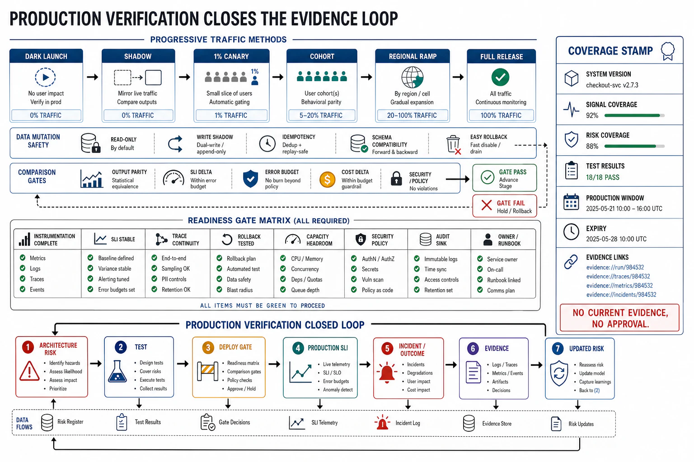

# Production Verification and the Evidence Loop



## Abstract

Pre-production tests (file 09) verify the system against the inputs you *thought of*; production is where the inputs you did not think of arrive, and so the highest form of verification is **verification in production** — not recklessness, but the disciplined practice of proving claims against real traffic under the observability that makes it safe (file 01's boundary: the canary is verification in production gated by observation). This file closes the chapter and the operational arc of the book by assembling the pieces into an **evidence loop**: the system emits telemetry (files 02–08), the telemetry is queried to answer whether claims hold (SLOs, quality, cost), the answers gate deploys (Chapter 13 f07) and fire the detection signals that trigger reliability responses (Chapter 13 f02), and the *outcomes of those responses* are themselves observed and fed back — so the system is continuously proving, in production, that it does what it claims, with every incident and every deploy producing evidence that updates the design. The file's practices: **production verification techniques** — canary and progressive delivery as the primary form (Chapter 13 f07: verify on 1% before 100%, gated by the observable SLI), plus feature-flag experiments, shadow/mirror traffic (run the new path on real traffic without serving its output, comparing against the old), and synthetic probes (the external, user-perspective signal of Chapter 13 f02's differential observability); **readiness gates** — the explicit checklist a service passes before it may take production traffic or before a deploy may proceed, which is where this chapter's coverage requirements become *enforced* (does it emit the golden signals, propagate trace context, have SLOs and burn-rate alerts, have the risk-mapped tests, have a tested rollback); and **the observability-coverage stamp** — the chapter's evidence discipline, a record per service of what it emits, what questions that telemetry can answer, which risks have tests, and when each was last verified, so observability coverage is auditable rather than assumed. The synthesis and the book's operational close: **a system is production-ready not when it is believed correct but when its correctness is continuously *evidenced*** — verifiable before deploy, observable after, with the loop between them closed so that the design learns from every real failure instead of rediscovering it. Observability without verification is watching without checking; verification without observability is checking once and hoping; the evidence loop is both, running continuously, which is the difference between a system that is reliable and one that is merely believed to be.

## 1. Verification in Production — Techniques That Use Real Traffic Safely

```text
Figure 1. Production-verification techniques, ordered by how much
real exposure they risk. Each is gated by observability (f06 SLIs);
none is safe without the signal that catches the regression.

  technique          real-traffic exposure     verifies
  ─────────────────  ────────────────────────  ────────────────────
  synthetic probe    none (generated traffic)  liveness + the
                     from outside the system   external/user vantage
                                                (Ch13 f02 differential)
  shadow / mirror    real traffic COPIED to     new path's behavior
                     the new path; output NOT   on real inputs, no
                     served (compared, dropped)  user risk
  canary (Ch13 f07)  1% of real users, output   the real thing on
                     served, SLI-gated,          real traffic at
                     auto-rollback on breach     bounded blast (1%)
  feature-flag       a cohort, instantly         a feature's real
  experiment         retractable (Ch13 f07)      effect, A/B measured
  progressive        1%→5%→25%→100%, each        full rollout, each
  rollout            stage SLI-gated             stage a verification

  Every row REQUIRES the observability (f06) that decides pass/fail.
  Verification in production without the observing SLI is not
  verification — it is shipping to users and finding out from them.
```

The techniques form a graduated path from zero real-traffic risk (synthetic probes, shadow traffic) to bounded real exposure (canary, progressive rollout), and the enabling condition for *all* of them is the observability of files 02–08: each is only "safe" because a signal is watching that can catch the regression and trigger the revert *before* the blast radius grows. This is the concrete payoff of the file-01 verification boundary — **you can verify against real traffic precisely because you can observe the outcome** — and it is why a system that is not observable cannot deploy safely (Chapter 13 f07's canary is blind without it) and cannot run experiments (a feature flag whose effect you cannot measure is a change you cannot evaluate). Shadow traffic deserves emphasis as the under-used technique: running a new model version, a new retrieval pipeline, or a new service path on *copied* production traffic — comparing its output against the incumbent without serving it — verifies behavior on the real input distribution at zero user risk, the ideal pre-canary gate for the AI changes (Chapter 13 f08) whose failures only appear on real prompts.

## 2. Readiness Gates — Where Coverage Becomes Enforced

A readiness gate is the checklist a service passes before it may serve production traffic (or before a deploy may proceed), and it is where this chapter's requirements stop being advice and become *enforced preconditions*:

```text
Figure 2. The production-readiness gate. Each item is a chapter
requirement made a hard precondition. A "no" blocks the launch —
observability and verification coverage checked BEFORE traffic, not
after the incident proves them missing.

  □ emits RED + USE + golden signals (f02)
  □ one wide event per unit of work, high-cardinality, governed (f03)
  □ propagates trace context across every hop; no dark hops (f04)
  □ continuous profiling enabled (f05)
  □ SLIs measure the USER's outcome; SLOs + burn-rate alerts set (f06)
  □ telemetry cardinality/retention within budget (f07)
  □ [AI] outcome-quality eval + token/cost telemetry emitted (f08)
  □ risk→test map complete; contract/load/chaos/regression present (f09)
  □ rollback tested; canary + auto-revert wired (Ch13 f07)
  □ every failure class has a detection signal (Ch13 f01 register)
        │
        ▼
  all checked → cleared for production traffic
  any unchecked → BLOCKED (the gap is found here, not in the outage)
```

The readiness gate is the chapter's instrument of *prevention*: it moves the discovery of a missing signal, an un-mapped risk, or an untested rollback from the incident (where it is expensive and public) to the launch review (where it is cheap and private). Its discipline is that the checklist items are *this book's requirements* — the golden signals, the wide events, the trace propagation, the SLOs, the risk-mapped tests, the tested rollback, the failure-class register — so passing the gate means the system is both observable (every SLI has an emission path) and verified (every risk has a test), which is exactly the chapter rule (file 00) made a launch precondition rather than a hope.

## 3. The Evidence Loop and the Coverage Stamp

```text
Figure 3. The evidence loop: the system continuously proves it does
what it claims. Observability feeds detection (Ch13), responses are
themselves observed, and every deploy/incident produces evidence
that updates the design.

   ┌───────────────────────────────────────────────────────────┐
   │  emit telemetry (f02–f08)                                  │
   │        │                                                    │
   │        ▼                                                    │
   │  query: do the claims hold? (SLOs, quality, cost)          │
   │        │                                                    │
   │        ├──► gates deploys (canary promote/revert, Ch13 f07)│
   │        ├──► fires detection (burn-rate alert, Ch13 f02)    │
   │        │         │                                          │
   │        │         ▼                                          │
   │        │    triggers reliability responses (Ch13:          │
   │        │    isolate/degrade/recover/rollback)              │
   │        │         │                                          │
   │        │         ▼                                          │
   │        └──◄ OBSERVE the response's outcome (did it work?)  │
   │                  │                                          │
   │                  ▼                                          │
   │        evidence → updates SLOs, tests, runbooks, design    │
   └───────────────────────────────────────────────────────────┘

  Coverage stamp (per service, the chapter's evidence discipline):
   { signals emitted, questions answerable, risks→tests mapped,
     SLOs + alerts, last readiness-review date, last incident's
     "was it answerable?" result }
```

The evidence loop is the chapter's synthesis with Chapter 13: **observability is not a passive dashboard but the active signal that closes the reliability loop** — it feeds the detection that triggers the responses, and it observes whether those responses worked, so the system is continuously evidencing its own correctness and the design learns from every real failure. The **coverage stamp** is the auditable record that makes this discipline durable (the chapter's analog of Chapter 13's reliability-generation stamp): per service, what it emits, what questions that telemetry can answer, which risks have tests, and when coverage was last verified — so a novel incident that turns out *unanswerable* from existing telemetry is not just fixed but recorded as a coverage gap to close, and the next readiness review checks it. This is how observability coverage stops decaying: every incident that asks an unanswerable question becomes an instrumentation requirement, closing the file-01 gap between the questions the system can answer and the questions reality asks.

## 4. Approval Gates

| Gate | Evidence Required | Failure Condition |
|---|---|---|
| Production-verification gate | Canary/progressive delivery gated by observable SLIs; shadow traffic for high-risk (esp. AI) changes; synthetic probes for the external vantage | Big-bang deploys; verifying only pre-prod; a canary with no observing SLI (shipping and finding out from users) |
| Readiness-gate gate | An enforced pre-traffic checklist covering emission (f02–08), risk-mapped tests (f09), tested rollback, and the failure-class register | Coverage checked after the incident; services launched without SLOs, trace propagation, or a tested rollback |
| Evidence-loop gate | Observability feeds detection (Ch13 f02) and gates deploys (Ch13 f07); reliability responses' outcomes observed; incidents update the design | Observability as passive dashboards disconnected from detection/deploy; responses fired but never verified to work |
| Coverage-stamp gate | A per-service record of signals emitted, questions answerable, risks→tests, and last-verified date; unanswerable incident questions logged as coverage gaps | Coverage assumed not audited; the same unanswerable-question dead-end recurring; decayed instrumentation undiscovered |

## Output

The output of this file — and the chapter — is the evidence loop: production verification (canary, shadow, progressive) that proves claims against real traffic *because* the observability to catch a regression makes it safe; readiness gates that enforce this chapter's coverage as a precondition for traffic rather than a lesson from an outage; and the coverage stamp that keeps observability and verification honest by auditing, per service, what can be answered and what has been tested. The synthesis is the book's operational close: a system is production-ready not when it is believed correct but when its correctness is continuously evidenced — verifiable before deploy, observable after, with the loop closed so the design learns from every failure instead of rediscovering it.

## References

- [Google SRE Book — "Testing for Reliability" (production verification, canarying)](https://sre.google/sre-book/testing-reliability/)
- [Google SRE Workbook — "Canarying Releases" (SLI-gated progressive verification)](https://sre.google/workbook/canarying-releases/)
- [Google SRE Book — "The Production Readiness Review"](https://sre.google/sre-book/evolving-sre-engagement-model/)
- [Chapter 13 file 02 — the detection the evidence loop feeds; file 07 — the canary it gates](../13-reliability-recovery-and-failure-domains/02-detection-and-time-to-detect.md)
