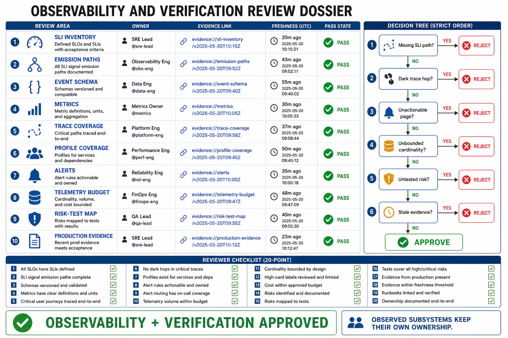

# Observability and Verification Review Templates



## Abstract

This file assembles the chapter into its executable form: the dossier a team completes to put an observability-and-verification design in front of an architecture review, and the checklist the reviewer walks to approve it. The organizing principle is the chapter rule (file 00) made procedural: **every SLI a prior chapter defined has an emission path, every alert pages on a user-felt symptom, and every architecture risk has a test that can fail** — with the coverage audited both ways, so a blind spot (a question no telemetry answers) and waste (telemetry answering no question) are both findings. The dossier forces the numbers and maps the chapter demands — the golden signals per service, the trace-completeness product, the cardinality budget, the SLO/burn-rate alerts, the risk→test map, the readiness gate — where the default would report "we have dashboards and tests." A review that produces "looks well-monitored" has failed; a review that produces "the checkout path has a dark hop at the legacy inventory service (trace completeness 0.67), and there is no open-loop load test for the queue that collapsed last quarter" has done its job.

## 1. Dossier Assembly

```text
Figure 1. Dossier assembly: each section is produced by one file's
gates; the checklist consumes the whole. §A (the model) sets the
frame; §B–§E are the signals; §F–§G alerting and cost; §H AI; §I–§J
verification.

  f01 ─► §A observability model & boundary   f06 ─► §F SLO & alerting
  f02 ─► §B metrics (RED/USE/golden)         f07 ─► §G telemetry economics
  f03 ─► §C events & logs                    f08 ─► §H AI-native telemetry
  f04 ─► §D tracing & propagation            f09 ─► §I test taxonomy
  f05 ─► §E profiling                        f10 ─► §J production verification
                     │                                & the evidence loop
                     └──────────► reviewer checklist (§3)
                                  ─► approve design / findings
```

## 2. The Observability & Verification Dossier

**§A Model & boundary (file 01).** The novel-question test passed (an unanticipated incident question answerable from emitted telemetry); the wide-event substrate (not three lossy pillars); every production claim both verifiable and observable; instrumentation written as part of each feature, including *outcome* emission.

**§B Metrics (file 02).** RED per service, USE per resource, golden signals with saturation carried; latency as histograms at p50/p95/p99/p99.9 (not averages); success/failure latency separated; high-cardinality questions routed to events, not metric labels.

**§C Events & logs (file 03).** One wide structured event per unit of work with high-cardinality identity + infra + outcome context; trace ids propagated into events; keep-the-rare/sample-the-common volume policy; PII deletable/redacted, secrets never logged, untrusted fields bounded.

**§D Tracing (file 04).** Requests traced as span trees with per-hop latency attribution; context propagated across every hop (process/network/async) with the trace-completeness product (∏pᵢ) computed and dark hops named; sampling that keeps errors/tails; agent loops and RAG pipelines traced with GenAI conventions.

**§E Profiling (file 05).** Continuous, low-overhead (eBPF <~1%) fleet profiling so any past moment's profile is queryable; the right resource profiled per symptom (CPU/alloc/lock/off-CPU); the most expensive compute (GPU/inference) profiled against derived capacity.

**§F SLO & alerting (file 06).** SLIs measuring the user's actual outcome (through differential observability); SLO + error budget as a spendable resource; symptom-based, multiwindow burn-rate alerting (fast-burn pages, slow-burn tickets); every page actionable, symptomatic, urgent, diagnosable.

**§G Telemetry economics (file 07).** Metric labels bounded (series = ∏ cardinalities estimated); high-cardinality on events; tiered retention; telemetry designed from the questions it must answer; spend audited against coverage (blind spots and waste both named).

**§H AI-native telemetry (file 08).** Output quality as the primary SLI via a standing online eval loop; per-request token/cost telemetry attributed; LLM/agent traces; captured generation context for reproducibility; abstention/guardrail signals.

**§I Test taxonomy (file 09).** A risk→test map with gaps named; the pyramid shape; contract (Ch07), open-loop load (Ch09), fault-injection chaos (Ch13), and AI-quality regression rungs populated; every test exercises a real risk with a failing assertion.

**§J Production verification & evidence loop (file 10).** Canary/progressive/shadow verification gated by observable SLIs; an enforced readiness gate; the evidence loop closed (observability feeds detection and gates deploys; responses observed); a per-service coverage stamp with last-verified dates.

## 3. Reviewer Checklist

| # | Check | Source gate | Common failure it catches |
|---:|---|---|---|
| 1 | An unanticipated incident question is answerable from already-emitted telemetry | f01 observability-not-monitoring | Only pre-built dashboards; "add logging and wait for it to recur" |
| 2 | Wide high-cardinality events per unit of work; metrics/traces/logs derived as lenses | f01 substrate | Three lossy pre-aggregated pillars discarding the needed dimension |
| 3 | Every production claim both verifiable (a test can fail it) and observable (a signal alerts it) | f01 verification-boundary | Verified-but-unobservable regressing silently; observable-but-unverified shipped on hope |
| 4 | RED per service, USE per resource, golden signals with saturation carried | f02 RED+USE | Missing error/latency metrics; saturation (the cascade's leading indicator) unmonitored |
| 5 | Latency as histograms at percentiles; success/failure split; percentiles not averaged | f02 distribution | Mean latency hiding the tail; fast 500s flattering the graph |
| 6 | One wide event per unit of work; trace ids in events; PII/secrets governed | f03 width + governance | Thin scattered logs; verbatim PII/prompts as retention liability; logged secrets |
| 7 | Volume policy keeps the rare, samples the common; levels as cost policy | f03 sampling-economics | Sampling errors away; full-volume logging bankruptcy |
| 8 | Context propagated across every hop; trace completeness ∏pᵢ computed; dark hops named | f04 propagation-completeness | A dark hop orphaning its subtree; "mostly instrumented" traces that break |
| 9 | Sampling keeps errors/tails (tail-based); agent/RAG traced with GenAI conventions | f04 sampling + AI-control-flow | Head-based 1% discarding the outage's traces; agent/retrieval as black boxes |
| 10 | Continuous low-overhead profiling; right resource per symptom; GPU path profiled | f05 continuous + compute-priority | On-demand-only profiling missing unreproducible incidents; unprofiled GPU waste |
| 11 | SLIs measure the user's outcome (not a proxy that lies in gray failure) | f06 SLI-honesty | "Available" by a health check that passes during gray failure |
| 12 | Symptom-based, multiwindow burn-rate alerting; pages actionable/urgent/diagnosable | f06 symptom + alert-quality | Cause-based alert fatigue; the real incident buried; non-actionable 3 a.m. pages |
| 13 | Metric labels bounded; high-cardinality on events; series count estimated | f07 cardinality | user_id/request_id as labels; a surprise combinatorial-series bill |
| 14 | Tiered retention; telemetry designed from questions; spend audited both ways | f07 coverage-not-volume | Collect-everything; observability bill exceeding the service with no coverage case |
| 15 | Output quality emitted as the primary AI SLI via a standing online eval loop | f08 outcome + online-eval | Traditional-stack-only monitoring; the silent 200-status wrong answer invisible |
| 16 | Per-request token/cost telemetry attributed; generation context captured for replay | f08 token/cost + reproducibility | Cost as a monthly surprise; unreproducible AI failures |
| 17 | A risk→test map with gaps named; the pyramid shape, not the ice-cream cone | f09 risk-coverage + pyramid | Test count as the metric; happy-path-only; slow flaky e2e-heavy CI missing real risks |
| 18 | Contract, open-loop load, fault-injection chaos, and AI-regression rungs populated | f09 seam-and-stress + AI-regression | Closed-loop load hiding collapse; no chaos verification; drifted AI gold set |
| 19 | Every test exercises a real risk with a meaningful failing assertion; flaky tests fixed | f09 trustworthiness | Tests that cannot fail; muted flaky tests as false green lights |
| 20 | Canary/shadow verification gated by observable SLIs; enforced readiness gate; evidence loop closed with a coverage stamp | f10 all | Big-bang deploys; coverage found missing in the outage; observability disconnected from detection |

## 4. Approval Statement

Approval of an observability-and-verification dossier asserts: every SLI the system's design depends on has an emission path; the telemetry answers the questions incidents will ask, at a cardinality and retention the budget justifies; alerts page on user-felt symptoms at a data-derived urgency; the output's quality is measured directly for the AI failures infra cannot see; every architecture risk maps to a test that can fail under realistic conditions; and production verification runs continuously under the observability that makes it safe, with the evidence loop closed. It asserts *nothing* about the correctness of the subsystems it observes and verifies — the planes, the state, the serving, the agents, the retrieval, the reliability responses — those approvals are the prior chapters', made checkable here, never re-derived. This chapter approves that the system is *observable and verified*; it does not re-approve what is observed.

## Output

The output of this file — and the chapter — is an executable review instrument: a ten-section dossier that forces observability and verification into audited coverage (every SLI emitted, every risk tested, both blind spots and waste named), and a twenty-point checklist that converts this chapter's gates into findings a review can produce. A design leaves this review with a coverage map — what can be answered, what has been tested, and what has not — rather than the false comfort of "we have dashboards and tests."

## References

- [Chapter 14 file map — the approval dependency graph this dossier assembles](00-chapter-file-map.md)
- [Chapter 01 file 11 — the evidence classification the coverage stamp inherits](../01-architectural-objective-and-system-boundary/11-evidence-classification-and-architecture-review.md)
- [Google SRE Book — "The Production Readiness Review" (the readiness gate this operationalizes)](https://sre.google/sre-book/evolving-sre-engagement-model/)
