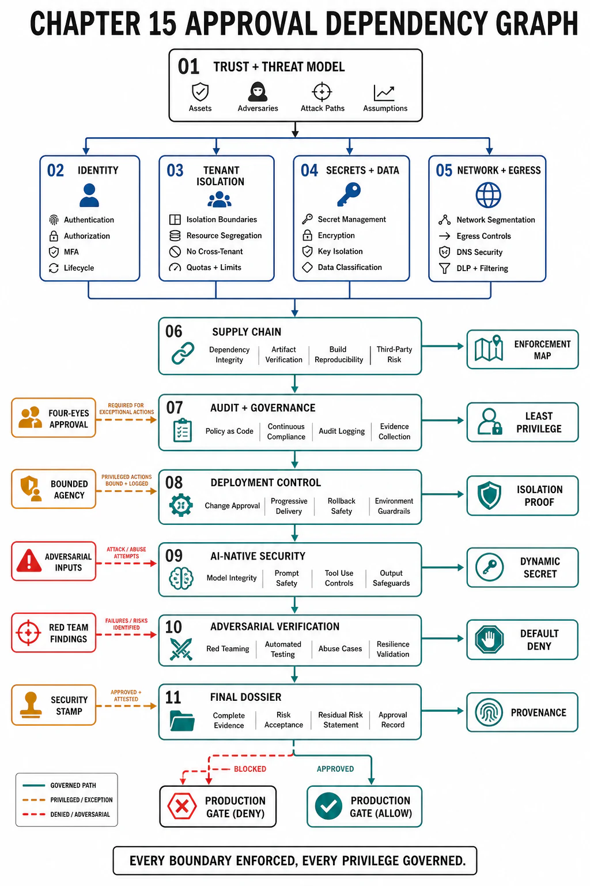

# Chapter 15 — File Map and Reading Order



## What This Chapter Owns

Every prior chapter drew a boundary — Chapter 01's system boundary, Chapter 02's plane split, Chapter 03's state ownership, Chapter 05's partition ownership, Chapter 07's API contract, Chapter 11's agent harness — and each of those boundaries is, viewed through this chapter's lens, a **trust boundary**: a line across which a request, a caller, or a piece of data must not be assumed benign. This final chapter owns the discipline that governs those boundaries and the operation of the system across them: **security** (who is allowed to do what, proven by identity and enforced at every boundary under an assume-breach posture) and **operational governance** (how the system is deployed, changed, audited, and held accountable — the controls that decide what may ship and prove who did what). Its root claim, which is also the book's closing claim: **a system is production-acceptable only when its trust boundaries are enforced, its privileged operations are governed, its actions are auditable, and its deployment is gated on the observability and recovery paths of the prior two chapters already being verified** — security is not a layer added at the end but the property that every boundary the book has drawn is actually *defended*, and governance is the discipline that the most powerful operation in any system (changing it) is done deliberately, reversibly, and accountably. What this chapter does **not** own: the boundaries themselves (drawn in their home chapters) or the mechanisms it composes (isolation from Chapter 05, the harness from Chapter 11, the audit telemetry from Chapter 14) — it owns making them *trust* boundaries, enforced against an adversary, under governance that survives audit. This is the chapter where the book's architecture meets the assumption that someone will try to break it.

## Reading Order

```text
Figure 1. Dependency graph. File 01 sets the threat model and the
zero-trust posture. Files 02–05 are the enforcement boundaries
(identity, tenancy, secrets, network). 06–08 are the operational-
integrity controls (supply chain, audit/governance, deployment).
09 is the AI-native threat set. 10–11 verify and template.

  01 trust-boundary model & threat model (assume breach, zero trust)
        │
  ┌─────────────┬──────────────┬───────────────┐
  ▼             ▼              ▼               ▼
  02 identity   03 tenant      04 secrets &    05 network
  authn/authz   isolation      data protection segmentation
  (SPIFFE,      (cross-tenant  (KMS, envelope, (egress =
  least priv)   leak boundary) crypto-shred)   exfil boundary)
        └─────────────┴──────┬───────┴───────────────┘
                             ▼
  06 supply-chain integrity (SLSA, signing, SBOM, model provenance)
        │
        ▼
  07 audit, data governance & compliance (who-did-what, retention)
        │
        ▼
  08 deployment governance & change control (the highest-privilege op)
        │
        ▼
  09 AI-native security (injection-as-boundary, excessive agency,
        │                 model supply chain, agent least-privilege)
        ▼
  10 security verification (threat model, pentest, red-team, drills)
        ▼
  11 review templates (dossier + checklist)
```

## Approval Dependency Graph

| File | Produces | Consumes (prerequisite, cited not re-argued) |
|---|---|---|
| 01 | The trust-boundary model, threat model, and zero-trust posture | Every chapter's boundary; NIST SP 800-207 |
| 02 | Identity, authn, authz, workload identity | Ch07 f-auth (OAuth/BOLA); SPIFFE/SPIRE |
| 03 | Tenant isolation as a security boundary | Ch05 partitioning; Ch03 ownership; Ch08/Ch12 per-tenant state |
| 04 | Secret management and data protection | Ch03 f09 crypto-shredding; Ch14 f03 (secrets never logged) |
| 05 | Network segmentation and egress control | Ch02 plane boundary; Ch11 f08 lethal trifecta (exfil) |
| 06 | Supply-chain integrity (software + model) | Ch14 build/deploy; the model artifacts of Ch10/Ch12 |
| 07 | Audit, data governance, compliance | Ch14 telemetry (as audit); Ch03 f09 retention |
| 08 | Deployment governance and change control | Ch13 f07 rollout; Ch14 f10 readiness gate |
| 09 | The AI-native threat set | Ch11 f08 injection; Ch12 f08 corpus-as-attack; Ch13 f08 |
| 10 | Security verification | Ch01 f11 evidence; Ch13 f10 drills; Ch14 f09 tests |
| 11 | The review dossier and checklist | every file above |

## Chapter Rule

A system is approved for production only when **every trust boundary has an enforcement mechanism** (an identity checked, an isolation verified, a secret protected, an egress controlled — not an assumption of good behavior), **every privileged operation is governed** (least-privilege, separation of duties, auditable, reversible), and **deployment is gated on the prior chapters' verification** (Chapter 13's recovery paths and Chapter 14's observability already proven, because shipping into an unobservable, unrecoverable system is itself the security failure). The chapter's discipline is the assume-breach posture: the question is never "is this secure?" (nothing is) but "**when a component is compromised, what can the attacker reach, and how fast will we know**" — and a design that cannot answer that for each of its boundaries has not been secured, only trusted. This is the book's last gate: the architecture is acceptable when it is not merely correct, reliable, and observable, but *defensible, accountable, and governable* against the adversary who assumes it is none of those things.

## References

- [NIST SP 800-207 — Zero Trust Architecture (no trusted network; verify every access)](https://csrc.nist.gov/pubs/sp/800/207/final)
- [OWASP Top 10 for LLM Applications 2025 (the AI threat baseline this chapter defends)](https://genai.owasp.org/llm-top-10/)
