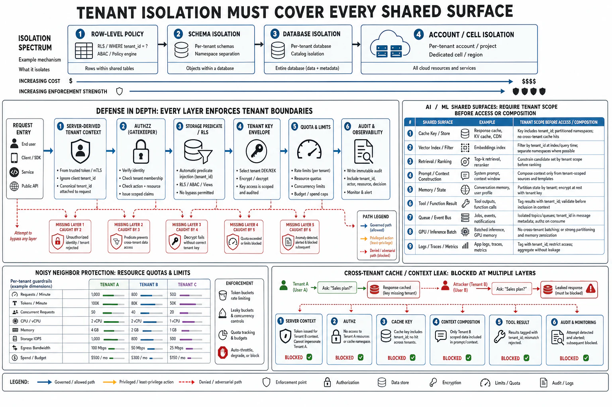

# Tenant Isolation and Data-Plane Security



## Abstract

A multi-tenant system serves many customers from shared infrastructure, and its single most consequential security property is **tenant isolation**: the guarantee that one tenant cannot read, modify, or affect another's data or workload. The failure of this guarantee — a **cross-tenant data leak** — is among the most severe incidents a SaaS system can have, because it is a confidentiality breach of *someone else's* data caused by *your* architecture, and it destroys the trust that multi-tenancy depends on. This file treats isolation as the security discipline it is, extending Chapter 05's partitioning (which owned isolation for *capacity and correctness*) to isolation for *confidentiality against an adversary*. The core model is the **isolation spectrum** from *pooled* (all tenants share the same database, tables, and compute, separated only by a `tenant_id` column and application logic) to *siloed* (each tenant gets dedicated infrastructure — its own database, its own compute), with a *bridge* model between — and the security trade is stark: pooled is cheap and dense but places the *entire* isolation guarantee on application code (one missing `WHERE tenant_id = ?` is a cross-tenant leak, the file-02 BOLA at data-store scale), while siloed is expensive but makes isolation a property of *infrastructure* the application cannot accidentally violate. The discipline is to choose the isolation level *per data sensitivity* and to enforce pooled isolation with defense in depth (file 01) rather than a single application check: **row-level security in the database** (the store enforces `tenant_id` even if the app forgets), **per-tenant encryption keys** (envelope encryption where each tenant's data is encrypted under its own key, so a query that leaks another tenant's *bytes* still cannot decrypt them — and key destruction is the crypto-shredding deletion of Chapter 03 f09), and **isolation verified by test** (file 10: a standing test that attempts cross-tenant access and asserts denial). The AI-native dimension (standard 1, developed in f09) is that multi-tenancy now has *new* shared surfaces the pre-AI model did not: a shared **cache** (Chapter 08 — a semantic cache serving tenant A's answer to tenant B is a leak with cosine similarity as the access-control bug), shared **retrieval** (Chapter 12 — an index without per-tenant filtering returns tenant A's documents to tenant B), shared **memory** (Chapter 12 f07 — an agent's memory leaking across tenants), and a shared **model context** (residual context bleeding between requests) — each a tenant-isolation boundary that the AI serving path introduced and that must be enforced as deliberately as the database's. The synthesis: tenant isolation is a security boundary enforced in *depth* across every shared resource, chosen per sensitivity, verified continuously — because the cross-tenant leak is the multi-tenant system's defining catastrophic failure.

## 1. The Isolation Spectrum — Cost vs Enforcement Locus

```text
Figure 1. The isolation spectrum. Moving right moves the isolation
guarantee from fragile application code to robust infrastructure —
at rising cost. Choose per data sensitivity.

  POOLED ◄───────────────── bridge ─────────────────► SILOED
  (shared everything)                          (dedicated everything)

  shared DB + tables,   shared DB, separate    dedicated DB +
  tenant_id column,     schemas/tables per     compute per tenant
  app-enforced          tenant                  │
   │                     │                       │
  isolation lives in:   ...moving from app...   isolation lives in:
  APPLICATION CODE                              INFRASTRUCTURE
  (one missing WHERE                            (the app CANNOT reach
   tenant_id = leak)                             another tenant — no
   │                                             shared store to leak)
  cheapest, densest,    ────────────────►       most expensive,
  HIGHEST leak risk                             LOWEST leak risk

  Rule: the isolation guarantee is only as strong as WHERE it is
  enforced. Pooled puts it on the line of code most easily forgotten;
  siloed puts it on infrastructure that has no cross-tenant path to
  forget. Match the level to what a leak of THIS data would cost.
```

The spectrum's security lesson is about the *enforcement locus*: pooled multi-tenancy is efficient but concentrates the entire isolation guarantee in application logic, where a single omitted filter — in a new query, a new report, a new endpoint written by someone who did not know the invariant — is a cross-tenant leak, and the invariant must hold across *every* data access forever. Siloed multi-tenancy moves the guarantee to infrastructure (there is no shared store, so there is no query that *can* cross tenants), trading cost for a stronger, less-forgettable boundary. Most systems are pooled for density, which is defensible — but only with the defense-in-depth (§2) that stops relying on the application getting the filter right every single time.

## 2. Defense-in-Depth for Pooled Isolation

Pooled isolation on a single application check is a weakest-link failure waiting for one forgotten filter (file 01's composition law: one weak path is the breach). Defense in depth adds *independent* layers so a single miss does not leak:

- **Row-level security at the database**: the datastore itself enforces `tenant_id` scoping (Postgres RLS, or a query-rewriting proxy), so a query that forgets the `WHERE tenant_id = ?` returns *nothing* rather than everything — the database becomes an independent enforcement layer beneath the application, and the most common leak (a forgotten filter) is caught by the store.
- **Per-tenant encryption keys (envelope encryption)**: each tenant's data is encrypted under a distinct data key (itself wrapped by a KMS key, file 04), so even if a query *does* leak another tenant's rows, the bytes are ciphertext the leaking context has no key to decrypt — confidentiality survives an authorization miss. This is also the deletion mechanism (crypto-shredding, Chapter 03 f09): destroy a tenant's key and its data is cryptographically unrecoverable, everywhere at once.
- **Isolation as a tested invariant**: a standing security test (file 10) that authenticates as tenant A and *attempts* to access tenant B's resources across every access path, asserting denial — because an isolation guarantee that is not continuously tested decays as new code paths are added, and the test is the only thing that catches the new endpoint that forgot the filter before an attacker does.

The three layers are *independent* (an app bug does not disable RLS, an RLS gap does not surrender keys, and the test catches what both miss), which is exactly the defense-in-depth the file-01 composition law rewards — a cross-tenant leak now requires the application *and* the database *and* the encryption to all fail together, not any one of them.

## 3. Isolation Beyond the Database — Noisy Neighbors and Side Channels

Tenant isolation is not only about stored data; it is about every shared resource a tenant's activity touches:

- **Performance isolation (the noisy neighbor as a security concern)**: one tenant's load must not degrade another's service — the Chapter 09 admission and quota controls reframed as isolation, because a tenant who can exhaust a shared resource (connection pool, CPU, rate limit) can *deny service* to co-tenants (STRIDE's D, file 01), and an *attacker*-tenant doing so deliberately is a security event, not just a capacity one. Per-tenant quotas and the fair-scheduling of Chapter 09 are the controls.
- **Side channels**: shared caches, shared timing, and shared resources can leak information across tenants even without a direct data path — a shared cache whose hit/miss timing reveals another tenant's activity, a co-located workload inferring another's behavior. These are subtle and often accepted risks, but for high-sensitivity tenants they push toward siloed isolation (§1) where there is no shared substrate to channel through.
- **The blast radius of a shared-component compromise**: a shared component (one cache, one queue, one model server) that is compromised reaches *all* tenants it serves — so the isolation level also bounds the blast radius of an infrastructure breach, and the most sensitive tenants' data benefits from siloing not just against leaks but against a shared component's compromise reaching them.

## 4. AI-Native Tenant Isolation — The New Shared Surfaces

```text
Figure 2. The AI serving path introduced shared surfaces the pre-AI
isolation model never had. Each is a tenant boundary that must be
enforced, or it is a cross-tenant leak with an AI mechanism.

  shared surface     the leak if unenforced           enforce by
  ─────────────────  ──────────────────────────────   ──────────────
  semantic cache     tenant A's cached answer served  tenant_id IN
  (Ch08 f09)         to tenant B on a similar query    the cache key
                     (cosine similarity as the             (per-tenant
                      access-control BUG)                   cache scope)
  retrieval index    A's documents returned to B when  per-tenant
  (Ch12)             the ANN has no tenant filter       filter at
                     (the filtered-ANN of Ch04 as a         retrieval,
                      SECURITY control, not just quality)   pre-filter
  agent memory       A's remembered facts recalled     tenant scope
  (Ch12 f07)         into B's session                  on memory
                                                         read/write
  model context      residual context from A's request per-request
                     bleeding into B's (batching,        context
                      state reuse)                        hygiene;
                                                          no cross-req
                                                          state
  token/cost         A's usage/prompts visible to B     per-tenant
  telemetry (Ch14)   via shared observability            obs scoping

  Rule: every shared AI surface is a tenant-isolation boundary.
  The AI serving path did not remove the cross-tenant-leak risk —
  it added new mechanisms for it.
```

The AI-native point is that multi-tenancy's attack surface *grew* with the serving path: the caches (Chapter 08), retrieval indexes (Chapter 12), agent memory (Chapter 12 f07), and model context that AI systems introduce are all shared resources that carry tenant data, and each is a cross-tenant leak if its tenant scoping is omitted — with a *new* mechanism for the leak that the pre-AI database model never had. The semantic cache is the sharpest example: a cache keyed only on prompt similarity (without `tenant_id` in the key) serves one tenant's answer to another's similar question, making *cosine similarity the access-control decision* — a confidentiality breach dressed as a cache hit. The filtered ANN of Chapter 04, framed there as a quality-and-correctness control, is *here* a security control: the per-tenant retrieval filter is what stops the index from returning another tenant's documents, and its failure is a leak. Every shared AI surface inherits the isolation discipline of §2 — scoped by tenant, enforced in depth, verified by test.

## 5. Approval Gates

| Gate | Evidence Required | Failure Condition |
|---|---|---|
| Isolation-level gate | Isolation level (pooled/bridge/siloed) chosen per data sensitivity against the cost of a leak of that data | Uniform pooled for all data including the most sensitive; isolation locus never chosen deliberately |
| Depth gate | Pooled isolation defended in depth: DB row-level security + per-tenant encryption keys + a standing cross-tenant test — independent layers | Isolation on a single application `WHERE tenant_id`; one forgotten filter = a leak; no independent backstop |
| Crypto-isolation gate | Per-tenant encryption keys so a data leak yields ciphertext; key destruction as crypto-shredding deletion (Ch03 f09) | One key for all tenants; a leaked row immediately readable; deletion that leaves recoverable copies |
| Performance-isolation gate | Per-tenant quotas/fair-scheduling (Ch09) so no tenant can deny service to co-tenants; noisy-neighbor treated as a security event | A tenant able to exhaust shared resources and deny co-tenants; noisy neighbor unbounded |
| AI-surface gate | Every shared AI surface (cache, retrieval, memory, context, telemetry) scoped by tenant and verified | A semantic cache without tenant_id (cosine-similarity leak); unfiltered retrieval returning others' docs; memory/context bleed |

## Output

The output of this file is tenant isolation as a security boundary enforced in depth: an isolation level chosen per data sensitivity along the pooled-to-siloed spectrum, pooled isolation backstopped by independent layers (database row-level security, per-tenant encryption keys, a standing cross-tenant test) so no single forgotten filter leaks, performance isolation so no tenant can deny service to another, and — the AI-native extension — every shared serving surface (cache, retrieval index, agent memory, model context, telemetry) scoped by tenant, because the AI path added new mechanisms for the cross-tenant leak that remains the multi-tenant system's defining catastrophic failure. Isolation is chosen deliberately, enforced redundantly, and verified continuously.

## References

- [AWS SaaS Lens — tenant isolation models (silo/pool/bridge)](https://docs.aws.amazon.com/wellarchitected/latest/saas-lens/tenant-isolation.html)
- [PostgreSQL — Row Security Policies (database-enforced tenant scoping)](https://www.postgresql.org/docs/current/ddl-rowsecurity.html)
- [Chapter 05 — partitioning and ownership (isolation for capacity, extended here to confidentiality)](../05-replication-partitioning-and-quorum-semantics/README.md)
- [Chapter 03 file 09 — crypto-shredding and per-tenant key deletion](../03-state-ownership-and-consistency-model/09-ai-native-state.md)
