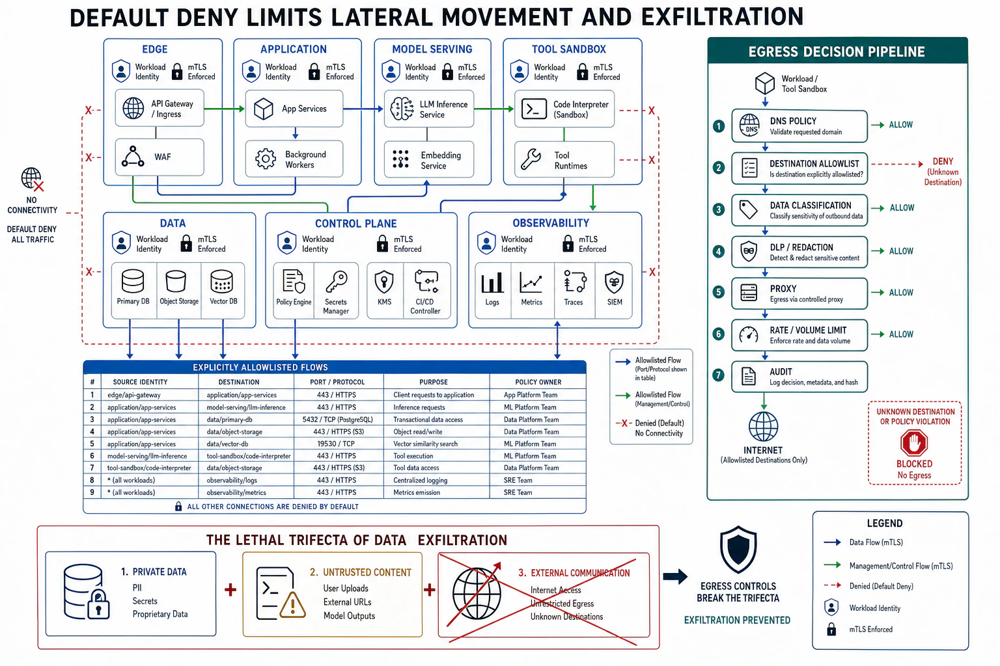

# Network Policy and Segmentation



## Abstract

The network is where lateral movement happens: an attacker with a foothold in one component (assume breach, file 01) reaches the *next* one across the network, so the network's segmentation is what decides whether a single-component compromise stays contained or becomes a path to the crown jewels. This file owns the network as a trust boundary under two disciplines. **Segmentation** (and its fine-grained form, **microsegmentation**) divides the network so that components can reach only what they must — the **default-deny** principle: nothing may talk to anything unless a policy explicitly allows it, inverting the legacy model where anything inside the perimeter could reach anything else (the flat network that turns one breach into total reach). Under zero trust (file 01, [NIST SP 800-207](https://csrc.nist.gov/pubs/sp/800/207/final)) there is no trusted interior: every connection is authenticated (mTLS via the workload identities of file 02) and authorized by policy, so network position confers nothing and an attacker's foothold cannot ride the flat network to the database. **Egress control** is the discipline this file emphasizes because it is the most under-implemented and, for AI systems, the most critical: controlling what a component may connect to *outbound* is the boundary that stops **data exfiltration** — an attacker who has breached a component and read the data still has to *get it out*, and a default-deny egress policy (a component may reach only the specific destinations it needs) is what denies that last step. This is the structural break in Chapter 11's **lethal trifecta** (private data + untrusted content + exfiltration): even if a prompt injection steers an agent to read private data, an egress policy that blocks the agent from reaching arbitrary outbound destinations removes the *exfiltration* leg, containing the breach — which is why egress control is the highest-leverage network control for agentic and AI systems, and why "the agent can make arbitrary outbound HTTP calls" is the configuration that makes the trifecta lethal. The synthesis: network segmentation under default-deny denies lateral movement, mTLS makes every connection authenticated regardless of position, and egress control denies exfiltration — together converting the network from the attacker's highway into a set of enforced boundaries where a foothold reaches only what policy explicitly permits.

## 1. Default-Deny Segmentation — Denying Lateral Movement

```text
Figure 1. Flat network vs default-deny segmentation. The flat
network turns one foothold into total reach; segmentation contains
it to what policy allows.

  FLAT (legacy perimeter model):
    [breached web tier] ──► can reach ──► EVERYTHING inside
     one foothold                          (DB, secrets, other
                                            services, admin) →
     the perimeter was the only wall; inside is a highway

  DEFAULT-DENY SEGMENTATION (zero trust):
    every component reaches ONLY what an explicit policy allows
    [breached web tier] ──allowed──► [app tier] (mTLS, authz'd)
                        ──DENIED────► DB directly (no policy)
                        ──DENIED────► secrets manager (no policy)
                        ──DENIED────► other tenants' services
     the foothold reaches one hop it was allowed; lateral movement
     to everything else is denied by default

  Rule: NOTHING talks to anything without an explicit allow policy.
  The blast radius of a network foothold = what its segment's
  policy permits (least privilege, f02, applied to the network).
```

Default-deny is the network form of least privilege (file 02): a component's network reach is scoped to exactly the connections it needs, so a breached component reaches only its permitted neighbors, not the flat interior. This is the single most important change from the legacy perimeter model — where a hard outer shell protected a soft, flat interior in which any foothold could reach anything — to the zero-trust model where the interior is itself segmented and every hop is authorized. Microsegmentation takes this to the per-workload level (each service's allowed connections explicitly defined), and the service mesh (file 02's mTLS) is the enforcement layer: identities are checked and policy applied on every connection, so segmentation is enforced by *authenticated identity* rather than by the spoofable network attributes (IP, VLAN) of the legacy model.

## 2. Egress Control — Denying Exfiltration

```text
Figure 2. Egress control breaks the exfiltration leg. Even a
successful breach or injection cannot get the data OUT if outbound
is default-deny to arbitrary destinations.

  attacker/injection has: read access to private data (breach or
                          prompt injection steered the component)
        │
        ▼  must now EXFILTRATE it (get it out)
  ┌──────────────────────────────────────────────────────────┐
  │  NO egress control:  component → arbitrary outbound HTTP   │
  │    → POST the data to attacker.com  ✗ EXFILTRATED          │
  │                                                            │
  │  DEFAULT-DENY egress: component → only allowed destinations│
  │    → POST to attacker.com  DENIED (not on the allowlist)   │
  │    → the data was read but CANNOT LEAVE  ✓ CONTAINED       │
  └──────────────────────────────────────────────────────────┘

  Lethal trifecta (Ch11 f08) = private data + untrusted content +
  EXFILTRATION. Egress control removes the third leg STRUCTURALLY:
  break any leg and the trifecta is defused. Egress is the leg
  easiest to break with an infrastructure control.
```

Egress control is the file's emphasis because it is both under-implemented and uniquely powerful against modern AI threats: most network security focuses on *inbound* (who can reach us), but *outbound* (what we can reach) is the boundary that stops stolen data from leaving and stops a compromised component from reaching command-and-control. A default-deny egress policy — a component may connect outbound only to an explicit allowlist of destinations it needs — means an attacker who has breached the component and read the data cannot *exfiltrate* it to an arbitrary destination, and an agent steered by prompt injection (Chapter 11 f08) cannot POST the private data it was tricked into reading to the attacker's server. This is the structural defense against the **lethal trifecta**: the trifecta requires all three of private-data-access, untrusted-content-exposure, and exfiltration-capability, so removing *any* leg defuses it, and egress control removes the exfiltration leg with an *infrastructure* control that does not depend on the fragile task of preventing the injection itself — which is why, for agentic systems that browse or call tools, egress control is the highest-leverage security investment and "arbitrary outbound access" is the setting that keeps the trifecta loaded.

## 3. The Network as Defense-in-Depth, Not the Only Layer

Network controls are necessary but not sufficient, and the file is explicit that segmentation is *one layer* of the defense-in-depth (file 01), not the whole:

- **Network controls complement, not replace, identity and authz**: a segment boundary says "these components may connect," but the connection is still authenticated (mTLS, file 02) and the *action* still authorized (file 02's per-resource check) — because an attacker who compromises a component that *is* allowed to reach the database still faces the database's authz and encryption (files 03–04). The network layer denies the connections policy forbids; the identity and data layers defend the connections it allows.
- **Egress control is not perfect and needs depth**: a determined exfiltration can sometimes use an allowed channel (DNS tunneling, an allowed SaaS destination, a covert channel), so egress control *raises the cost and narrows the paths* rather than closing exfiltration absolutely — which is why it is paired with data protection (file 04, so exfiltrated data is encrypted), audit (file 07, so unusual egress is detected), and least-privilege data access (file 02, so there is less to exfiltrate).
- **The trifecta is defused by breaking the easiest leg, in depth**: for a given system, break whichever legs you can — egress control (this file), untrusted-content handling (file 09), and least-privilege data access (file 02) — because defense in depth means an attacker must defeat *all* the legs you defended, not just one.

## 4. Approval Gates

| Gate | Evidence Required | Failure Condition |
|---|---|---|
| Default-deny gate | Network segmentation where nothing connects without an explicit allow policy; microsegmentation for sensitive components | Flat network where a foothold reaches everything; perimeter-only security with a soft interior |
| Zero-trust-network gate | Every connection authenticated (mTLS, workload identity) and policy-authorized; no trust from network position | Trust granted by IP/VLAN/network location; unauthenticated internal connections |
| Egress-control gate | Default-deny egress to an explicit allowlist; arbitrary outbound denied — especially for agents/AI components | Arbitrary outbound access; exfiltration and C2 paths open; the trifecta's third leg loaded |
| Trifecta-break gate | For agentic/AI systems, the lethal trifecta defused by breaking a leg structurally (egress control primary), in depth | A browsing/tool-calling agent with private-data access and arbitrary egress — the loaded trifecta |
| Depth gate | Network controls as one layer; connections it allows still defended by identity, authz, encryption; egress paired with data protection and audit | Network segmentation treated as sufficient alone; an allowed connection facing no further control |

## Output

The output of this file is the network as an enforced set of boundaries rather than the attacker's highway: default-deny segmentation and microsegmentation so a foothold reaches only what policy explicitly allows, zero-trust mTLS so every connection is authenticated regardless of position, and — the emphasis — egress control that denies exfiltration and thereby breaks the lethal trifecta's third leg with an infrastructure control, containing even a successful breach or injection. Network segmentation is one layer of defense in depth, complementing the identity, data, and audit layers rather than replacing them — together denying the lateral movement and exfiltration on which a contained foothold depends to become a total breach.

## References

- [NIST SP 800-207 — Zero Trust Architecture (segmentation, per-request authorization)](https://csrc.nist.gov/pubs/sp/800/207/final)
- [Willison, "The lethal trifecta for AI agents" (private data + untrusted content + exfiltration)](https://simonwillison.net/2025/Jun/16/the-lethal-trifecta/)
- [Kubernetes — Network Policies (default-deny, explicit-allow)](https://kubernetes.io/docs/concepts/services-networking/network-policies/)
- [Chapter 11 file 08 — the lethal trifecta this file's egress control structurally defuses](../11-agentic-orchestration-and-tool-routing/08-security-sandboxing-and-blast-radius.md)
