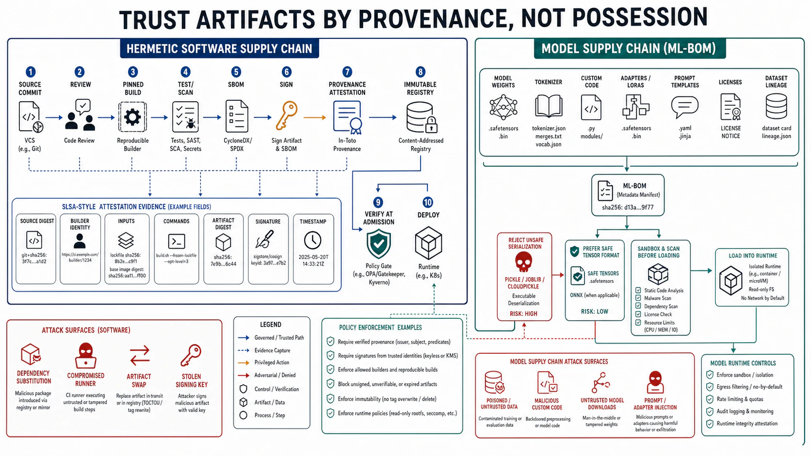

# Supply-Chain Integrity



## Abstract

The code your system runs is mostly not code you wrote: it is open-source dependencies, base images, build tools, CI plugins, and — for AI systems — pre-trained models and datasets, each a trust boundary (file 01) where third-party artifacts enter your system, and each a path by which an attacker who compromises the *supplier* compromises *you* without ever touching your perimeter. The **software supply chain** attack — poisoning a dependency, a build tool, or an update channel so the malicious code is delivered *through* your trusted build pipeline (SolarWinds, the `xz` backdoor, typosquatted packages) — is among the highest-leverage attacks because it bypasses every boundary this chapter has built: the malicious code arrives *inside*, signed by your own pipeline, trusted because it came from your build. This file owns the discipline of trusting artifacts based on **verifiable provenance** rather than assumption. The framework is [**SLSA**](https://slsa.dev/) (Supply-chain Levels for Software Artifacts, OpenSSF; spec v1.x with a Build track L0–L3 and an approved Source track): progressive levels of assurance about *how an artifact was built*, backed by **provenance attestations** — cryptographically signed statements of what source and build process produced an artifact — so a consumer can verify an artifact came from the expected source through the expected build, not from an attacker's substitution. The enabling technology is **signing** ([Sigstore](https://www.sigstore.dev/): keyless signing tied to identity, used by GitHub artifact attestations) and the **SBOM** (Software Bill of Materials — the inventory of every dependency in an artifact, so that when a vulnerability is disclosed you can answer "are we affected?" in minutes rather than an audit). The AI-native extension (standard 1, developed in f09) is urgent and current: the **model supply chain** is a live, actively-exploited attack surface — pre-trained models distributed as Python **pickle** files execute *arbitrary code on load* (a vulnerability class exploited in the wild on model hubs since at least 2024; [malicious models using "nullifAI" evasion bypassed Hugging Face's PickleScan in early 2025](https://www.reversinglabs.com/blog/the-race-to-secure-the-aiml-supply-chain-is-on-get-out-front), and PickleScan itself carried CVSS-9.3 bypass CVEs disclosed December 2025) — so a model downloaded and loaded is *code execution from an untrusted source*, and it needs the same provenance discipline as any dependency plus its own controls (safe formats like safetensors, model signing, an **ML-BOM** cataloging model lineage, datasets, and base models). The synthesis: **trust artifacts by verified provenance, not by where you got them** — sign what you build, verify what you consume, inventory everything (software and model), and treat a downloaded model as untrusted code until its provenance is proven, because the supply chain is the boundary that delivers the attack *inside* the walls the rest of this chapter built.

## 1. The Supply-Chain Attack — Bypassing Every Perimeter

```text
Figure 1. Why supply-chain attacks are high-leverage: the malicious
code arrives THROUGH the trusted pipeline, inside the walls, signed
by you.

  attacker compromises a SUPPLIER, not your perimeter:
    · a dependency (poisoned package, typosquat, hijacked maintainer)
    · a base image / build tool / CI plugin
    · a pre-trained model or dataset (f09)
        │
        ▼  your build pipeline pulls it in (trusted by default)
    your CI builds it into your artifact, SIGNS it with YOUR key
        │
        ▼
    deployed inside your walls, trusted because "we built it" —
    every boundary in this chapter BYPASSED, because the malicious
    code did not cross them: it was BUILT IN

  Defense: do not trust an artifact because you have it. Trust it
  because its PROVENANCE is verified — the source and build that
  produced it are the expected ones, attested and signed (§2).
```

The supply-chain attack is uniquely dangerous because it defeats perimeter thinking entirely: the identity boundary (file 02), the network segmentation (file 05), the tenant isolation (file 03) all defend against an attacker coming *at* the system, but the supply-chain attacker comes *through the build*, arriving as a trusted component your own pipeline assembled and signed. This is why the defense cannot be another wall — it must be **verification of provenance**: not "did this come from inside" (it did — that is the problem) but "can I cryptographically verify this artifact was built from the expected source by the expected process," which is exactly what SLSA and attestations provide.

## 2. SLSA, Provenance, and Signing — Verifiable Build Integrity

```text
Figure 2. The provenance chain. Each artifact carries a signed
attestation of how it was built; the consumer verifies before trust.

  source (git, verified) ──► BUILD (hermetic, on a trusted builder)
                               │  emits, and SIGNS (Sigstore):
                               ▼
                          PROVENANCE ATTESTATION
                          { source repo + commit, build system,
                            build steps, inputs, output hash }
                               │
                               ▼
  consumer VERIFIES before deploy:
    · signature valid (Sigstore identity = expected builder)?
    · provenance says built from OUR source, OUR pipeline?
    · output hash matches what we're deploying?
    → yes: trust. no: reject (a substitution / tampering)

  SLSA levels (Build track) = increasing assurance:
    L0 none · L1 provenance exists · L2 signed + hosted builder ·
    L3 hardened, non-forgeable provenance, isolated build
  + SBOM: the dependency inventory answering "are we affected?"
    when a CVE drops (in minutes, not an audit)
```

SLSA formalizes *how much you can trust an artifact's origin* as levels, each demanding stronger, harder-to-forge provenance — L1 merely requires provenance to exist, L2 requires it signed and produced by a hosted build service, L3 requires a hardened, isolated builder producing non-forgeable provenance — so a consumer can *require* a level and reject artifacts that do not meet it. **Provenance attestations** (signed via Sigstore, surfaced as GitHub artifact attestations) are the verifiable statements that make this checkable: the artifact carries a signed record of the source and build that produced it, and the consumer verifies the signature and the provenance *before* trusting the artifact — catching the substitution (an attacker's artifact swapped for yours) and the tampering (a modified build) that a perimeter cannot see. The **SBOM** is the operational complement: an inventory of every dependency, so that the *next* disclosed vulnerability (the inevitable `log4shell`/`xz`-class event) is answered by querying the SBOM ("which of our artifacts contain the affected version?") in minutes rather than by a frantic manual audit — turning "are we affected?" from an open question into a lookup.

## 3. The Model Supply Chain — Downloaded Models Are Untrusted Code

```text
Figure 3. A pre-trained model is a dependency AND, for pickle-based
formats, executable code that runs ON LOAD. Treat it as untrusted
code from an untrusted source until provenance is proven.

  model hub ──download──► model file ──load()──► ???
                            │
              format matters:
   ┌────────────────────────┼───────────────────────────┐
   ▼                        ▼                            ▼
  PICKLE (.bin/.pt)      SAFETENSORS               signed + attested
  arbitrary code runs    data only, no code        provenance verified
  AT LOAD TIME           execution on load          (ML-BOM: lineage,
   → RCE from an          → safe(r) by format        base model,
     untrusted download                              datasets)
   (exploited in the                                → the trust
    wild on HF: nullifAI                              discipline of §2
    bypassed PickleScan                               applied to models
    early 2025; PickleScan
    CVE-2025-10155/56/57
    CVSS 9.3, Dec 2025)

  Controls: prefer safetensors (no code exec); scan pickles (but
  scanners have bypasses — defense in depth, not sole reliance);
  verify model signatures; maintain an ML-BOM; pin + provenance-
  check model versions (the un-pinned "latest" model = Ch13 f08 +
  supply-chain risk combined).
```

The model supply chain is the file's most current and under-appreciated point: an AI system's most important dependency — the model — is frequently downloaded from a public hub and *loaded*, and in the dominant legacy format (Python pickle), **loading executes arbitrary embedded code**, making a downloaded model a remote-code-execution vector from an untrusted source. This is not theoretical: malicious models have been repeatedly found on public hubs, evasion techniques ("nullifAI") have bypassed the platform scanners, and the primary scanner (PickleScan) itself carried CVSS-9.3 bypass vulnerabilities disclosed in December 2025 — so relying on a single scan is insufficient (defense in depth, file 01). The controls translate the §2 provenance discipline to models: **prefer safe formats** (safetensors stores weights as data with no load-time code execution — a *structural* fix, the strongest kind), **scan pickle models but do not rely on scanning alone** (scanners have bypasses), **verify model signatures** where the source signs, **pin model versions and check their provenance** (the un-pinned "latest" model is Chapter 13 f08's unpatched-dependency risk *and* a supply-chain risk at once), and **maintain an ML-BOM** cataloging the model's lineage, base model, and training datasets so a compromised upstream model or poisoned dataset is traceable. A downloaded model is untrusted code until its provenance is proven — the same rule as any dependency, with a sharper edge because loading it can execute.

## 4. Approval Gates

| Gate | Evidence Required | Failure Condition |
|---|---|---|
| Provenance gate | Artifacts trusted by verified provenance (SLSA level required, attestation signature + source + build verified before deploy), not by possession | Trusting artifacts because "we built/have them"; no provenance verification; substitutions undetectable |
| Signing gate | Builds signed (Sigstore/attestations); consumers verify signatures against the expected builder identity | Unsigned artifacts; signatures unverified; an attacker's artifact accepted as yours |
| SBOM gate | An SBOM per artifact enabling minutes-to-answer "are we affected?" on a new CVE | No dependency inventory; a disclosed CVE triggering a manual audit of unknown scope |
| Model-supply-chain gate | Models treated as untrusted code: safe formats (safetensors) preferred, pickles scanned + not solely relied on, signatures/provenance verified, versions pinned, ML-BOM maintained | Loading un-vetted pickle models (RCE); "latest" models un-pinned; sole reliance on a bypassing scanner; no model lineage |
| Dependency-hygiene gate | Dependencies vetted, pinned, and monitored; build tools and base images in the trust model | Un-pinned/un-vetted dependencies; typosquat exposure; build tools outside the threat model |

## Output

The output of this file is supply-chain integrity as verified provenance rather than assumed trust: SLSA-leveled artifacts carrying signed provenance attestations that consumers verify before deploy, an SBOM that turns the next CVE into a lookup, and the AI-native extension that treats a downloaded model as untrusted code — preferring safe formats, verifying signatures and provenance, pinning versions, and maintaining an ML-BOM — because the model is the AI system's most important and most actively-attacked dependency. The supply chain is the boundary that delivers the attack inside the walls, so it is defended not by another wall but by verifying, cryptographically, that every artifact is what it claims to be.

## References

- [SLSA — Supply-chain Levels for Software Artifacts (OpenSSF)](https://slsa.dev/)
- [Sigstore — keyless signing and verification](https://www.sigstore.dev/) + [GitHub Artifact Attestations](https://docs.github.com/en/actions/security-guides/using-artifact-attestations-to-establish-provenance-for-builds)
- [ReversingLabs, "The race to secure the AI/ML supply chain" (malicious models, nullifAI, PickleScan bypasses)](https://www.reversinglabs.com/blog/the-race-to-secure-the-aiml-supply-chain-is-on-get-out-front)
- [safetensors — a safe (no code execution on load) model serialization format](https://github.com/huggingface/safetensors)
