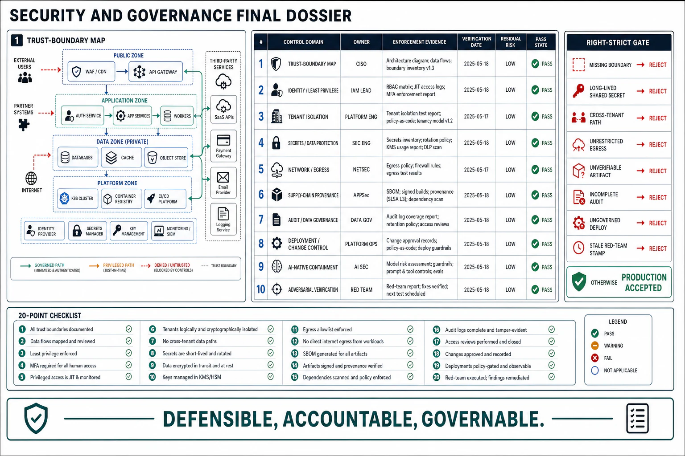

# Security and Governance Review Templates



## Abstract

This file assembles the chapter — and, as the book's final review instrument, the operational-acceptability gate for the whole system — into its executable form: the dossier a team completes to put a security-and-governance design in front of a review, and the checklist the reviewer walks to approve it. The organizing principle is the chapter rule (file 00) made procedural: **every trust boundary has an enforcement mechanism, every privileged operation is governed, and deployment is gated on the prior chapters' verification** — under the assume-breach posture that asks, for each boundary, *what a compromise reaches and how fast it is detected*, and the composition law that security is a weakest-link property improved only by defense in depth. The dossier forces the specific enforcements the chapter demands — the boundary map, the identity scoping, the isolation depth, the secret lifecycle, the egress policy, the supply-chain provenance, the audit trail, the deployment gates, the AI-injection containment — each backed by a dated verification stamp (file 10). A security review that produces "looks secure" has failed; a review that produces "the agent runs with a broad delegated token and arbitrary egress — a successful injection exfiltrates, and the last red-team was fourteen months ago on a prior architecture" has done its job. This is the last gate in the book: passing it asserts the system is not merely correct, reliable, and observable, but *defensible, accountable, and governable*.

## 1. Dossier Assembly

```text
Figure 1. Dossier assembly: each section is produced by one file's
gates; the checklist consumes the whole. §A (threat model) is the
spine — every other section enforces a boundary it names.

  f01 ─► §A trust boundaries & threat model   f06 ─► §F supply chain
  f02 ─► §B identity, authn, authz            f07 ─► §G audit & governance
  f03 ─► §C tenant isolation                  f08 ─► §H deployment governance
  f04 ─► §D secrets & data protection         f09 ─► §I AI-native security
  f05 ─► §E network & egress                  f10 ─► §J security verification
                     │                                │
                     └──────────► reviewer checklist (§3)
                                  ─► approve for production / findings
```

## 2. The Security & Governance Dossier

**§A Trust boundaries & threat model (file 01).** Every trust boundary enumerated (network and non-network: doc→context, code→build, output→action, operator→prod); STRIDE walked per boundary with a control or accepted risk each; zero-trust posture (no trusted network); assume-breach answers (blast radius of compromise, detection speed) per component; security spend triaged to the weakest link then independent depth.

**§B Identity, authn, authz (file 02).** Authentication then per-(principal, action, resource) authorization (object-level checks present); least privilege scoping every identity; short-lived attested workload identity (SPIFFE/mTLS), no long-lived shared secrets; delegation carrying scoped authority; agent tool calls minimally scoped.

**§C Tenant isolation (file 03).** Isolation level chosen per data sensitivity; pooled isolation defended in depth (DB row-level security + per-tenant keys + a standing cross-tenant test); performance isolation (no tenant denies co-tenants); every shared AI surface (cache, retrieval, memory, context, telemetry) tenant-scoped.

**§D Secrets & data protection (file 04).** No standing secrets (none in code/config/image/logs); dynamic, short-lived, centrally-governed, audited secrets; envelope encryption (KMS-held KEKs) at rest and TLS/mTLS in transit; crypto-shredding deletion reaching backups and derived copies.

**§E Network & egress (file 05).** Default-deny segmentation and microsegmentation; zero-trust mTLS on every connection; **default-deny egress** breaking the exfiltration leg — especially for AI/agent components; network as one depth layer, connections it allows still identity/authz/encryption-defended.

**§F Supply-chain integrity (file 06).** Artifacts trusted by verified provenance (SLSA level, signed attestations verified pre-deploy); SBOM answering "are we affected?"; models treated as untrusted code (safe formats, signatures, pinned versions, ML-BOM); pipeline inputs vetted.

**§G Audit & governance (file 07).** Complete, tamper-evident, attributable audit log (beyond the audited principals' reach); separation of duties + four-eyes on high-risk ops; data classified, retained/deleted, residency + consent honored; AI decision-audit via the Ch10/Ch12 stamps; training-data consent addressed.

**§H Deployment governance (file 08).** Change control (reviewed, approved, recorded); separation of duties on production deploys; deployment gated on verified observability (Ch14) and recovery (Ch13); least-privilege, supply-chain-vetted, audited pipeline; break-glass logged/time-boxed/reviewed.

**§I AI-native security (file 09).** Prompt injection treated as a structural boundary to contain; model input adversarial, output untrusted (validated/escaped/sandboxed); excessive agency minimized (functionality/permissions/autonomy) with human-in-the-loop for irreversible; lethal trifecta broken structurally in depth; poisoning/jailbreak/disclosure handled; OWASP/ATLAS/NIST threaded.

**§J Security verification (file 10).** Continuous scanning (SAST/DAST/SCA/secret/IaC) in the pipeline; threat modeling on change; penetration testing and red-teaming (testing detection + response); AI red-teaming of the §I controls; a dated security-verification stamp re-earned on a cadence.

## 3. Reviewer Checklist

| # | Check | Source gate | Common failure it catches |
|---:|---|---|---|
| 1 | Every trust boundary (incl. non-network) enumerated with an enforcement control | f01 boundary-map | A missing boundary; trust granted by network location |
| 2 | STRIDE per boundary; zero trust (no trusted network); assume-breach answered per component | f01 threat-model + zero-trust + assume-breach | Ad-hoc threat modeling; an internal zone skipping authn; no answer for the day prevention fails |
| 3 | Security spend triaged weakest-link-first; defense-in-depth layers independent | f01 composition | A 10th lock on the strong door; "independent" layers sharing one credential |
| 4 | Authn then per-(principal, action, resource) authz; object-level checks present | f02 authn/authz-order | BOLA — authenticated users reaching others' objects |
| 5 | Least privilege everywhere; short-lived attested workload identity; no long-lived shared secrets | f02 least-priv + workload-identity | Over-privileged accounts; static shared API keys in config |
| 6 | Delegation scoped; agent tool calls carry minimal delegated authority | f02 delegation + agent-principal | Agents running as admin — injection = total compromise |
| 7 | Isolation level per sensitivity; pooled defended in depth (RLS + per-tenant keys + cross-tenant test) | f03 depth | Single-`WHERE` isolation; one forgotten filter leaks |
| 8 | Every shared AI surface (cache/retrieval/memory/context) tenant-scoped | f03 AI-surface | Semantic cache without tenant_id (cosine-similarity leak); unfiltered cross-tenant retrieval |
| 9 | No standing secrets; dynamic/short-lived/centralized/audited | f04 no-standing-secret + dynamic | Secrets in code/git/images/logs; permanent skeleton keys |
| 10 | Envelope encryption at rest + TLS/mTLS in transit; crypto-shred reaching derived copies | f04 envelope + crypto-shred | Plaintext at rest; cleartext internally; deletion missing backups/embeddings |
| 11 | Default-deny segmentation; zero-trust mTLS; **default-deny egress** breaking exfiltration | f05 default-deny + egress | Flat network; arbitrary outbound; the trifecta's exfil leg loaded |
| 12 | Artifacts trusted by verified provenance (SLSA, signed attestations); SBOM present | f06 provenance + SBOM | Trusting artifacts by possession; a CVE triggering a manual audit |
| 13 | Models treated as untrusted code: safe formats, signatures, pinned versions, ML-BOM | f06 model-supply-chain | Loading un-vetted pickle models (RCE); "latest" models; sole reliance on a bypassing scanner |
| 14 | Complete, tamper-evident, attributable audit log beyond the audited's reach | f07 audit + tamper-evidence | Gaps in the trail; an attacker/operator erasing tracks; unattributable actions |
| 15 | Separation of duties + four-eyes on high-risk ops; data governed (retention/deletion/consent); AI decision-audit | f07 sep-of-duties + data-governance | Unilateral high-risk ops; over-retention; training data beyond consent; AI decisions with no "why" |
| 16 | Change control recorded; deploys need a 2nd approver; gated on verified observability + recovery | f08 change-control + readiness | Undocumented changes; solo prod deploys; shipping into an unobservable/unrecoverable system |
| 17 | Least-privilege, supply-chain-vetted, audited pipeline; break-glass logged/time-boxed/reviewed | f08 pipeline + break-glass | A pipeline with standing prod admin; a permanent unlogged "emergency" backdoor |
| 18 | Injection treated as structural; model output validated/escaped; excessive agency minimized + human-in-the-loop | f09 injection + untrusted-IO + excessive-agency | Prompt-engineering as injection "prevention"; trusted model output; agents that can do anything |
| 19 | Lethal trifecta broken structurally in depth; poisoning/jailbreak/disclosure handled; frameworks threaded | f09 trifecta-break + model-threat + framework | A browsing agent that can exfiltrate; guardrails as sole defense; no structured AI threat model |
| 20 | Continuous scanning + threat modeling + pentest + red-team (detection tested) + AI red-team; dated security stamp | f10 all | Prevention-only verification; the novel AI surface untested; a stale "pentested" badge |

## 4. Approval Statement

Approval of a security-and-governance dossier — the book's final operational gate — asserts: every trust boundary is enforced, not assumed; every identity is least-privileged and every secret short-lived, so a compromise is contained; tenants are isolated in depth across every shared surface including the AI ones; the network denies lateral movement and exfiltration; the supply chain is trusted by verified provenance, models included; the system is accountable through a tamper-evident audit trail and its data governed to its obligations; deployment is governed as the highest-privilege operation and gated on the prior chapters' verification; the AI-native injection boundary is contained rather than assumed-away; and every control carries a dated adversarial-verification stamp. It asserts *nothing* about the correctness, reliability, or observability of the subsystems it secures — those are the prior fourteen chapters' approvals, which this chapter defends and governs but does not re-derive. This is the last gate: the architecture is acceptable for production when it is defensible, accountable, and governable against an adversary who assumes it is none of those.

## Output

The output of this file — and of the chapter, and of the book's review apparatus — is an executable instrument: a ten-section dossier that forces security and governance into enforced boundaries, governed operations, and dated adversarial evidence, and a twenty-point checklist that converts this chapter's gates into findings a review can produce. A system leaves this review either cleared for production — defensible, accountable, governable — or with the specific boundaries left un-enforced, the privileges left un-scoped, the trifecta left loaded, and the controls left un-attacked, named as the work remaining before it may ship.

## References

- [Chapter 15 file map — the approval dependency graph this dossier assembles](00-chapter-file-map.md)
- [Chapter 01 file 11 — the evidence classification the security stamp inherits](../01-architectural-objective-and-system-boundary/11-evidence-classification-and-architecture-review.md)
- [OWASP Application Security Verification Standard (ASVS) — the control-verification discipline this operationalizes](https://owasp.org/www-project-application-security-verification-standard/)
